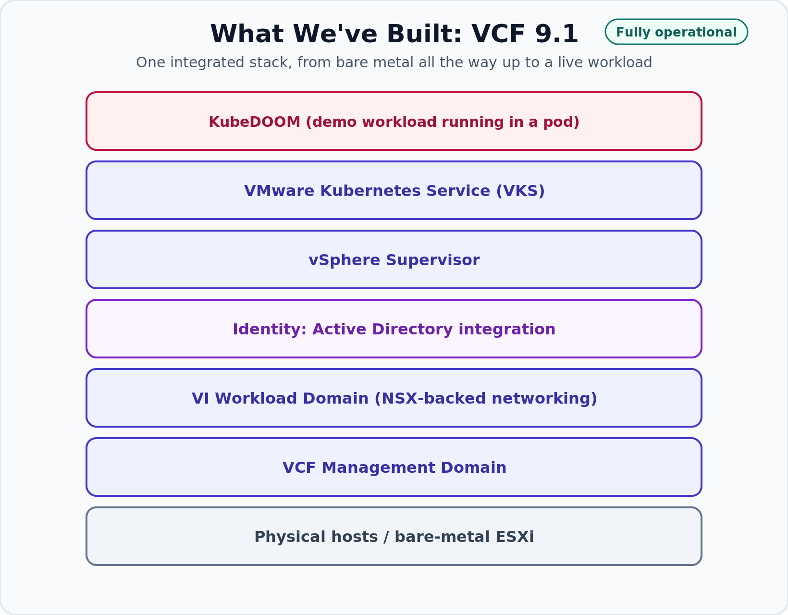

# Zero to VCAP: VCF vs. VVF – Which Upgrade Path Is Right for Your VMware Environment?

## The Question Everyone Keeps Asking Me

Over the last few months, almost every customer conversation eventually lands on the same question. It usually shows up right after we finish talking about hardware refreshes and renewals.

Someone leans back and asks: "So should we move to VMware Cloud Foundation, or should we just upgrade to VMware vSphere Foundation?"

I understand why it keeps coming up. The packaging changed, the naming changed, and a lot of teams are unsure whether they need a big architectural leap or whether they can keep doing what they have always done on a newer version.

A good chunk of that confusion comes from marketing pages that are trying to sell a platform rather than help you decide. If you have felt that, you are in good company, and this post is for you.

Before I go further, I want to be straight about something, because this series tries to meet people where they actually are. That two-option question is the common one, but it is not the only one. Underneath it, a fair number of teams are asking something harder: whether to stay on the platform at all.

The acquisition changed the cost model for a lot of organizations, and for some the new math is genuinely hard to absorb. When that is the reality, taking a hard look at the alternatives is not disloyalty, it is due diligence, and I am not going to pretend those meetings are not happening. This series still focuses on the two in-platform paths, because that is what it is for. But I would rather name the bigger conversation up front than write around it.

Rather than answer with theory and a slide full of bullets, I decided to show you. I would rather build the thing and let you watch the decision play out than point at a feature matrix and say "well, it depends." So I built both, and over the next two posts I will demonstrate each path in my lab with real workloads.

This article is not a deep implementation guide. Think of it as the on-ramp to the next phase of Zero to VCAP, a practical way to think about the choice before we get our hands dirty.

## Where We Are in the Zero to VCAP Journey

If you have been following along, you know how much ground we covered to get here. Here is the short version.

I built VMware Cloud Foundation 9.1 from bare metal. Not nested, not from a pre-baked appliance, but [from physical hosts and a blank canvas](https://humbledgeeks.com/automating-a-cisco-ucs-flexpod-with-netapp-asa-a30-on-broadcom-vcf/). From there I built the Management Domain, then created a VI Workload Domain to host real tenant workloads.

After that I [integrated Active Directory](https://humbledgeeks.com/connecting-my-flexpod-vcf-91-deployment-to-active-directory-vcf-single-sign-on/) so identity worked the way it would in production. I deployed the vSphere Supervisor, then [VMware Kubernetes Service](https://humbledgeeks.com/running-doom-on-kubernetes-vsphere-kubernetes-service-vks-on-my-flexpod-vcf-91/) on top of it.

To prove the stack was actually functional and not just a wall of green checkmarks, I deployed [KubeDOOM](https://github.com/storax/kubedoom) inside Kubernetes. Watching Doom run in a pod while you delete pods to kill monsters makes container orchestration feel a lot less abstract.

The individual milestones are not the point. The point is that the VCF environment is now fully operational and ready to receive workloads. That matters for everything that follows.

*The Zero to VCAP lab so far: one integrated VCF 9.1 stack, from bare metal all the way up to a workload you can actually play.*

## Why This Actually Matters

Here is what a lot of vendor content quietly ignores. Almost nobody starts with empty hardware. That is a lab luxury.

In the real world, customers already have production running. They have applications people depend on, databases that cannot go dark, and change windows measured in hours. When they ask about VCF versus VVF, they are really asking "what happens to the stuff I already have, and how do I get where I need to be without breaking it?"

That is why I built a second environment that looks nothing like greenfield. Alongside the new VCF 9.1 platform, I have a separate, production-like vSphere 8.0U3 environment with its own vCenter and ESXi hosts. Inside it are two Active Directory Domain Controllers, several Ubuntu Linux servers, and real workloads.

I did that on purpose. The moment you stop dealing with a clean lab, the VCF versus VVF question stops being about features and starts being about migration risk and operational change.

*Two environments, one lab. The shiny new private cloud on the left, and a production-like legacy estate on the right that shares nothing with it.*

## What VVF Actually Is (The Short Version)

Let me keep this architectural, because the second I start listing SKUs this turns into a [licensing article](https://humbledgeeks.com/licensing-my-flexpod-cisco-ucs-netapp-broadcom-vcf-91-deployment/). Packaging shifts over time, so confirm current bundle contents with your Broadcom contact before you build a proposal on it.

[VMware vSphere Foundation](https://www.vmware.com/products/cloud-infrastructure/vsphere-foundation), or VVF, is the path that feels most familiar. At its core it is vSphere the way you already know it, ESXi and vCenter, with capabilities layered on for operations and monitoring. The operational model is the one your team already lives in.

The big practical characteristic is that VVF supports in-place upgrades. Moving to it is far closer to a version upgrade than a platform migration. You are not standing up a new management fabric and relocating everything onto it. You are bringing the environment you have forward.

VVF fits organizations whose core need is virtualization done well. If your workloads are traditional VMs, your team is effective with vCenter, and you do not have an immediate need for software-defined networking or a built-in Kubernetes platform, VVF gives you a modern, supported foundation without asking you to re-architect. There is nothing second-class about choosing it.

## What VCF Actually Is (The Short Version)

[VMware Cloud Foundation](https://www.vmware.com/products/cloud-infrastructure/vmware-cloud-foundation), or VCF, is a different animal, and I mean that architecturally rather than as "better." VVF is an enhanced virtualization platform. VCF is a full private cloud platform. That distinction is the whole ballgame.

Where VVF hands you vSphere and gets out of the way, VCF hands you an integrated stack with lifecycle management built in. Instead of patching components on your own schedule and hoping the interoperability matrix lines up, VCF coordinates the lifecycle of the whole platform. That is a genuinely different operating philosophy, and it trips people up coming from a traditional vSphere mindset.

VCF brings NSX in as a first-class citizen, so software-defined networking and its security capabilities are part of the platform. It introduces Workload Domains, letting you carve out purpose-built environments with their own policies under a common control plane. It leans into automation and includes a modern application platform through the Supervisor and Kubernetes services.

That power comes with weight. VCF asks you to embrace its lifecycle model, its networking, and its structure. For the right organization that is the point. For the wrong one it is overhead they did not need.

*The shape of the two platforms side by side. VVF keeps things familiar. VCF stacks a full private cloud on top of the same vSphere core.*

## So Which One Is Better?

Neither. I know that is not the satisfying answer, but it is the honest one. These are not two rungs on one ladder where one is the upgraded version of the other. They solve different problems, and the right choice falls out of your business requirements.

Picture a mid-sized manufacturer running a couple hundred VMs. Traditional apps, a small and stretched IT team, networking handled competently at the physical layer by people with no appetite for NSX. No Kubernetes strategy, and no pretending there is one.

VVF is the obvious fit there. Handing them the full VCF stack means handing them complexity they cannot staff, for capabilities they will not use.

Now picture a large enterprise or service provider offering self-service infrastructure to a dozen internal business units. Each wants isolation, wants automation, and increasingly wants containers alongside VMs. They need Workload Domains for tenancy, NSX for micro-segmentation, and lifecycle management so staying current does not eat a whole team's calendar.

VVF would be a constant fight against its own limits for that shop. VCF is what lets them operate at that scale.

Then there is the customer in the middle, on vSphere today, under real pressure to modernize, and genuinely unsure which way to jump. That customer is who the rest of this series is for. The honest answer usually depends on where they are going, not just where they are, and the only way to make that useful is to show what each path looks like.

## What Happens Next in the Series

This is where the lab earns its keep. I am going to take that production-like vSphere 8.0U3 environment through both journeys, one after the other.

### Blog #1: Cross-vCenter Migration into VCF

In the first post I migrate workloads out of the standalone 8.0U3 environment into my VCF 9.1 Workload Domain using cross-vCenter migration. This is the VCF story for a customer who already has a platform built and now needs to bring existing workloads onto it.

I will prepare the networking so workloads land somewhere they can communicate, prepare the storage so there is a valid destination, and validate the environment before moving anything. Then I will run the [cross-vCenter vMotion](https://techdocs.broadcom.com/us/en/vmware-cis/vsphere/vsphere/9-1/vcenter-and-host-management/migrating-virtual-machines/vmotion-across-vcenter-server-systems.html), migrating the Ubuntu servers first because they are lower risk and a good way to prove the path.

Once the Linux servers are across and validated, I will migrate one of the two Active Directory Domain Controllers. And I am deliberately leaving the other one behind. That decision is more interesting than the mechanics, so let me explain it.

The first reason is availability during the transition. Active Directory is the quiet dependency under almost everything in a VMware environment. Identity, DNS, and authentication all lean on it, and vCenter and NSX get unhappy fast when name resolution or authentication fails.

If I move both DCs at once and something breaks on the destination, I have taken down the very services I need to troubleshoot with. Keeping one DC in its original home means directory services never fully depend on the move succeeding.

The second reason is rollback safety. If the migrated DC comes up with a replication or networking problem, I still have a healthy, authoritative DC in an environment I know works. I can confirm the migrated one is genuinely healthy before deciding the fate of the one I kept.

The third reason ties into the second post. That legacy environment is not getting torn down. It is getting upgraded, and an environment going through an in-place upgrade still needs working identity, DNS, and authentication of its own. Leaving a DC behind keeps it self-sufficient so the next phase has stable ground to stand on.

I will finish by validating that the migrated applications actually work, not just that they powered on, and write up the lessons learned, including the parts that did not go to plan.

### Blog #2: In-Place Upgrade to VVF

In the second post I turn back to the environment I kept, the one with the DC I left behind, and take it through an in-place upgrade to VMware vSphere Foundation 9.1. This is a completely different flavor of work.

One framing note, because the title uses ["upgrade path"](https://www.vmware.com/docs/vmware-cloud-foundation-9-1-feature-comparison-and-upgrade-paths) and I do not want to be sloppy. For the legacy environment, VVF genuinely is an upgrade. I take what exists and bring it forward in place. The VCF path in the first post is not an upgrade at all. It is a migration onto a platform that was already built separately.

Both are legitimate, and the difference between them is exactly the decision this article is trying to help you reason through.

The VVF post starts with an assessment, because you never begin an in-place upgrade by pushing a button and hoping. I will run health checks, then upgrade vCenter, then the ESXi hosts, then validate that workloads and identity came through intact. And once again I will document the lessons learned, because in-place upgrades have their own ways to surprise you.

*Same starting point, two very different journeys. One legacy environment feeds both of the next posts.*

### Planning Resources Worth Bookmarking

Before you plan any of this on a real environment, it is worth knowing that Broadcom publishes official guides for these journeys.

There is a set of static customer journey map PDFs for VCF 9.0 that lay out the converge and deploy sequences step by step. The one closest to my VVF path covers converting an existing vSphere-only environment into vSphere Foundation with the VCF Installer, deploying a new VCF Operations instance, and connecting your existing vCenter to it.

Newer, and where I would start for 9.1, is the interactive [VCF Upgrade Planning Tool](https://vmware.github.io/vcf-upgrade-planner/). You enter what you run today, pick a destination, and it builds a tailored plan with phases, resource and networking requirements, common pitfalls, and links back to the docs. You can export the whole thing to PDF for your change record.

One honest caveat. These resources are built around converging and upgrading an environment in place, which lines up with my VVF post. That is a different operation from the cross-vCenter migration in the first post, where I move workloads onto a platform that already exists. The two are easy to conflate, so it is worth keeping them separate in your head from the start.

## Wrapping Up

I built two environments instead of one because the VCF versus VVF question does not have a universal answer, and I did not want to pretend otherwise. One path shows what it looks like to migrate real workloads onto a private cloud. The other shows what it looks like to bring an existing environment forward in place.

Neither is the right answer in the abstract. The right answer is whichever one matches what your business needs to do.

Instead of reading a documentation page and imagining how it goes, you get to watch both paths unfold in a real lab, with real workloads, including the parts where something breaks and I have to figure out why. That has been the spirit of Zero to VCAP from the start. It was never meant to be a highlight reel. It is meant to document the whole engineering journey, the planning, the troubleshooting, and the lessons learned.

Next up is the cross-vCenter migration into the VCF Workload Domain, where I move the Ubuntu servers first, migrate one Domain Controller, and leave the other standing for all the reasons above. If you have ever had to move production across vCenter boundaries and felt your stomach tighten at the confirm button, that post is for you.

Come back for it, and let's do the scary part together.
