# Zero to VCAP: Deploying VMware Cloud Foundation 9.1, Screen by Screen

If you've been following the Zero to VCAP series, you know I've spent a good chunk of this journey standing up VMware Cloud Foundation in the lab. During my study runs I deployed **VCF 9.0.2** more times than I can count — enough that the wizard started to feel like muscle memory. So when **VCF 9.1** landed, I was genuinely excited to rebuild from scratch and see what changed.

This post is the full, honest walkthrough of that 9.1 deployment — specifically standing up the **management domain**, the foundation everything else in a VCF fleet builds on. I'll cover every screen, the wizard improvements that made me grin, and the prep work I did to get my hosts VCF-ready (hardening and certificate regeneration with my own PowerShell scripts). I took a screenshot at every step so you can follow along whether you're studying for the VCAP-VCF exam or about to do your first production bring-up.

A quick heads-up: this is a long one. I'd rather over-document than leave you guessing at a screen. Grab a coffee.

## Why I'm Excited About 9.1

VCF 9.1 is officially [Broadcom's "secure, cost-effective private cloud platform for production AI"](https://blogs.vmware.com/cloud-foundation/2026/05/05/vcf-9-1-secure-cost-effective-private-cloud-platform-for-production-ai/) — and the [release announcement](https://news.broadcom.com/releases/broadcom-announces-vmware-cloud-foundation-9-1) leans hard into AI, memory tiering, and Kubernetes economics. That's great if you're running GPUs. But as someone who *deploys* this stuff for a living, the things that actually made my week were quieter:

- **A unified installer experience.** One VCF Installer appliance, one "Get Started" pane, wizard *or* JSON spec.
- **Cleaner depot and binary management.** Connect a depot, pull exactly the bundles you need, all in the installer.
- **Smarter pre-deployment validation.** The Prepare and Validate stages catch DNS, certificate, and capacity problems *before* you waste an hour on a doomed deployment.
- **A genuinely useful progress UI.** Granular milestone and task tracking during bring-up instead of a spinner and a prayer.

Having run the 9.0.2 wizard more times than I'd like to admit, the 9.1 Deployment Wizard genuinely feels like a different product. The guided Plan → Prepare → Deploy flow, the fleet model, FQDN pre-fill, and inline validation add up to an experience that's smoother and much harder to get wrong. I came away genuinely impressed.

The one honest tradeoff: **it takes a lot longer to deploy.** My 9.1 management-domain bring-up ran almost *double* the wall-clock time of a comparable 9.0.2 deployment. There's simply more being stood up — VCF Operations, VCF Automation, and the fleet management plane on top of the usual vCenter, NSX, and SDDC Manager — so budget for the extra time.

### The big one: you don't have to rebuild

Here's the headline that matters if you're still on vSphere: **VCF 9.1 gives you a real upgrade path.** You can *converge* an existing standalone vSphere environment — your current vCenter and ESXi hosts — into a VCF 9.1 management domain, reusing them as building blocks instead of starting over. The requirement is that your environment is on **vSphere 8.0 U3a or later** before you converge. ([What's New with vSphere in VCF 9.1](https://blogs.vmware.com/cloud-foundation/2026/05/12/whats-new-with-vsphere-9-1/) · [How to Converge a vSphere Environment to VCF](https://blogs.vmware.com/cloud-foundation/2026/02/05/how-to-converge-a-vmware-vsphere-environment-to-vmware-cloud-foundation-9-0/) · William Lam's excellent [Demystifying Supported Upgrade Paths to 9.1](https://williamlam.com/2026/05/vcf-9-1-demystifying-supported-upgrade-paths-to-9-1.html).)

If you want the authoritative matrix of what can upgrade to what, Broadcom maintains a [feature comparison and upgrade paths](https://www.vmware.com/docs/vmware-cloud-foundation-9-1-feature-comparison-and-upgrade-paths) doc and the [Upgrading to VCF 9.1](https://techdocs.broadcom.com/us/en/vmware-cis/vcf/vcf-9-0-and-later/9-1/deployment/upgrading-cloud-foundation.html) guide. I went greenfield for this lab, but I'll point out the exact screen where you'd choose convergence instead.

### A word on resources — plan before you build

I'll say this once loudly: **VCF 9.1 is resource-intensive.** I'm running this on four hosts because it's a lab. In the real world, the sizing screens you'll see below are a planning document, not a suggestion. A High Availability / Medium deployment asks for a **minimum of 4 hosts collectively providing 220 vCPUs, 728 GB of RAM, and roughly 10.7 TB of disk** — *plus a recommended 20% buffer on top* — and the installer's own capacity check recommends at least **110 cores** to keep utilization under 80%. You'll watch me bump into that wall and right-size down to fit. Size your hardware to the deployment model you actually want, not the one that barely boots.

This deployment lands on the Cisco UCS FlexPod with NetApp ASA A30 storage I built in [my FlexPod foundation post](https://humbledgeeks.com/automating-a-cisco-ucs-flexpod-with-netapp-asa-a30-on-broadcom-vcf/) — the instance is even named `hg-vcf-flexpod` — so if you want the hardware foundation under all of this, start there.

## Getting the Bits: Binaries and the Depot

Before any of the screens below, you need the 9.1 binaries. In 9.1 the flow changed slightly: you **register a software depot in the Broadcom Business portal (vcf.broadcom.com) to get an activation code**, then connect the VCF Installer to that depot. Broadcom documents three ways to get binaries onto the installer appliance:

- [Connect to an online depot](https://techdocs.broadcom.com/us/en/vmware-cis/vcf/vcf-9-0-and-later/9-0/deployment/deploying-a-new-vmware-cloud-foundation-or-vmware-vsphere-foundation-private-cloud-/preparing-your-environment/downloading-binaries-to-the-vcf-installer-appliance/connect-to-an-online-depot-to-download-binaries.html) (what I used)
- [Connect to an offline depot](https://techdocs.broadcom.com/us/en/vmware-cis/vcf/vcf-9-0-and-later/9-0/deployment/deploying-a-new-vmware-cloud-foundation-or-vmware-vsphere-foundation-private-cloud-/preparing-your-environment/downloading-binaries-to-the-vcf-installer-appliance/connect-to-an-offline-depot-to-download-binaries.html)
- [Use the VCF Download Tool](https://techdocs.broadcom.com/us/en/vmware-cis/vcf/vcf-9-0-and-later/9-0/deployment/deploying-a-new-vmware-cloud-foundation-or-vmware-vsphere-foundation-private-cloud-/preparing-your-environment/downloading-binaries-to-the-vcf-installer-appliance/use-the-vmware-download-tool-to-download-binaries.html) to stage them yourself

The full parent doc is [Downloading Binaries to the VCF Installer Appliance](https://techdocs.broadcom.com/us/en/vmware-cis/vcf/vcf-9-0-and-later/9-0/deployment/deploying-a-new-vmware-cloud-foundation-or-vmware-vsphere-foundation-private-cloud-/preparing-your-environment/downloading-binaries-to-the-vcf-installer-appliance.html), and the VCF Installer appliance and Download Tool both come from **support.broadcom.com** under the VMware Cloud Foundation 9 product files. Now let's deploy.

---

## Phase 1 — Meet the VCF Installer

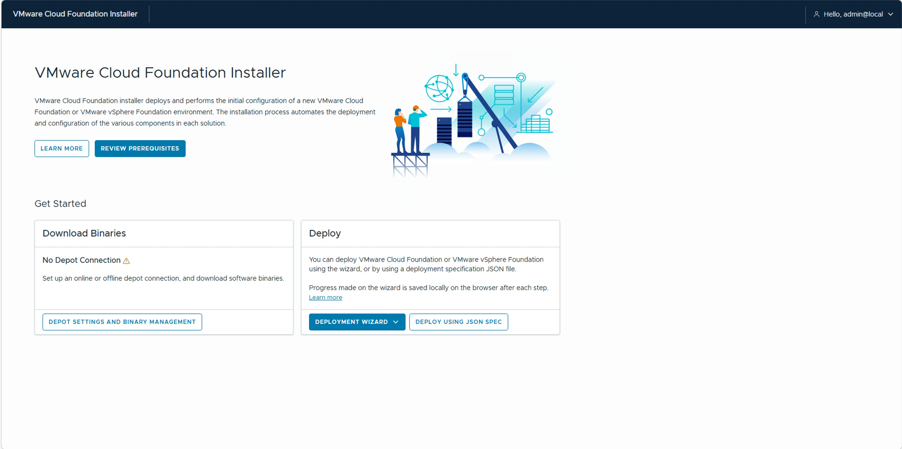

This is the front door: the **VMware Cloud Foundation Installer**. Everything in 9.1 starts from this single appliance — no more juggling separate tools. The "Get Started" section makes the two-step flow obvious: first connect a depot and download binaries, then deploy via the **Deployment Wizard** or **Deploy using JSON Spec**. Notice the "No Depot Connection" warning — that's our first job.

**Tip:** The wizard saves your progress locally in the browser after each step, so you can close the tab and come back without losing your inputs. For repeatable or production builds, do a wizard run once, download the JSON spec at the end, and deploy from JSON next time.

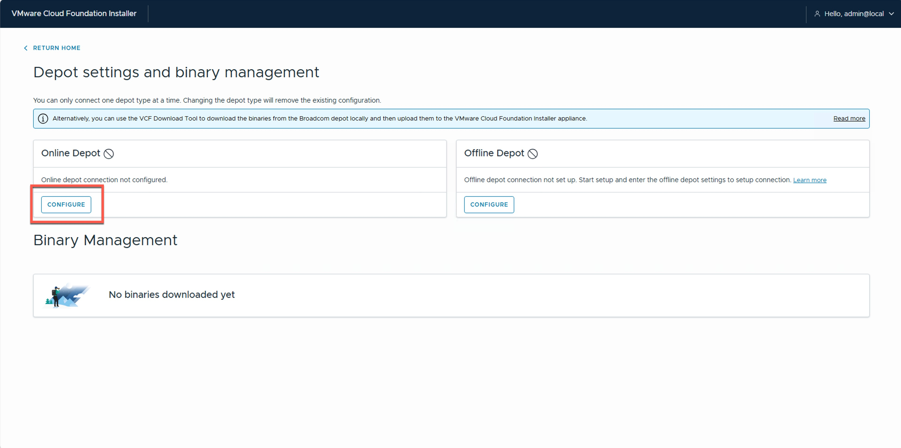

Clicking into **Depot Settings and Binary Management** shows a clean slate — neither the Online nor Offline depot is configured (the **Configure** button is highlighted), and "No binaries downloaded yet." You can only connect one depot type at a time. This is where the 9.1 binary flow begins.

## Phase 2 — Connecting a Depot & Downloading Binaries

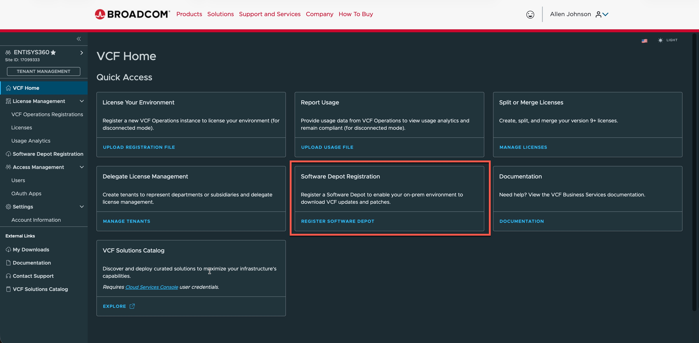

Over on the Broadcom portal, the VCF Home → Quick Access page is mission control for licensing and depot registration. The tile we care about is **Software Depot Registration** — that's how your on-prem installer earns the right to pull bits from the Broadcom Depot.

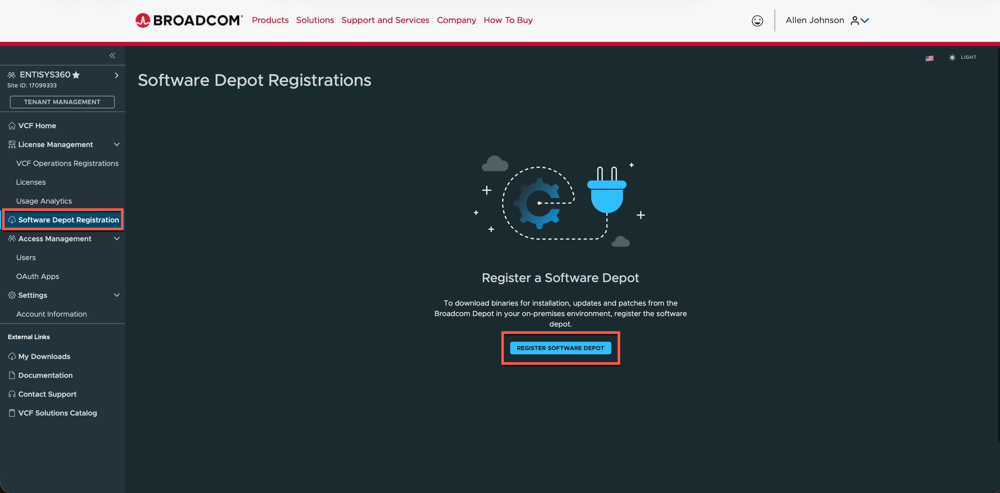

The Software Depot Registrations page starts empty. Clicking **Register Software Depot** kicks off generating the credentials the installer is waiting for.

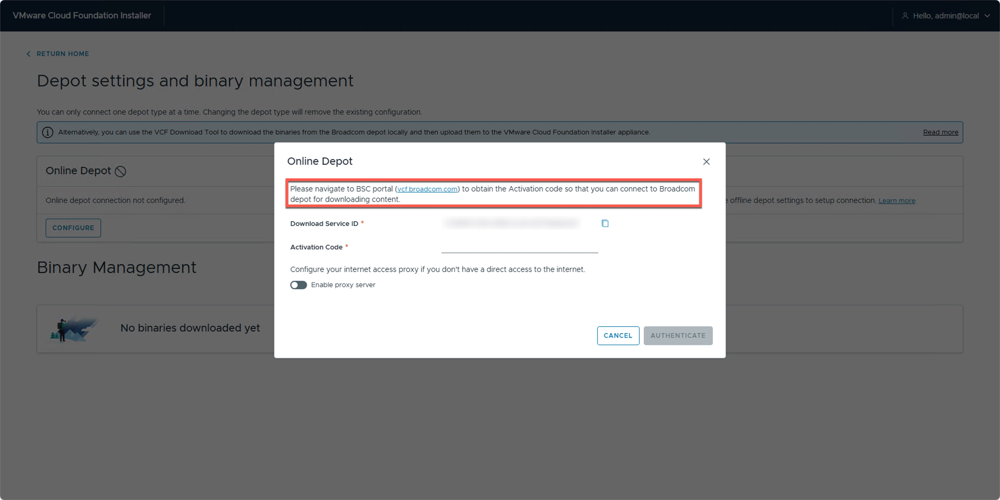

Back in the installer, the **Online Depot** dialog hands you a **Download Service ID** and waits for an **Activation Code**. There's also a proxy toggle here if your installer doesn't have direct internet access. The Service ID is what ties this installer to your depot registration. (I've blurred the IDs and codes in these shots — you should too if you ever share yours.)

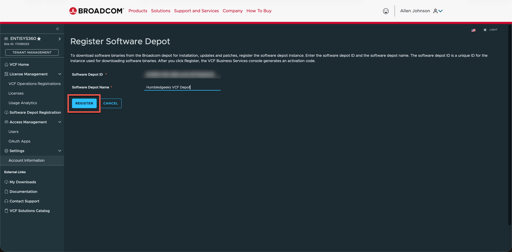

On the portal, you register the depot by pasting the Software Depot ID and giving it a friendly name — I called mine "Humbledgeeks VCF Depot." Then hit **Register**.

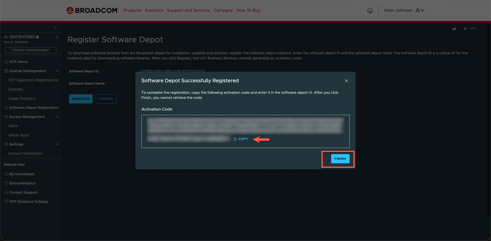

The portal returns your **Activation Code**. Copy it now.

**Gotcha:** This is a *one-time* code — once you click **Finish**, you can't retrieve it again. And treat it like a secret: anyone with your Service ID and activation code can pull binaries against your entitlement.

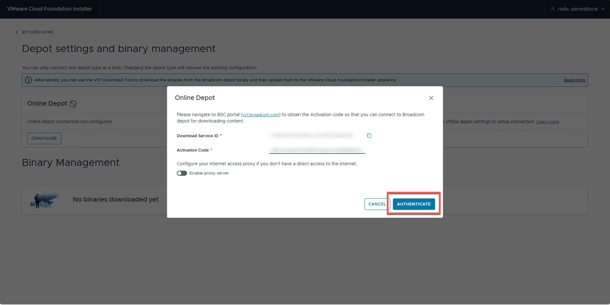

Paste the activation code into the installer's Online Depot dialog and the **Authenticate** button lights up. Click it to wire the installer to your depot.

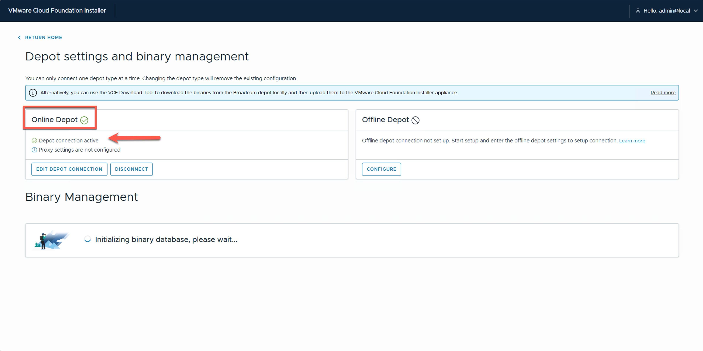

Success — **Depot connection active.** The installer immediately starts initializing its binary database so it can show you what's available to download.

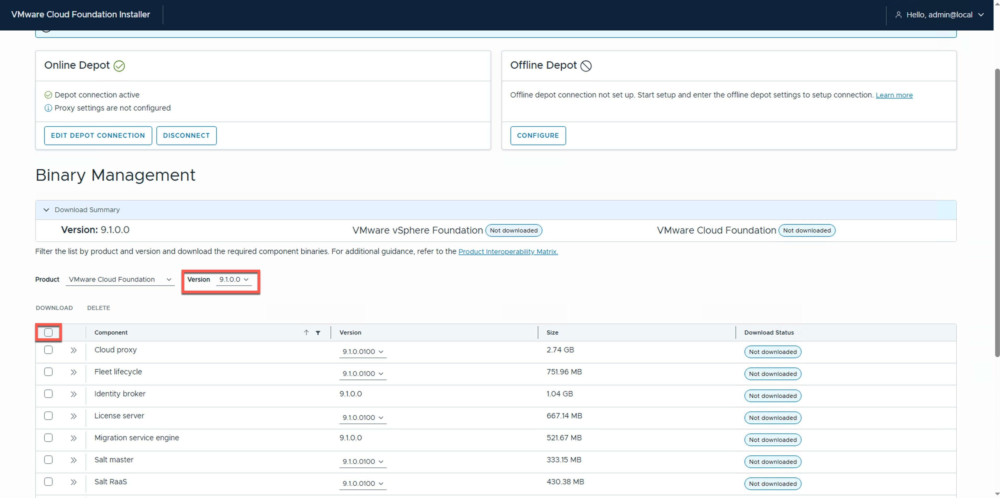

The Binary Management download summary confirms we're pulling **version 9.1.0.0**. Both bundles — VMware vSphere Foundation and VMware Cloud Foundation — are available but not yet downloaded.

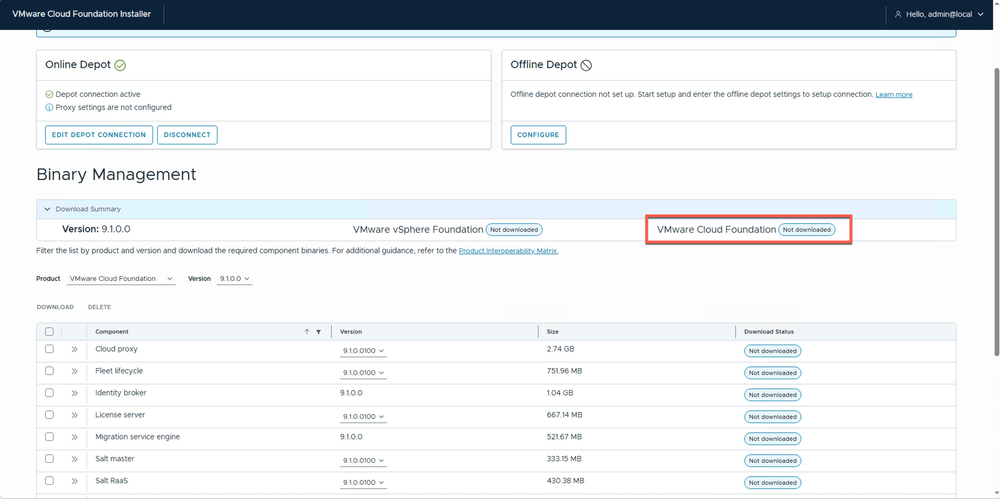

Expanding the component list shows everything that makes up VCF 9.1: Cloud proxy, Fleet lifecycle, Identity broker, License server, Migration service engine, Salt master/RaaS, and more — each with its download size.

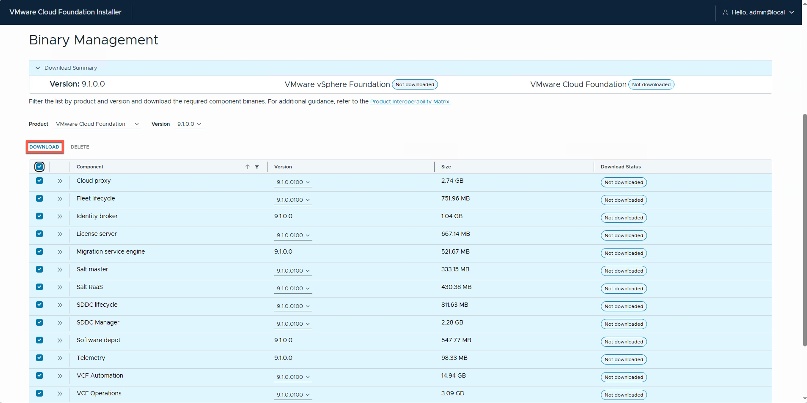

Selecting the full component set to download — SDDC Manager, Software depot, Telemetry, VCF Automation (~15 GB on its own), VCF Operations, and the rest.

**Tip:** This is a *lot* of data — tens of gigabytes. Make sure your installer has the disk and the bandwidth before you start, and ideally download outside business hours. If you're air-gapped, this is where the offline depot or the VCF Download Tool earns its keep.

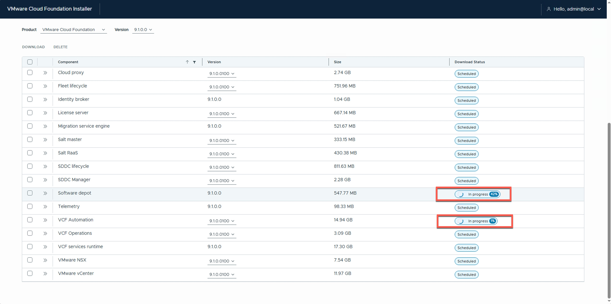

The download underway — most components sit "Scheduled" while Software depot and VCF Automation pull first. This stage takes a while; let it run.

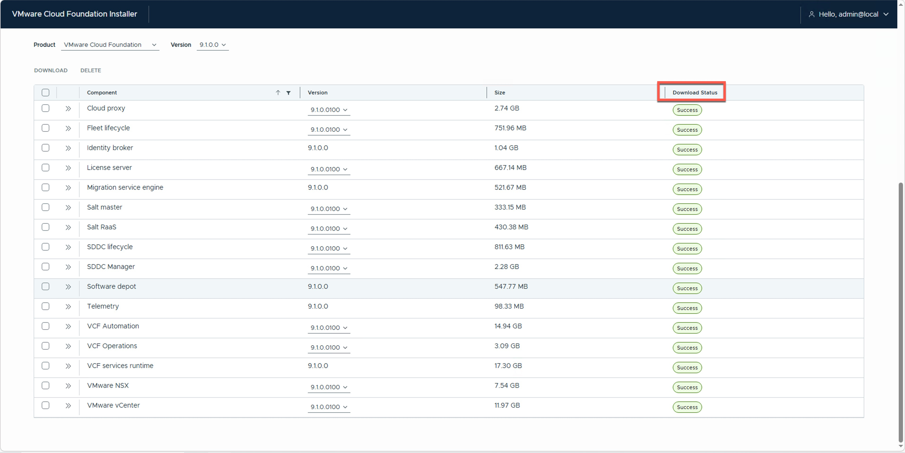

Every component now reads **Success** — all 9.1.0.0 binaries are local to the installer appliance.

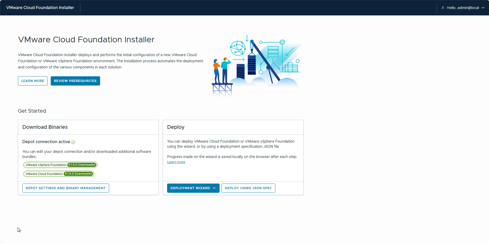

Back on the installer home, the "Download Binaries" card now confirms both **vSphere Foundation 9.1.0.0** and **Cloud Foundation 9.1.0.0** are Downloaded. We're cleared to deploy.

## Phase 3 — Launching the Deployment Wizard

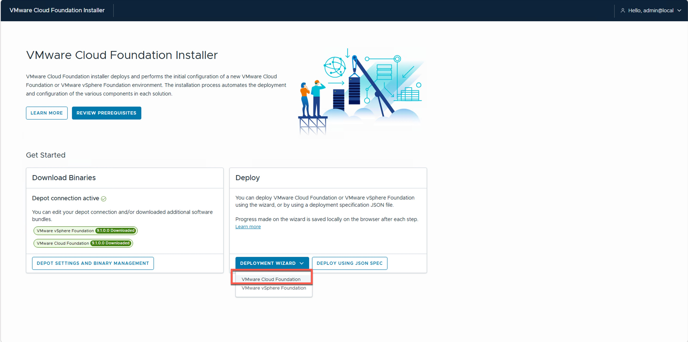

The **Deployment Wizard** dropdown lets you pick a full VMware Cloud Foundation build or a leaner vSphere Foundation. I'm going full VCF.

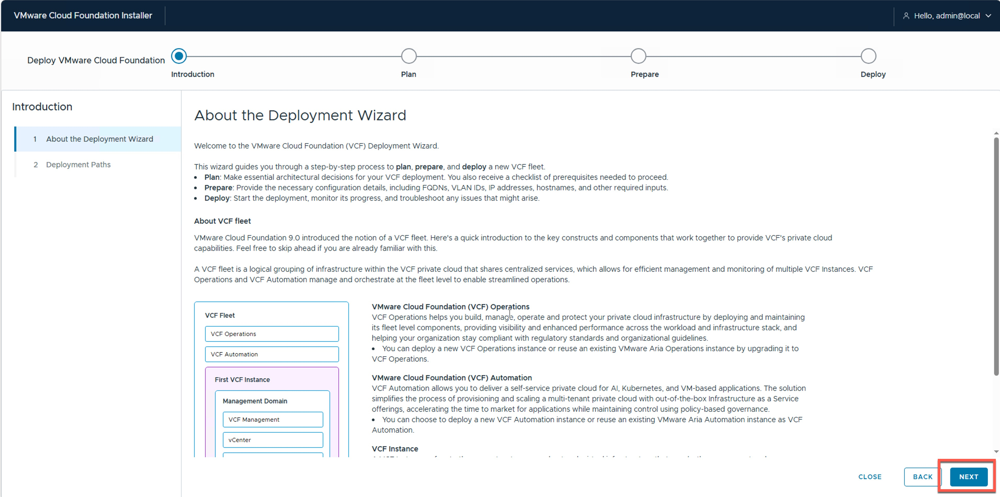

The Introduction step frames the whole flow: **Plan → Prepare → Deploy**. It also introduces the VCF *fleet* model — VCF Operations and VCF Automation managing one or more VCF instances — which is the mental model worth having before you start clicking.

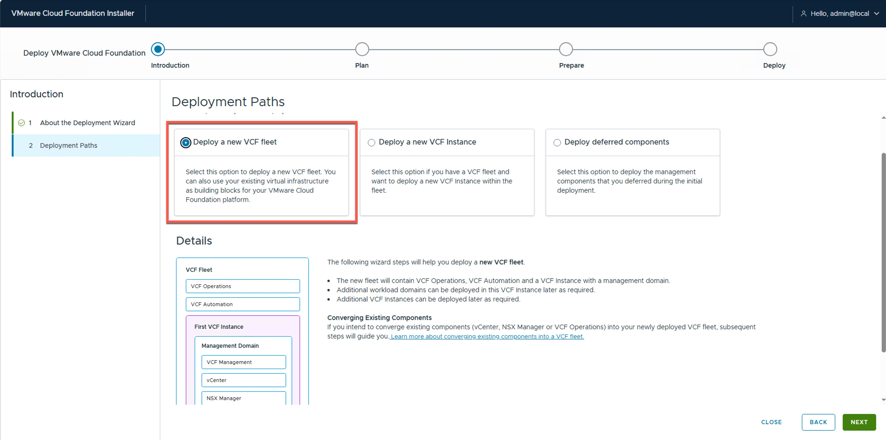

Choosing a **Deployment Path**: a brand-new VCF fleet, a new instance into an existing fleet, or deferred components. For a greenfield lab it's "Deploy a new VCF fleet."

**Tip:** This is conceptually adjacent to the convergence/upgrade story — if you were bringing an existing vSphere 8.0 U3a+ environment into VCF, you'd lean on the "Existing Component" planning step (coming up in Phase 5) rather than building everything fresh.

## Phase 4 — Installing ESXi 9.1 on the Hosts

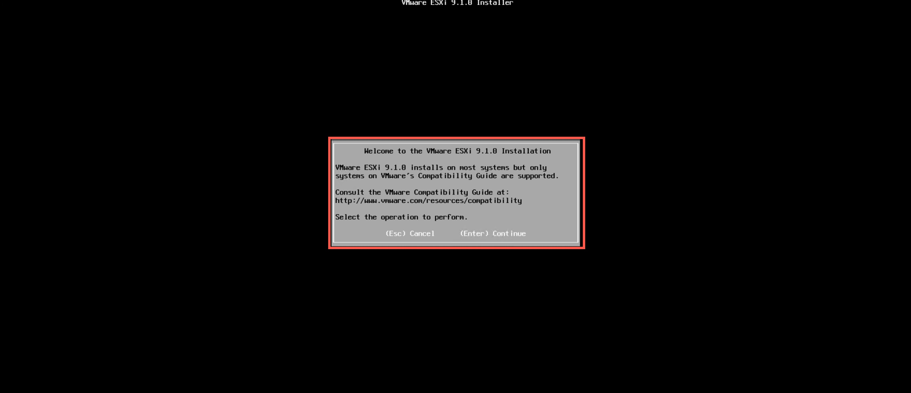

Before the installer can build a thing, every host needs a hypervisor. Here's the familiar text-mode **VMware ESXi 9.1.0** installer welcome screen. Nothing exotic — but worth confirming you're laying down 9.1, not an older build.

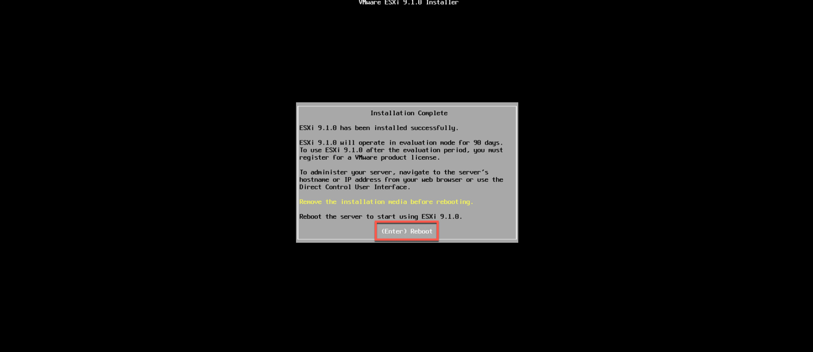

ESXi 9.1.0 installed successfully. It'll run in **90-day evaluation mode** until licensed. Pull the install media and reboot into the new hypervisor, then repeat for the rest of your hosts.

**Tip:** This is the perfect moment to apply a consistent host baseline — NTP, DNS, and security hardening — *before* VCF ever touches the hosts. That habit is exactly what keeps Phase 7 clean.

## Phase 5 — The Plan Stage: Sizing, Networking & Storage

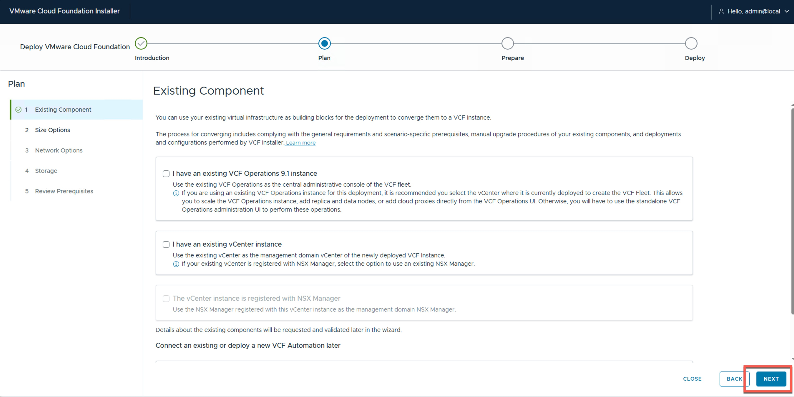

First stop in **Plan** is the **Existing Component** step — and this is the one I promised you. If you already run VCF Operations, a vCenter, or an NSX Manager, you check these boxes to *converge* them into the new fleet rather than deploying duplicates. This is the upgrade-path lifeline in action: meet your environment where it is. I'm greenfield, so I leave them unchecked and hit Next.

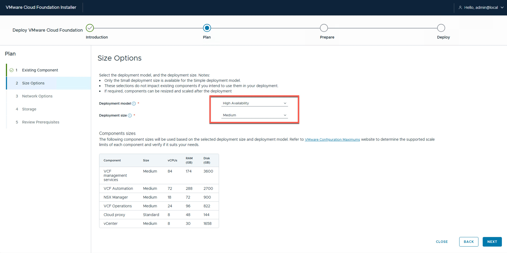

This is the screen to study *before* you buy hardware. With **Deployment model: High Availability** and **size: Medium**, look at the appetite: VCF management services want **84 vCPUs / 174 GB**, VCF Automation **72 vCPUs / 288 GB**, NSX Manager 18/72, VCF Operations 24/96, plus vCenter and Cloud proxy. VCF 9.1 is hungry.

**Gotcha:** These component sizes are driven by the model you pick. Choosing HA/Medium here is what sets the 220 vCPU / 728 GB minimum later — and it's why I end up resizing. Decide your model deliberately; you *can* resize components after deployment, but it's far easier to plan correctly now.

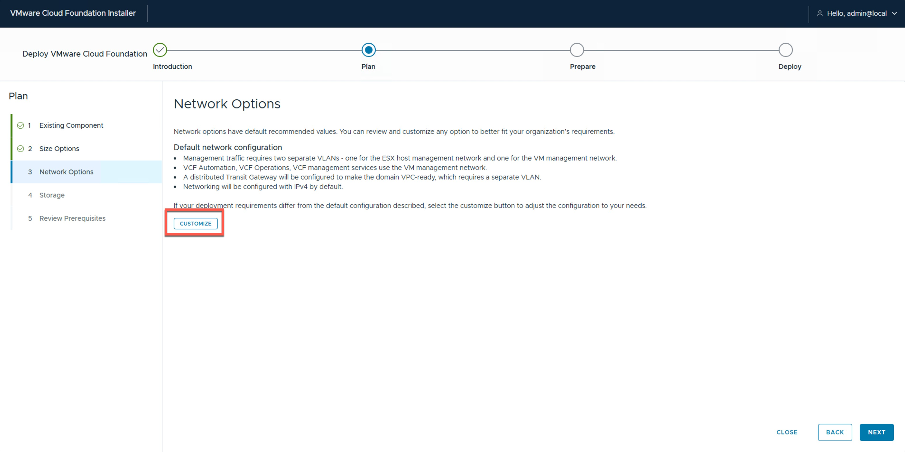

**Network Options** with the default recommended config: two management VLANs (one for ESX host management, one for VM management), a distributed Transit Gateway to make the domain VPC-ready, and IPv4 by default.

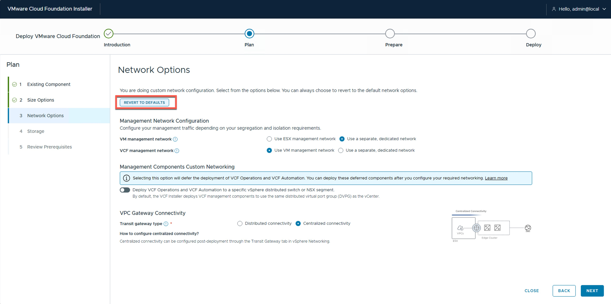

Hitting **Customize** exposes the knobs — dedicated vs shared management networks, the option to defer VCF Operations/Automation, and Transit Gateway connectivity (distributed vs centralized). Most labs are fine on defaults; customize when your segmentation requirements demand it.

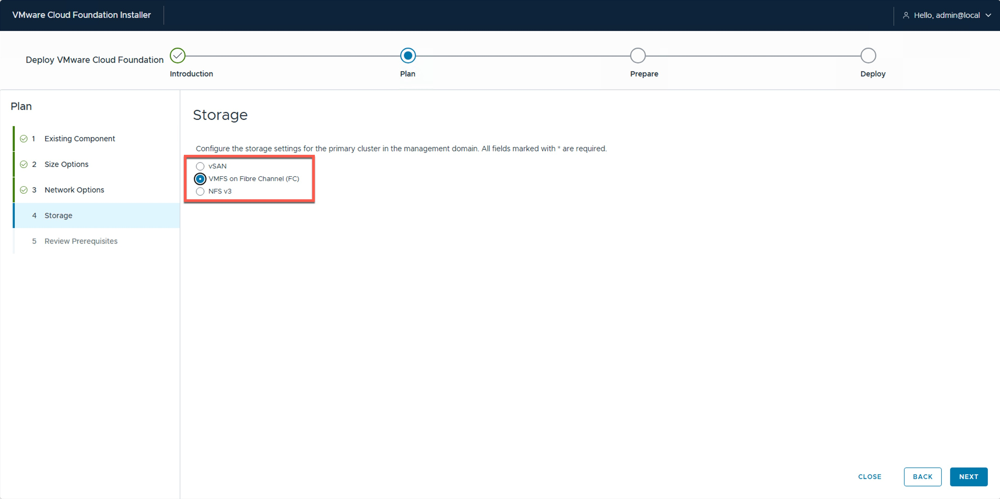

**Storage** for the management cluster. You get three choices — vSAN, **VMFS on Fibre Channel**, and NFS v3 — and I go straight to VMFS on FC. On the [Cisco UCS FlexPod with a NetApp ASA A30 all-flash FC array](https://humbledgeeks.com/automating-a-cisco-ucs-flexpod-with-netapp-asa-a30-on-broadcom-vcf/) I built in the last post, that's the natural fit: the management domain lands on the array instead of consuming local disk for vSAN.

**Tip:** Let your hardware reality drive this choice. vSAN ESA is fantastic when you've sized hosts for it, but don't force it if your foundation is array-based — VMFS on FC (or NFS) is a first-class citizen in 9.1.

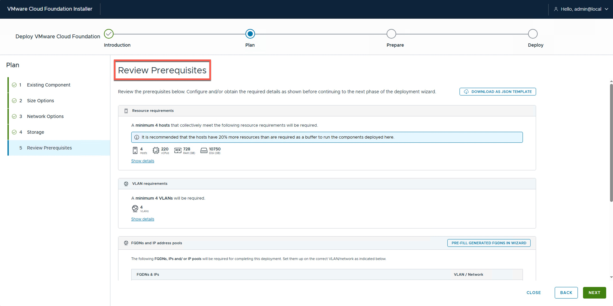

**Review Prerequisites** is the bill of materials for the whole deployment: a **minimum of 4 hosts** collectively providing **220 vCPUs, 728 GB RAM, ~10.7 TB disk** (with that recommended 20% buffer), at least 4 VLANs, plus all the FQDNs and IP pools. You can even **Download as JSON Template**.

**Tip:** Hit that JSON template button and keep the file. It's a perfect prerequisites checklist to hand your network and DNS teams, and a head start on a future JSON-spec deployment.

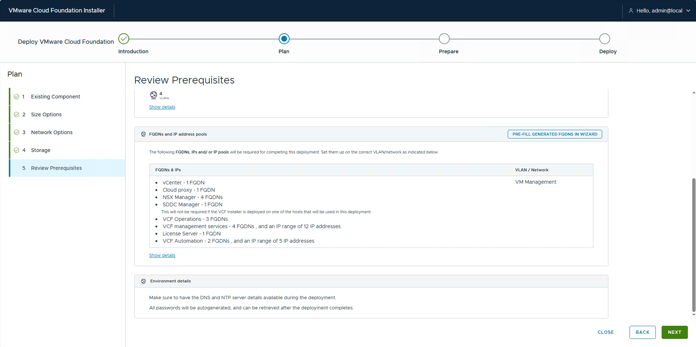

Scrolling the prerequisites shows every FQDN and IP pool you'll need — vCenter, NSX Manager (4 FQDNs), SDDC Manager, VCF Operations (3 FQDNs), VCF management services (4 FQDNs + a 12-IP range), License Server, VCF Automation — plus a reminder to have DNS and NTP ready.

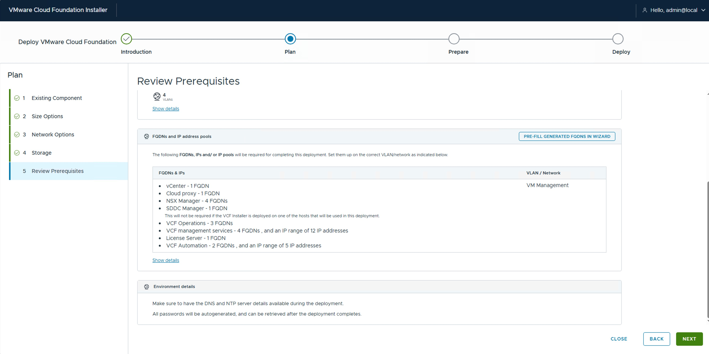

One genuinely nice touch under Environment details: **all appliance passwords are autogenerated during deployment and can be retrieved afterward.** You don't have to invent and track a dozen credentials up front — one less thing to fat-finger.

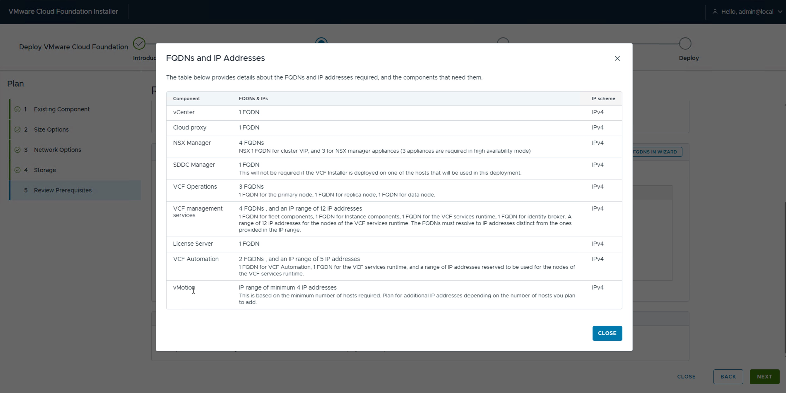

The full FQDN/IP detail table is worth a careful read. Note that **NSX Manager needs 4 FQDNs** (one cluster VIP plus three appliances in HA), VCF management services wants 4 FQDNs and a 12-IP range, and vMotion needs a minimum 4-IP range. Get DNS right here and the rest of the wizard flies.

## Phase 6 — Pre-Filling & Validating FQDNs

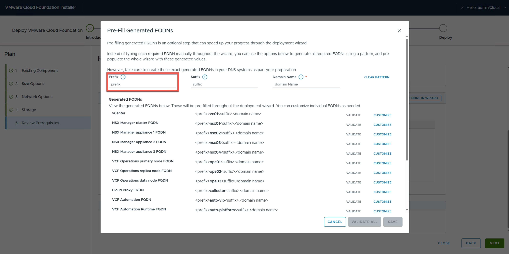

Here's a real 9.1 time-saver: **Pre-Fill Generated FQDNs.** Instead of hand-typing every hostname through the wizard, you define a prefix/suffix/domain pattern once and it generates them all.

**Tip:** This pairs beautifully with the prerequisites JSON template — define your naming pattern here, then pre-create those exact records in DNS *before* you validate. Far fewer round trips.

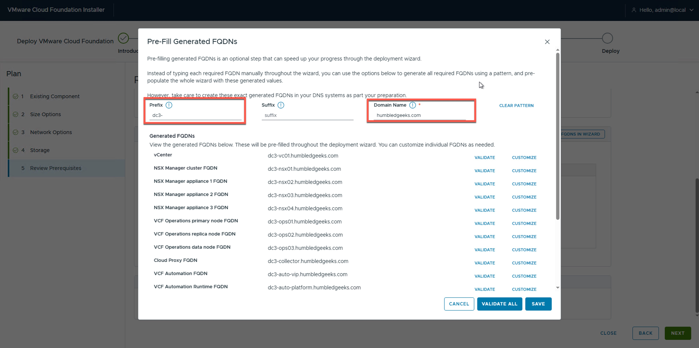

With prefix `dc3-` and domain `humbledgeeks.com` (both highlighted), the installer instantly generates every component FQDN — `dc3-vc01`, `dc3-nsx01`–`04`, `dc3-ops01`–`03`, `dc3-collector`, `dc3-auto-vip`, and so on.

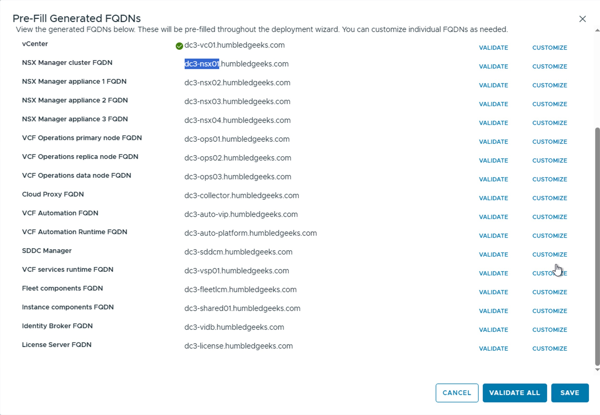

The complete generated set, zoomed in: vCenter, NSX cluster + appliances, VCF Operations nodes, Cloud Proxy, VCF Automation, SDDC Manager (`dc3-sddcm`), VCF services runtime, Fleet/Instance components, Identity Broker, and License Server.

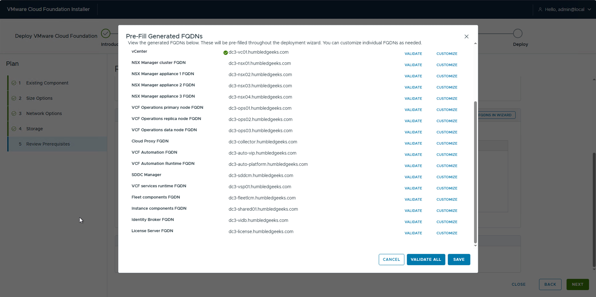

Hitting **Validate All** checks each generated FQDN against DNS in one shot. This is where missing or mistyped DNS records surface *immediately* instead of failing mid-deployment.

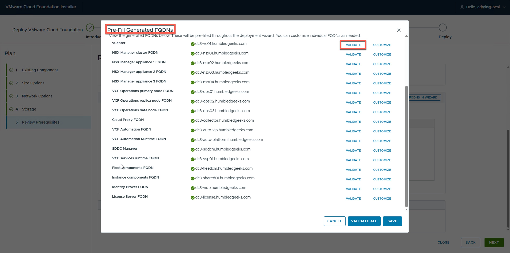

Every FQDN validated green. DNS is clean, and these names are now pre-filled throughout the rest of the wizard.

## Phase 7 — The Prepare Stage: Hosts

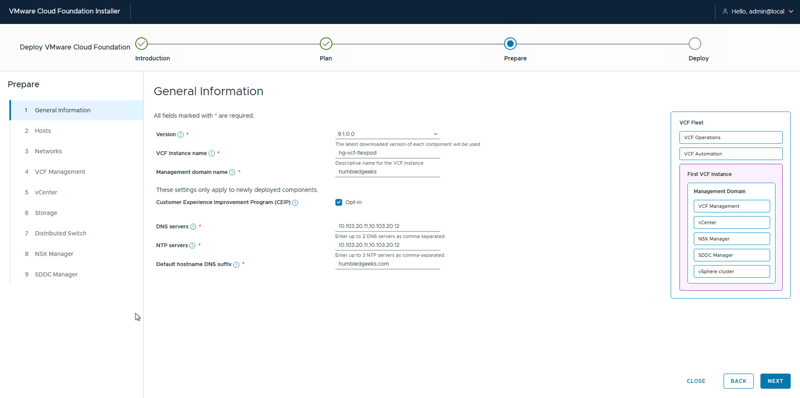

Into the **Prepare** stage. General Information captures the essentials: version **9.1.0.0**, VCF instance name `hg-vcf-flexpod`, management domain `humbledgeeks`, DNS/NTP servers, and the default hostname suffix `humbledgeeks.com`. The VCF Fleet diagram on the right is your live map of what's about to be built.

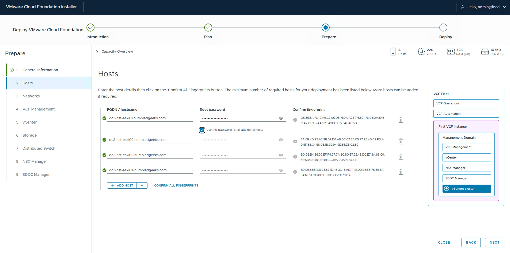

The Hosts step with all four ESXi hosts (`dc3-hst-esxi01`–`04`) entered, a single shared root password, and **fingerprints confirmed clean** — no certificate or SSH errors. That smooth result wasn't luck: those hosts were hardened and re-certificated before I ever got here. Let me back up and show that prep, because it's the part most walkthroughs skip.

## Phase 8 — Hardening & Regenerating ESXi Host Certificates

> If you install ESXi and then set hostnames/DNS afterward, the auto-generated host certificate won't match the final FQDN — and VCF's validation will (rightly) refuse those hosts. The fix is to harden and regenerate certs *before* bring-up. Both scripts below are mine.

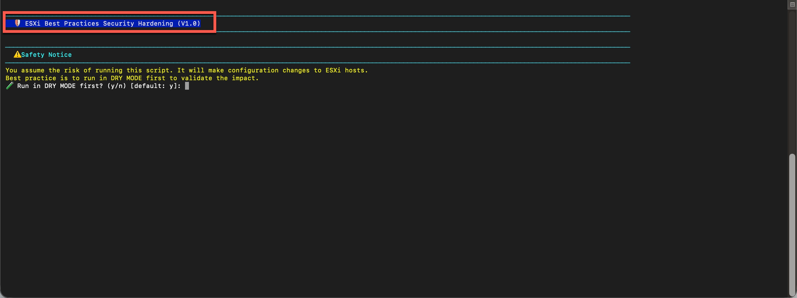

First, my **ESXi Best Practices Security Hardening** script (V1.0). I like that it insists on a **DRY MODE** run first — it shows you every change before it touches a host. You assume the risk of running it, so previewing is the right default. Both PowerShell scripts I use in this section — the Best Practices & Security Hardening script and the host certificate regeneration utility — are up on [my GitHub](https://github.com/humbledgeeks/infra-automation) if you want to grab them and adapt them to your own environment.

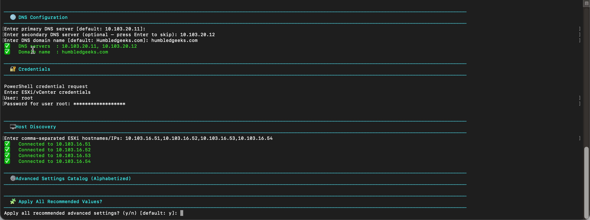

The hardening script collects DNS (`10.103.20.11`/`.12`, domain `humbledgeeks.com`) and root credentials, then discovers and connects to all four hosts by their management IPs (`10.103.16.51`–`54`).

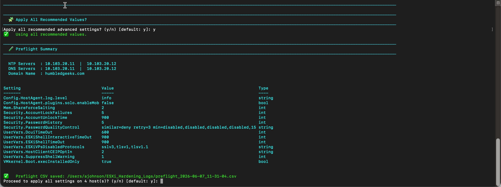

The preflight summary before anything is applied: NTP/DNS, plus the security baseline it'll enforce — account lockout, password quality, shell timeouts, disabling sslv3/TLS 1.0/TLS 1.1, CEIP opt-in, exec-installed-only. It even saves the plan to a CSV.

**Tip:** Hardening *before* bring-up means every host enters VCF with the same known-good baseline. Do it once, consistently, on every host.

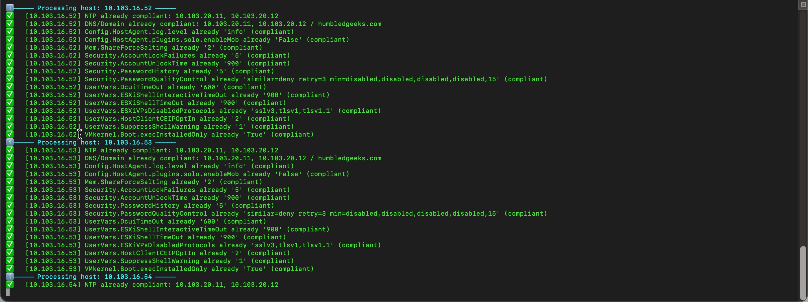

Applying across the fleet — each host reports setting-by-setting, and most come back "already compliant," confirming the baseline is consistent on all four.

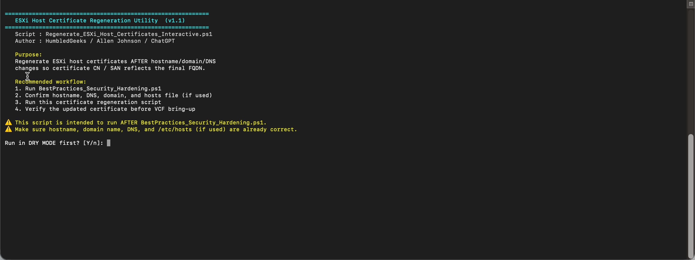

Now the second tool: the **ESXi Host Certificate Regeneration Utility.** Its whole job is to reissue host certs *after* the hostname/DNS changes so the certificate CN/SAN finally matches the real FQDN — which is exactly what VCF's host validation checks.

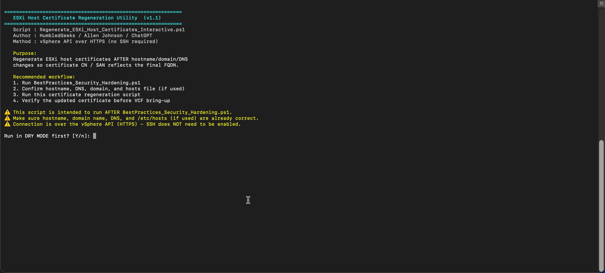

The v1.1 utility uses a clean method line: **vSphere API over HTTPS — no SSH required.** That matters, because the hardening I just applied locks SSH down; doing certificate work over the API sidesteps that entirely. The recommended order is right there on screen: harden → confirm hostname/DNS → regenerate certs → verify before VCF bring-up.

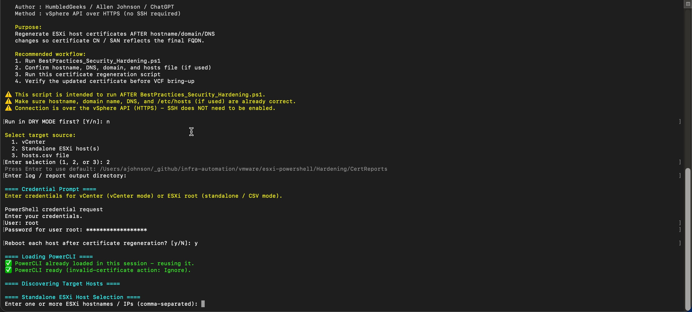

Running it for real: DRY mode off, target source "Standalone ESXi host(s)," root credentials, reboot each host after regeneration. PowerCLI loads and the script discovers the hosts and re-issues their certificates so the SAN matches `dc3-hst-esxiNN.humbledgeeks.com`. *That's* why the Hosts step back in Phase 7 validated clean.

## Phase 9 — Capacity Reality Check & Right-Sizing

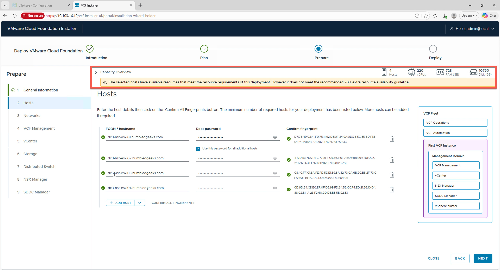

With certs sorted, the host fingerprints validate — but the Capacity Overview throws a yellow flag: the hosts **meet** the deployment's resource requirements but **don't** clear the recommended 20% extra-capacity guideline. In a lab that's a warning, not a blocker.

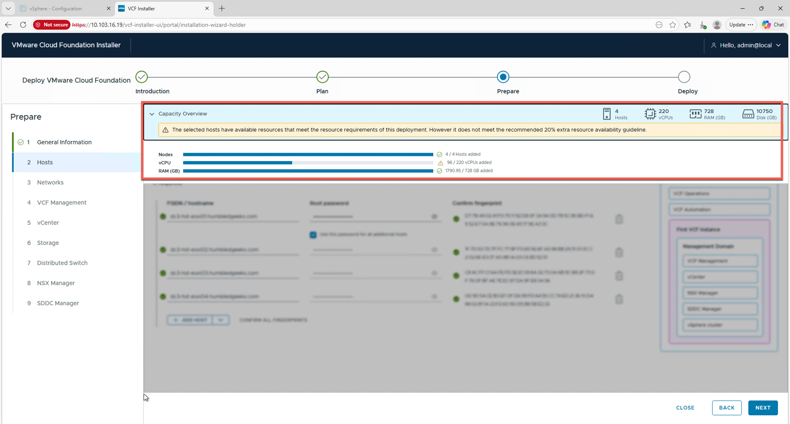

Expanding it shows the breakdown — 4/4 nodes added, with vCPU and RAM tallied against what the HA/Medium model reserves. It's a clean, at-a-glance way to see whether your hardware can actually carry the fleet you designed. Mine can run it, but only just.

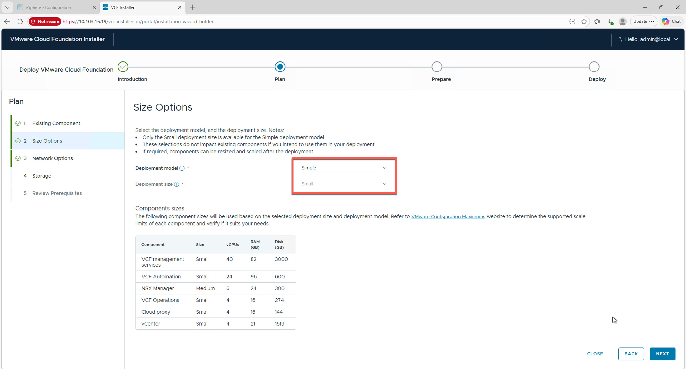

So I went back to **Plan → Size Options** and switched from **High Availability / Medium** to **Simple / Small.** Watch the appetite drop — VCF management services from 84 vCPUs to 40, and the whole stack shrinks to fit four lab hosts.

**Gotcha:** This is the single most important planning lesson in the whole post. If your hardware can't satisfy HA/Medium *plus* the 20% buffer, you have two honest choices: add hosts, or drop to a smaller model and accept the scaling limits. I chose Simple/Small because it's a lab. In production, **size the hardware to the model — don't shrink the model to the hardware.**

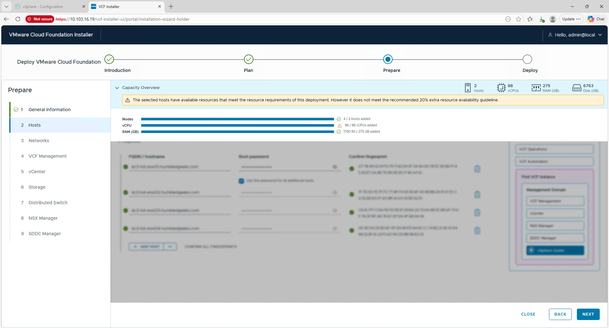

After resizing, the Capacity Overview reflects the smaller footprint — the minimum bar drops accordingly and my four hosts now sit comfortably above it (still shy of the 20% buffer, which is fine for a lab).

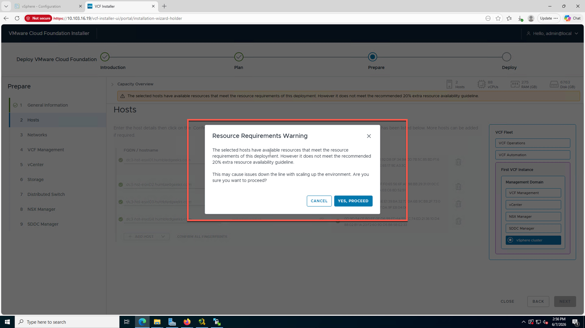

The installer makes you acknowledge it: a modal spelling out that the hosts meet requirements but not the recommended 20% buffer, warning it "may cause issues down the line with scaling up." In production, listen to this. In the lab — **Yes, Proceed.**

## Phase 10 — Finishing the Prepare Stage

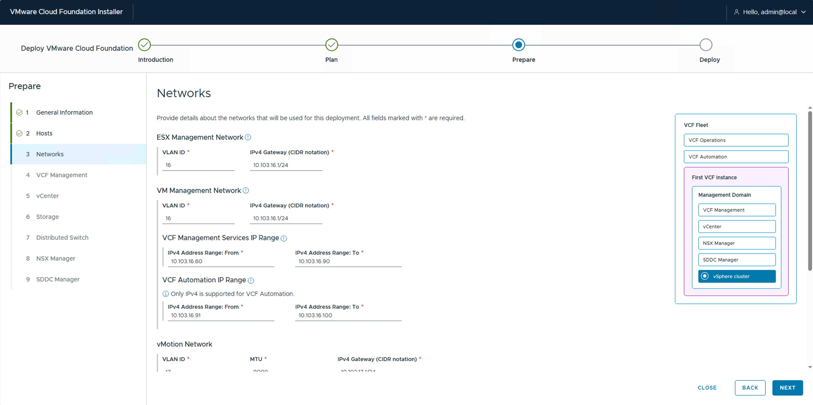

The **Networks** step — ESX and VM management on VLAN 16 (`10.103.16.0/24`), the VCF Management Services IP range (`.60`–`.90`), VCF Automation (`.91`–`.100`), and vMotion on VLAN 17 with a **9000 MTU**. All that FQDN/IP prep from Phase 6 pays off right here.

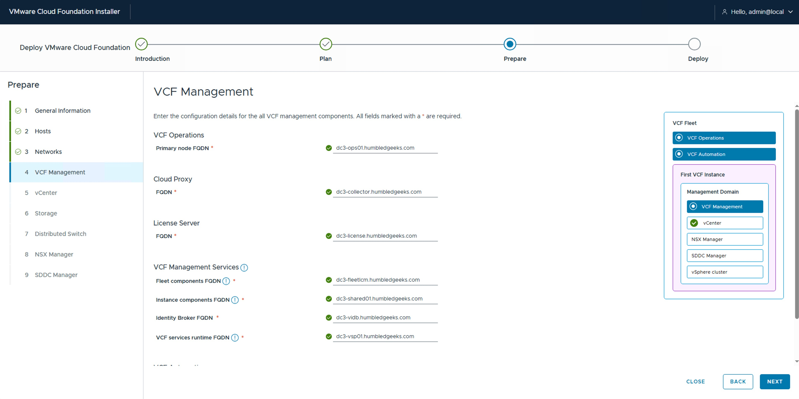

**VCF Management** components, all FQDNs validating green: VCF Operations (`dc3-ops01`), Cloud Proxy (`dc3-collector`), License Server (`dc3-license`), plus Fleet components, Instance components, Identity Broker, and VCF services runtime.

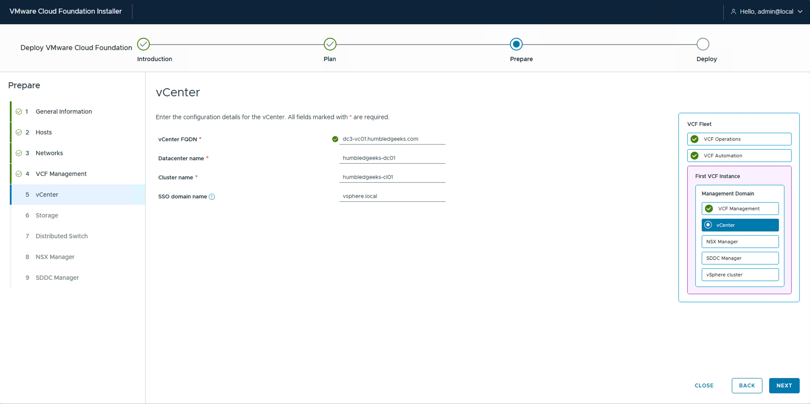

**vCenter** details: FQDN `dc3-vc01`, datacenter `humbledgeeks-dc01`, cluster `humbledgeeks-cl01`, and the SSO domain `vsphere.local`. The fleet diagram ticks vCenter green.

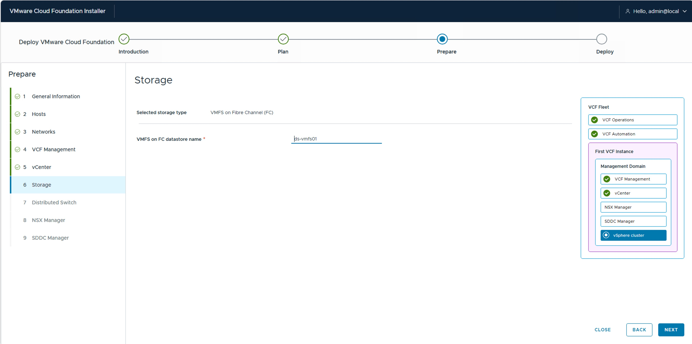

Storage confirmed in the Prepare stage: **VMFS on Fibre Channel**, datastore `ds-vmfs01` — the management domain landing on the NetApp ASA A30 array, exactly as planned.

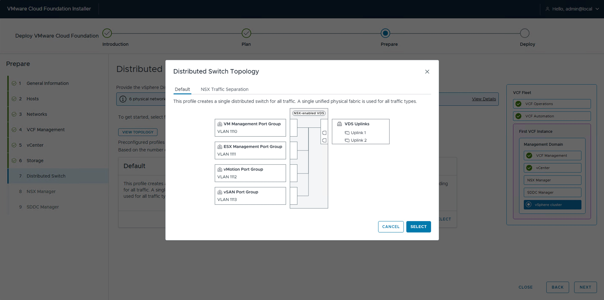

The **Distributed Switch Topology** picker — the Default profile builds a single NSX-enabled VDS carrying VM management, ESX management, vMotion, and vSAN port groups across two uplinks (there's also an NSX Traffic Separation profile).

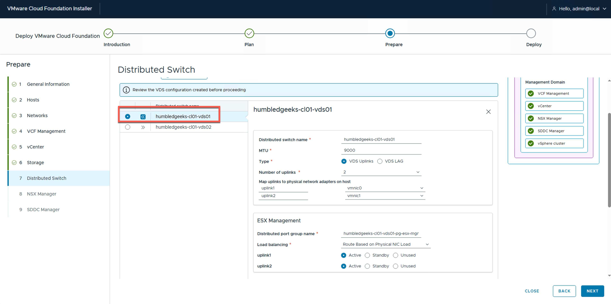

Reviewing the first VDS (`humbledgeeks-cl01-vds01`): MTU 9000, two uplinks mapped to `vmnic0`/`vmnic1`, ESX management port group with route-based-on-physical-NIC-load balancing.

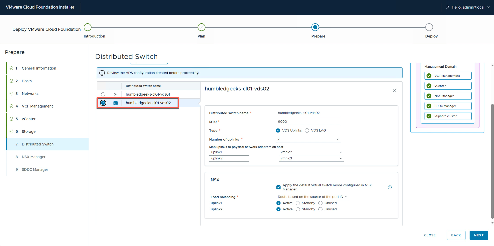

A second VDS (`humbledgeeks-cl01-vds02`) on `vmnic2`/`vmnic3` dedicated to **NSX** — it applies the default virtual switch mode from NSX Manager and load-balances by source port ID. Clean separation of overlay from infrastructure traffic.

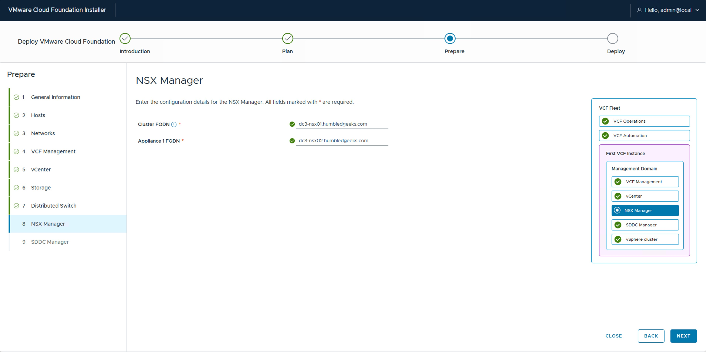

The **NSX Manager** step — cluster FQDN `dc3-nsx01` and appliance `dc3-nsx02`, both validated. With Simple sizing this is a lean NSX footprint rather than the full three-appliance HA cluster.

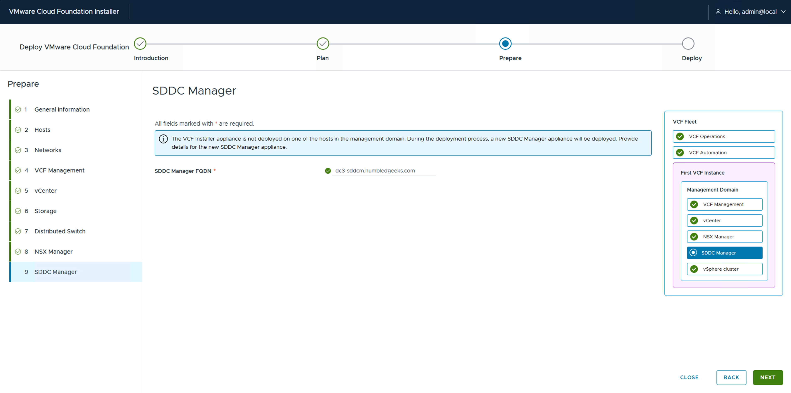

The last Prepare step: **SDDC Manager** (`dc3-sddcm`). The installer reminds you it'll deploy a brand-new SDDC Manager appliance into the management domain during bring-up — you just provide the FQDN.

## Phase 11 — Review & Pre-Deploy Validation

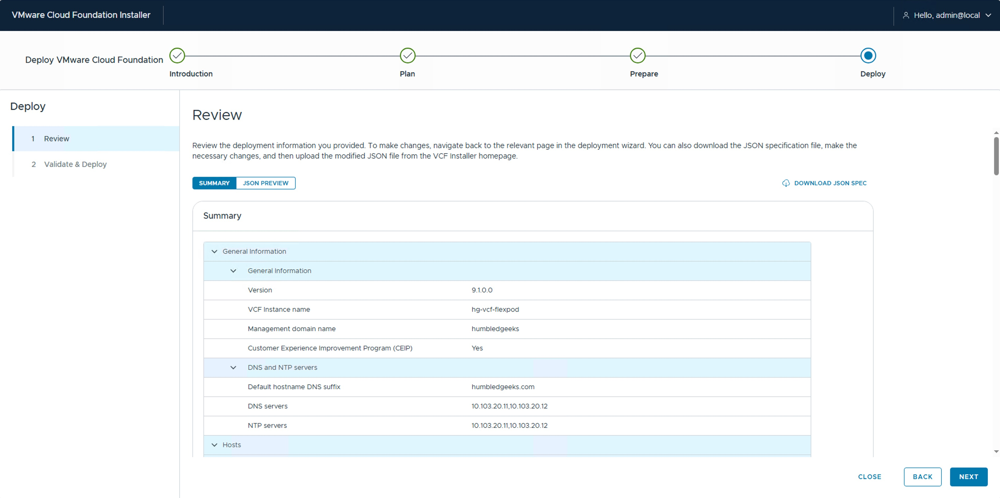

Into the **Deploy** stage. The Review screen plays back everything I entered — version 9.1.0.0, instance `hg-vcf-flexpod`, domain `humbledgeeks`, DNS/NTP — with a Summary view, a JSON Preview, and a **Download JSON Spec** button to save and reuse the whole config.

**Tip:** Download this JSON spec and store it with your runbook. It's your as-built record *and* the fastest way to rebuild this exact environment via "Deploy using JSON Spec" later.

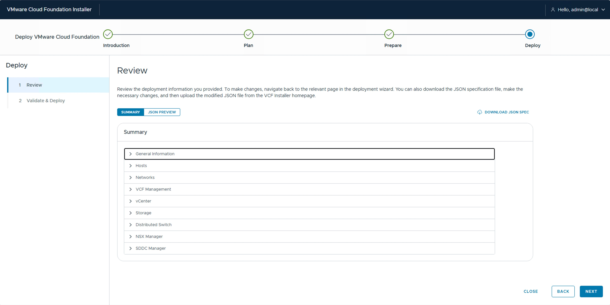

The collapsible review of every section — General Information, Hosts, Networks, VCF Management, vCenter, Storage, Distributed Switch, NSX Manager, SDDC Manager. Last chance to expand any of these and catch a typo before deploying.

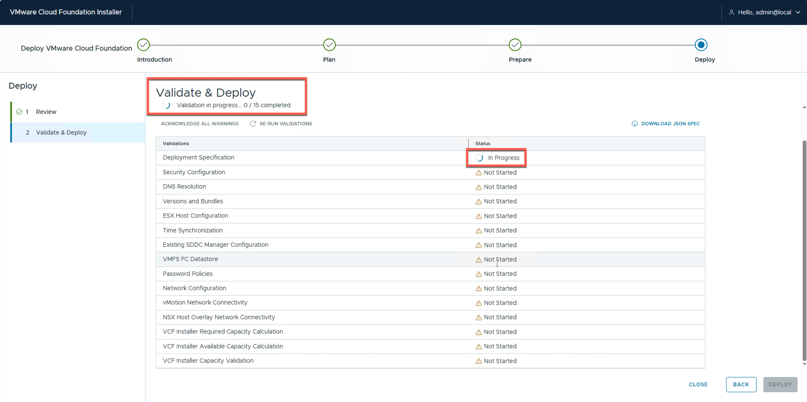

**Validate & Deploy** kicks off a **15-check pre-flight** — deployment spec, security, DNS, versions, ESX host config, time sync, VMFS FC datastore, password policies, network/vMotion/NSX-overlay connectivity, and capacity. This is the safety net before anything is built.

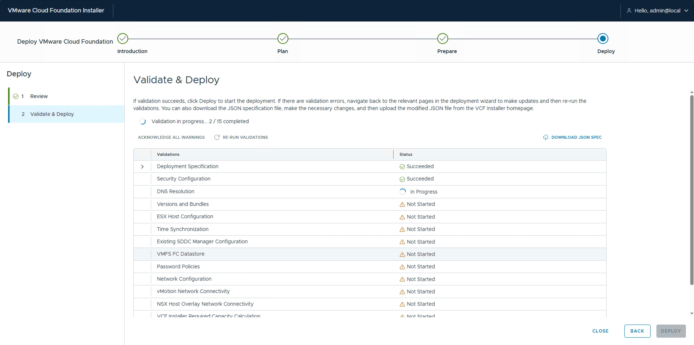

Validation rolling through — Deployment Specification and Security Configuration pass; DNS Resolution running. Watching these go green one by one beats discovering a problem an hour into bring-up.

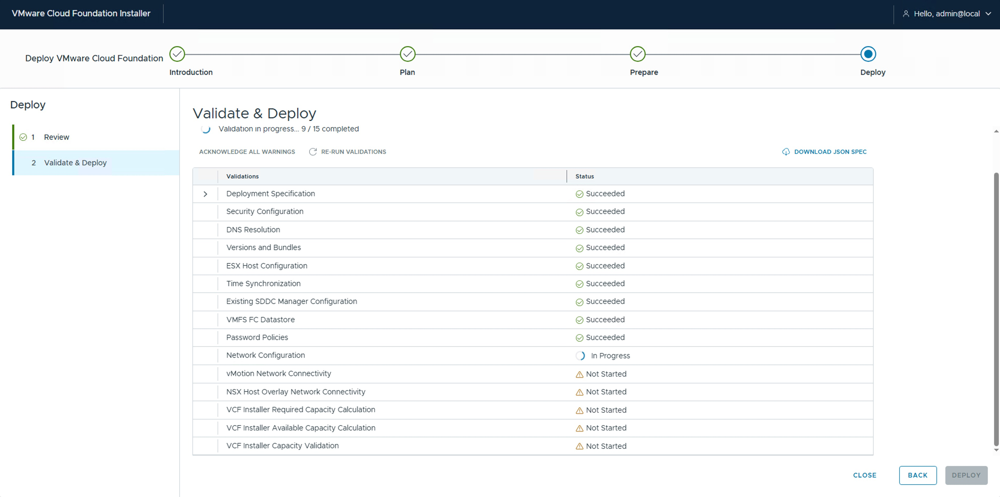

Nine of fifteen done and all green so far — host config, time sync, VMFS FC datastore, and password policies all validated; network configuration in progress.

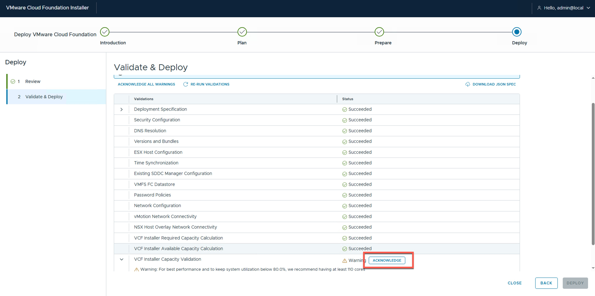

All checks pass except one **warning**: VCF Installer Capacity Validation recommends at least **110 cores** to keep utilization under 80%.

**Gotcha:** There's that resource theme one more time. My four lab hosts clear the functional minimum but not the performance recommendation. In production I'd take this seriously — sustained high utilization is how you turn a healthy fleet into a support case. In the lab, I acknowledge and continue.

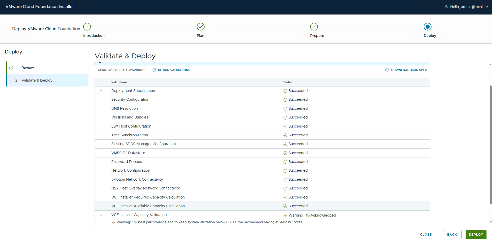

Warning acknowledged, all 15 validations green, and the **DEPLOY** button finally lights up. Everything's been checked; time to let the installer build the fleet.

## Phase 12 — Deploy: Watching the Fleet Come Up

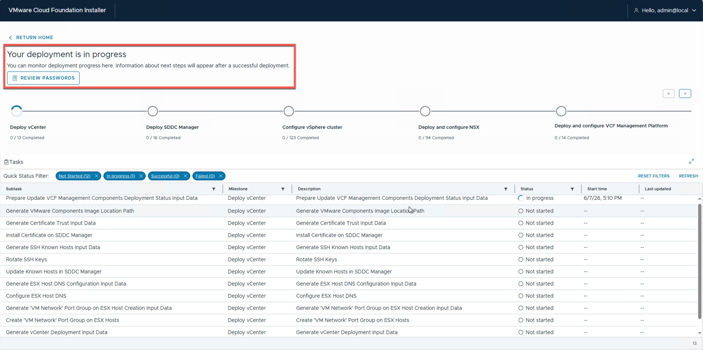

"**Your deployment is in progress.**" This is the monitoring UI I wanted. It tracks the milestones — Deploy vCenter, Deploy SDDC Manager, Configure vSphere cluster (123 tasks!), Deploy and configure NSX, Deploy and configure VCF Management Platform — with live, task-by-task status underneath.

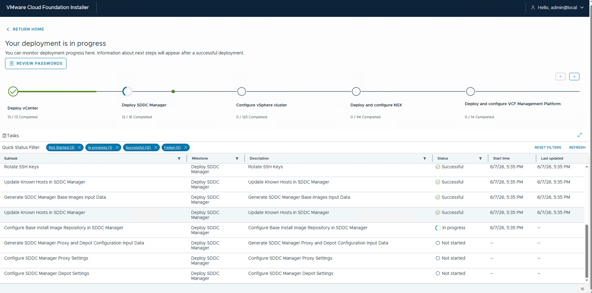

A while later: **Deploy vCenter shows 13/13 complete** and SDDC Manager is underway (12/16) — rotating SSH keys, updating known hosts, building base image repositories. From here it's hands-off automation.

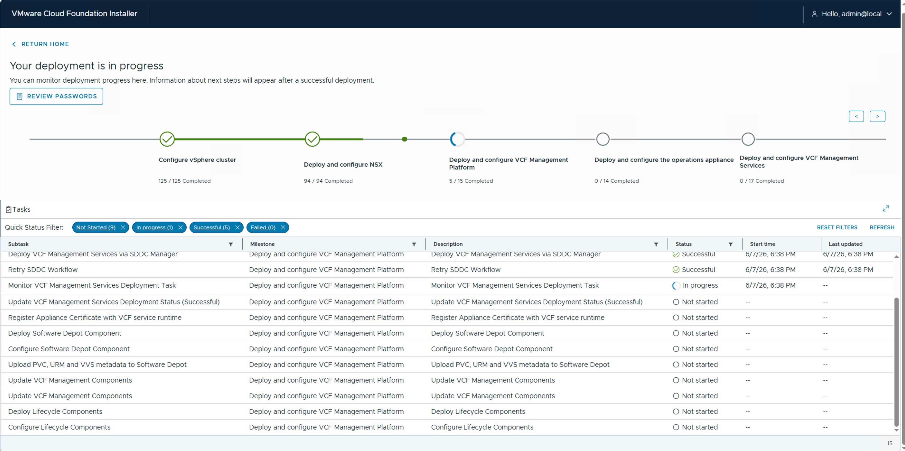

Further in: **Configure vSphere cluster (125/125) and Deploy and configure NSX (94/94) are both complete**, and the VCF Management Platform milestone is rolling. This is the part 9.0.2 didn't do for you — the fleet management plane assembling itself.

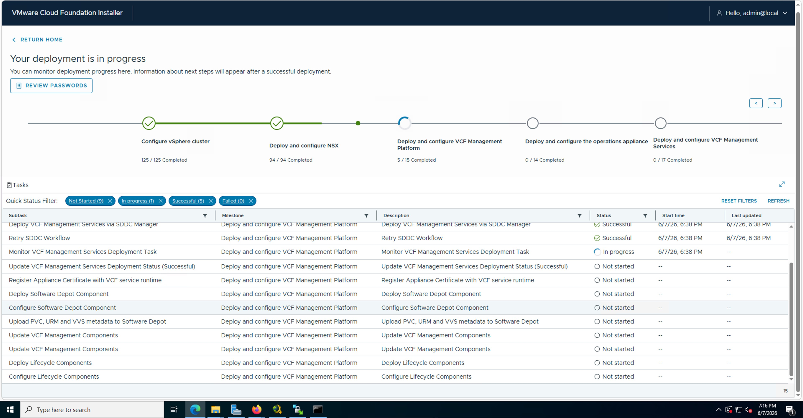

The VCF Management Platform milestone grinds through its task list — deploying lifecycle components, configuring the software depot, registering appliance certificates. This is also the longest stretch, and a big chunk of why 9.1 takes roughly twice as long as 9.0.2.

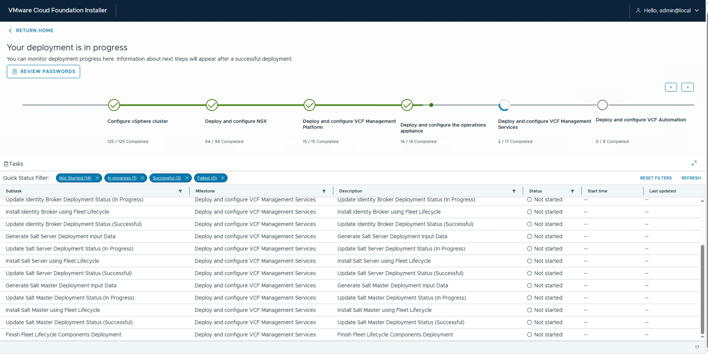

More milestones tick green — **VCF Management Platform (15/15) and the operations appliance (14/14) complete** — as VCF Management Services and VCF Automation begin. The fleet is really taking shape now.

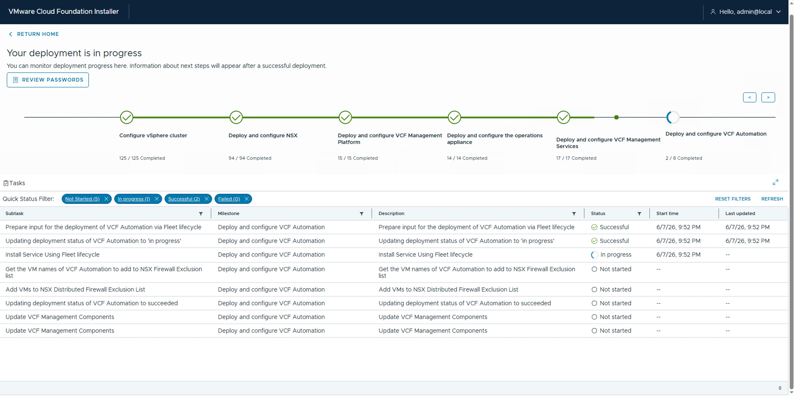

**VCF Management Services hits 17/17** and VCF Automation starts deploying via Fleet lifecycle. One milestone to go.

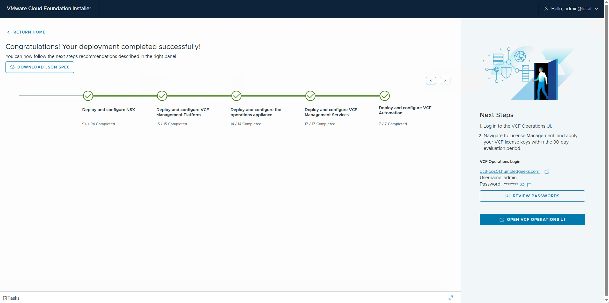

And there it is: **"Congratulations! Your deployment completed successfully!"** Every milestone green, and a Next Steps panel pointing me to the VCF Operations UI (`dc3-ops01.humbledgeeks.com`) with a reminder to **apply license keys within the 90-day evaluation period**. A full VCF 9.1 management domain — vCenter, NSX, SDDC Manager, VCF Operations, and VCF Automation — built and running on four lab hosts.

**Tip:** Click **Download JSON Spec** one more time here and use **Review Passwords** to capture all those autogenerated credentials before you do anything else. Store both somewhere safe — that's your as-built and your break-glass.

## The Payoff and What I Took Away

Standing back, VCF 9.1's deployment experience is a real step up from the 9.0.2 runs I did during study: one unified installer, a cleaner depot/binary flow, FQDN pre-fill and validation that catch DNS problems early, and pre-flight checks that won't let you deploy onto misconfigured hosts. Because I renamed my hosts after installing ESXi, I hardened them and regenerated their certificates up front — best practice anyway — so they matched their final FQDNs and sailed through validation. The wizard genuinely impressed me; the only real price of admission is time, since it ran almost double the length of a comparable 9.0.2 deployment.

And the resource lesson bears repeating: **9.1 is hungry.** I got it onto four hosts by right-sizing to Simple/Small, but the installer was very clear about what a production-grade HA/Medium fleet really wants. Plan for that before you order hardware.

If you're still on vSphere and dreading a rebuild — remember you may not need one. The [convergence/upgrade path from vSphere 8.0 U3a+ into VCF 9.1](https://williamlam.com/2026/05/vcf-9-1-demystifying-supported-upgrade-paths-to-9-1.html) means you can bring your existing vCenter and hosts forward instead of starting over.

### What's Next

This post stood up the **management domain** — the foundation everything else hangs off of. Here's where the series goes from here:

- **Build a workload domain:** adding **four more hosts** to run actual workloads on top of the management domain.
- **License the environment:** logging into VCF Operations and applying license keys before that 90-day evaluation clock runs out.
- **Converge my existing vCenter 8.0 U3 lab:** putting that upgrade path to the test and bringing a standalone vSphere environment into the fleet.
- More Zero to VCAP study notes and labs as I keep pushing toward the VCAP-VCF Administrator cert.

Follow along on [HumbledGeeks.com](https://humbledgeeks.com), or connect with me on LinkedIn if you're on the same journey. As always — built in the lab, mistakes and all.
