# Zero to VCAP: Building a VCF 9.1 Workload Domain, Screen by Screen

In the [last post](https://humbledgeeks.com/) <!-- TODO: swap in Part 1 URL once it's live --> I stood up a full **VMware Cloud Foundation 9.1 management domain** — vCenter, NSX, SDDC Manager, VCF Operations, and VCF Automation — on four Cisco UCS B200 blades. That domain is the foundation everything else hangs off of, but you don't run real workloads on it. The management plane is for managing the fleet; tenant VMs and clusters live in a **workload domain**.

So this post does exactly what I promised at the end of Part 1: I take the **remaining four [Cisco UCS B200 blades](https://www.cisco.com/c/en/us/products/servers-unified-computing/ucs-b-series-blade-servers/datasheet-listing.html)** in the same [UCS 5108 chassis](https://www.cisco.com/c/en/us/products/servers-unified-computing/ucs-5100-series-blade-server-chassis/index.html) and turn them into a **VI (Virtual Infrastructure) workload domain** — a second vCenter, a new vSphere cluster, NSX networking, and VMFS-on-FC storage off the same [NetApp ASA A30](https://www.netapp.com/asa/) all-flash SAN array. I'd already started commissioning the hosts when I sat down to write this, and as always I grabbed a screenshot at every screen so you can follow along.

I'll be honest about something up front: I've now deployed VCF — management domains and workload domains — more times than I can count, across 9.0.2 and now 9.1. Every single run teaches me something, and the runs that *fight back* teach me the most. This build was no exception: I sailed through commissioning, got most of the way through the workload-domain wizard, and then hit a wall near the end that stopped me cold (more on that when we get there). Untangling it sent me down a multi-day NSX rabbit hole — and I came out the other side knowing the platform better than any clean run ever taught me. That's the part of this journey I want to keep documenting: not just the happy path, but the walls, because the walls are where the learning lives. It's also exactly the kind of muscle memory I'm leaning on as I prep for my next VCF exam — the storage-heavy one I've got coming up shortly.

Same warning as last time: **this is a long one.** I'd rather over-document than leave you guessing at a screen. Grab a coffee.

## Management Domain vs. Workload Domain — and Why It Matters

If you're coming from classic vSphere, the VCF separation of "management domain" and "workload domain" is one of the first concepts worth getting straight — and it shows up on the VCAP-VCF blueprint.

- The **management domain** is deployed first (that was Part 1). It runs the VCF management plane itself: SDDC Manager, the first vCenter, an NSX instance, VCF Operations, and VCF Automation. It manages the fleet — you generally don't put production workloads on it.
- A **VI workload domain** is where your actual workloads live. Each VI workload domain gets **its own vCenter**, **its own vSphere cluster(s)**, and is attached to an **NSX instance** — either a brand-new one or an existing one you share. SDDC Manager provisions and lifecycle-manages all of it for you.

The payoff is operational separation with a single control plane: SDDC Manager patches, scales, and inventories every domain, but a problem (or a maintenance window) in a workload domain doesn't touch the management plane. Broadcom's own [Working with Workload Domains](https://techdocs.broadcom.com/us/en/vmware-cis/vcf/vcf-9-0-and-later/9-0/building-your-private-cloud-infrastructure/working-with-workload-domains.html) docs are the authoritative reference if you want the full architecture behind what I'm clicking through here.

## My Design Choices for This Workload Domain

Before the wizard, here's how I decided to build this WD — and why. Calling these out up front because the choices change which screens you see.

| Decision | What I chose | Why |
|---|---|---|
| **Principal storage** | VMFS on Fibre Channel ([NetApp ASA A30](https://www.netapp.com/asa/)) | Matches the management domain. My B200 blades are SAN-boot/diskless, so vSAN isn't on the table — the ASA A30 already serves the chassis over FC. |
| **NSX** | **Share the management domain's existing NSX instance** | Resource saver in the lab. Deploying a second NSX Manager cluster is a lot of appliances; sharing keeps me inside my host budget. |
| **vSphere Supervisor** | **Enabled** during the build | I want this domain ready for modern, Kubernetes-style workloads. Enabling it is also what surfaced the one real wall in this build — keep reading. |
| **Licensing** | Stay on the 90-day evaluation | I'll license the whole environment in a later post. For now the eval covers it. |
| **Hosts** | The 4 remaining B200 blades in the chassis | Finishes out the chassis — 4 for management, 4 for workloads. |

> **Gotcha:** Sharing an NSX instance is the right call for a lab, but in production it's a real tradeoff. A shared NSX instance means the management and workload domains share that networking fault domain and lifecycle. If you need hard isolation between the management plane and tenant networking, deploy a **dedicated** NSX instance for the workload domain instead. I'll point out the exact screen where you choose.

> **Tip:** Even though we're *sharing* NSX, a VI workload domain **always gets its own vCenter**. That surprises people who assume "shared NSX" means "shared everything." You'll still define a new vCenter (mine is `dc3-vc02`).

## The Storage Foundation — NetApp ASA A30 on a Cisco FlexPod

Before we touch SDDC Manager, it's worth saying out loud what this whole environment is sitting on, because the storage design is what makes (or breaks) a VMFS-on-FC workload domain. The entire `dc3` lab is a [Cisco and NetApp FlexPod](https://www.netapp.com/flexpod/) — the [validated converged-infrastructure design](https://www.cisco.com/site/us/en/solutions/computing/converged-infrastructure/flexpod/index.html) that pairs Cisco UCS compute and Nexus networking with NetApp ONTAP storage. I documented standing the whole thing up in my [FlexPod foundation post](https://humbledgeeks.com/automating-a-cisco-ucs-flexpod-with-netapp-asa-a30-on-broadcom-vcf/); this post is what gets built *on top* of it.

The array is a **[NetApp ASA A30](https://www.netapp.com/asa/)** — and the "ASA" part matters. The ASA (All-flash SAN Array) line is purpose-built for block storage: it's the [entry/midrange A-Series](https://www.netapp.com/product-updates/asa-a-series-entry-midrange-block-storage/) tuned for low-latency FC and iSCSI, as opposed to the unified AFF systems that also do NAS. For a VCF environment whose principal storage is **VMFS on Fibre Channel**, that's exactly the right tool: a block-optimized, all-flash target serving LUNs to diskless, SAN-boot blades.

Here's how the pieces line up, and why each choice points straight at VMFS-on-FC:

- **Compute:** Cisco UCS B200 blades in a [UCS 5108 chassis](https://www.cisco.com/c/en/us/products/servers-unified-computing/ucs-5100-series-blade-server-chassis/index.html), **diskless and SAN-boot**. No local capacity drives means **vSAN is off the table** — the cluster's storage has to come from the array.
- **Fabric:** the UCS fabric interconnects carry FC to the blades; the ASA A30 presents a LUN to all four hosts over that fabric.
- **Storage:** the ASA A30 serves a single shared VMFS datastore (`VMFS01`) to the new cluster, just like it does for the management domain.

> **Tip:** If you're choosing between a unified AFF and a SAN-only ASA for a VCF build that's committed to Fibre Channel, the ASA keeps the storage layer dead simple — block only, fewer moving parts, and a management model built around LUNs and igroups rather than also juggling NAS exports. For a VMFS-on-FC workload domain, simpler is a feature.

## Prerequisites — What I Did Before Touching SDDC Manager

A workload domain build only goes smoothly if the hosts and fabric are ready *before* you commission anything. Here's my pre-flight checklist for the four new blades:

- [ ] **ESXi installed, hardened, and certificates regenerated** on all four hosts so they match their final FQDNs. This is the exact same prep I documented in the [VCF 9.1 deployment post](https://humbledgeeks.com/) <!-- TODO: Part 1 URL --> — my PowerShell hardening and cert-regen scripts — so I won't re-walk it here.
- [ ] **DNS forward and reverse records** for all four hosts *and* the new vCenter (`dc3-vc02`), on `humbledgeeks.com`.
- [ ] **NTP** configured and reachable on every host — time sync is a validation check and a silent killer if it's off.
- [ ] **FC LUN zoned and presented from the NetApp ASA A30 to all four hosts.** This is the big one for VMFS-on-FC. The datastore validation in the WD wizard will fail if the LUN isn't visible to every host. This is the same UCS/NetApp FC zoning dance from my [FlexPod foundation post](https://humbledgeeks.com/automating-a-cisco-ucs-flexpod-with-netapp-asa-a30-on-broadcom-vcf/).
- [ ] **Network pool** for the workload domain (vMotion + TEP ranges), so commissioning has IPs to hand out.

> **Tip:** If you only check one thing before commissioning, make it FC LUN visibility. "Host can't see the datastore" is the most common reason a VMFS-on-FC workload domain validation falls over, and it's entirely a fabric/array problem, not a VCF one.

---

## Phase 1 — Commission the Hosts

Everything starts in **SDDC Manager**. Before a host can join a workload domain it has to be *commissioned* into the SDDC Manager inventory, where it lands as an **Unassigned Host** ready to be picked up by a domain.

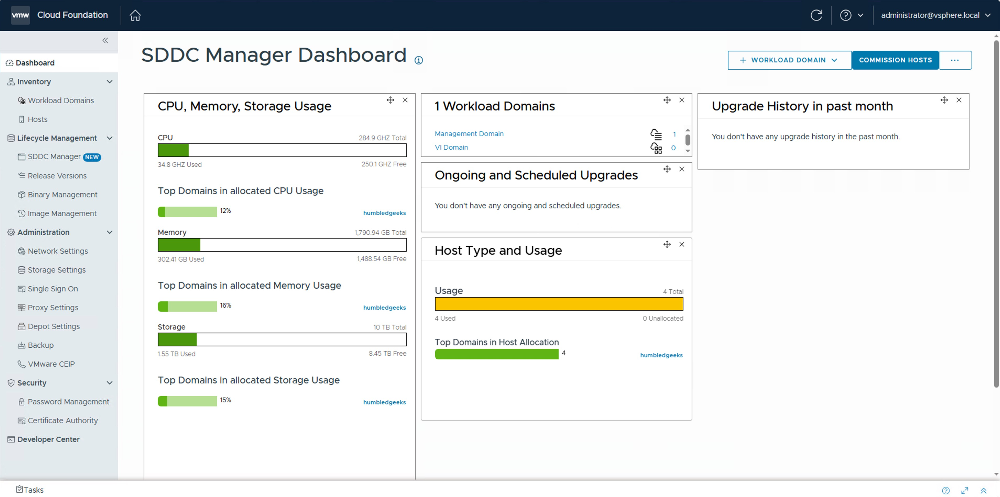

Here's my starting point: the SDDC Manager dashboard with exactly **one workload domain** (the management domain from Part 1) and **four hosts**, all in use. The Host Type and Usage widget shows 4 total, 4 used, 0 unallocated. By the end of this phase that picture changes.

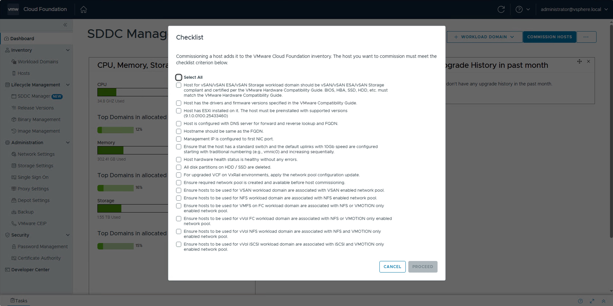

Clicking **Commission Hosts** opens a prerequisite checklist before it lets you do anything. This isn't busywork — read it. The lines about associating hosts with the right **network pool type** for their storage (VSAN vs. NFS vs. VMFS-on-FC vs. vVol) are the ones people skim past and regret later.

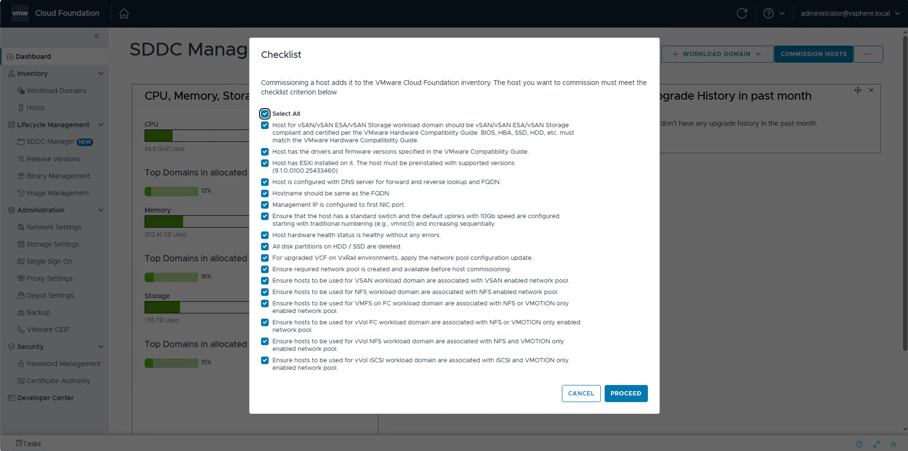

I confirmed each item against my actual environment — ESXi version, DNS forward/reverse, NTP, the network pool, and FC LUN presentation — then **Select All** and **Proceed**.

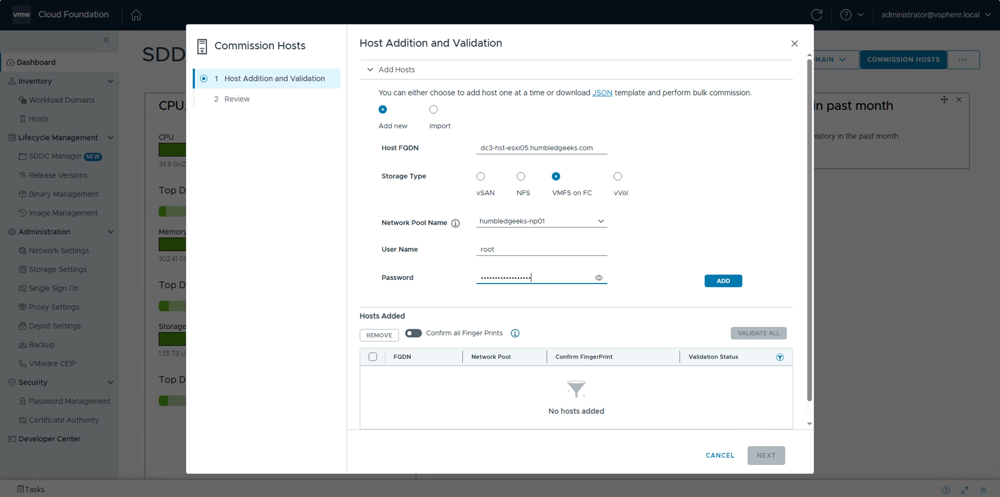

This is the heart of commissioning. For each host I enter the **FQDN**, pick the **Storage Type** — **VMFS on FC** for me — choose the **Network Pool** (`humbledgeeks-np01`), and supply the `root` credentials. You can add hosts one at a time or import a JSON template for a bulk run.

> **Gotcha:** Pick the **storage type at commission time** to match how the host will be used — I selected **VMFS on FC** here. Commission with the wrong storage type and you'll be decommissioning and redoing it before the WD wizard will take the host.

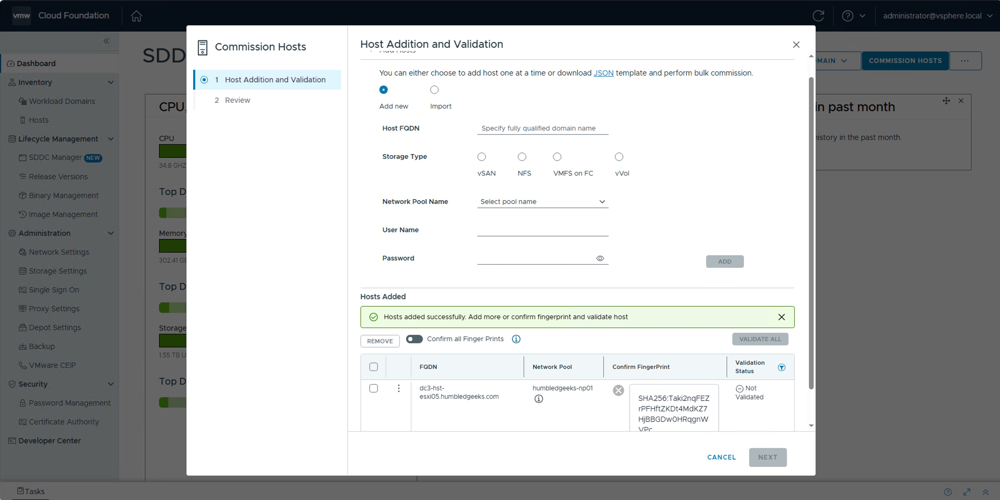

After **Add**, the host drops into the list with its SSL thumbprint captured and a status of **Not Validated**. I repeat for the other three blades.

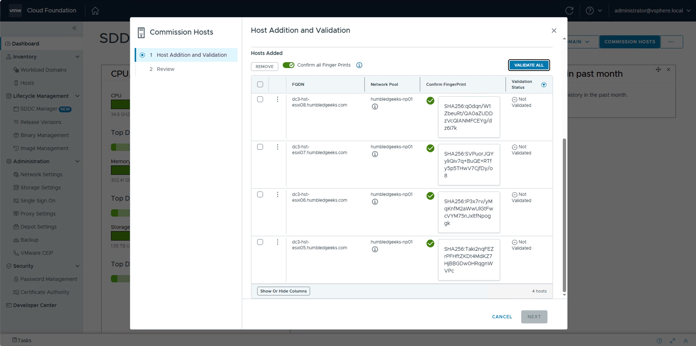

All four blades — `dc3-hst-esxi05` through `esxi08` — staged with their fingerprints confirmed. I flip on **Confirm all Finger Prints** and hit **Validate All**.

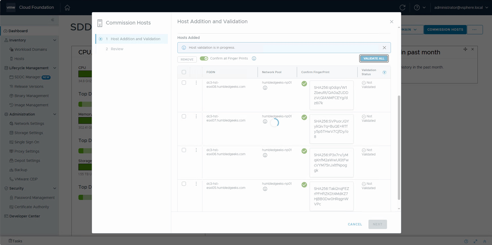

SDDC Manager reaches out to each host and checks it against the commission criteria — connectivity, version, network pool, and storage reachability.

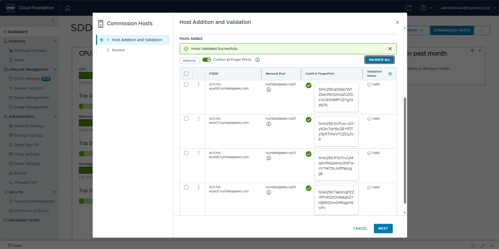

Green across the board — **Hosts Validated Successfully.** This is the screen you want to see; a red here usually traces back to DNS, NTP, or FC visibility, not VCF itself.

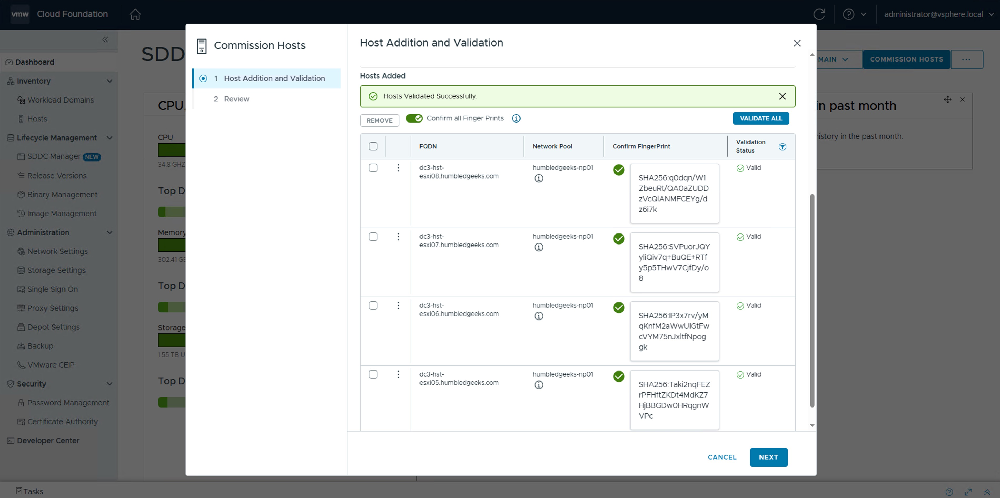

With all four valid, **Next** lights up.

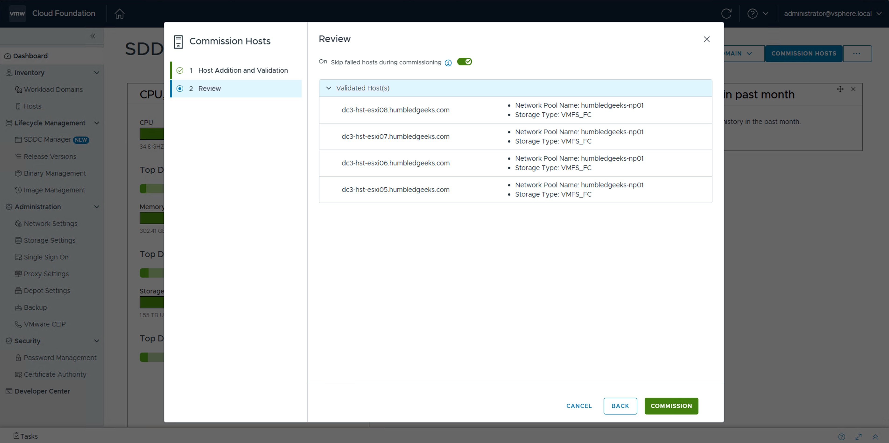

The **Review** step is a last look: each host with its network pool and **Storage Type: VMFS_FC**, plus a *Skip failed hosts during commissioning* toggle. I confirm it looks right and click **Commission**.

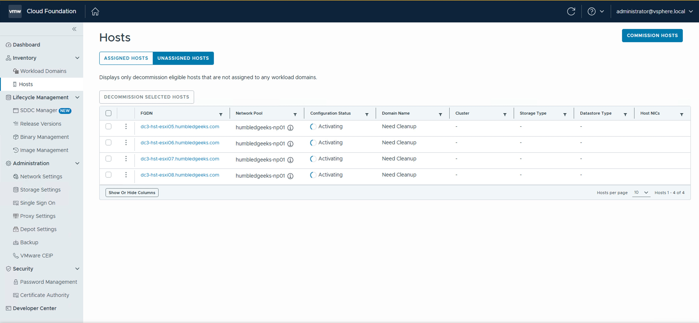

Right after commissioning, the new hosts show up under **Inventory → Hosts → Unassigned Hosts**, churning through **Activating / Need Cleanup**. That's normal — SDDC Manager is preparing each host.

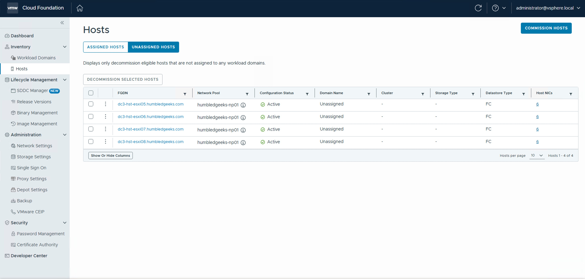

A few minutes later they settle into **Active** and **Unassigned** — exactly what I want. These four are now in inventory, FC datastore type, waiting to be claimed by a workload domain.

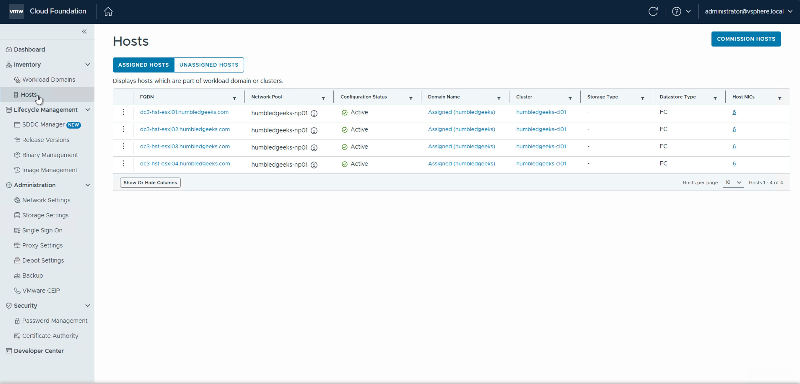

For contrast, the **Assigned Hosts** tab still shows my original four management hosts (`esxi01`–`esxi04`), bound to the `humbledgeeks` domain and cluster. The split is the whole point: four assigned to management, four unassigned and ready for workloads.

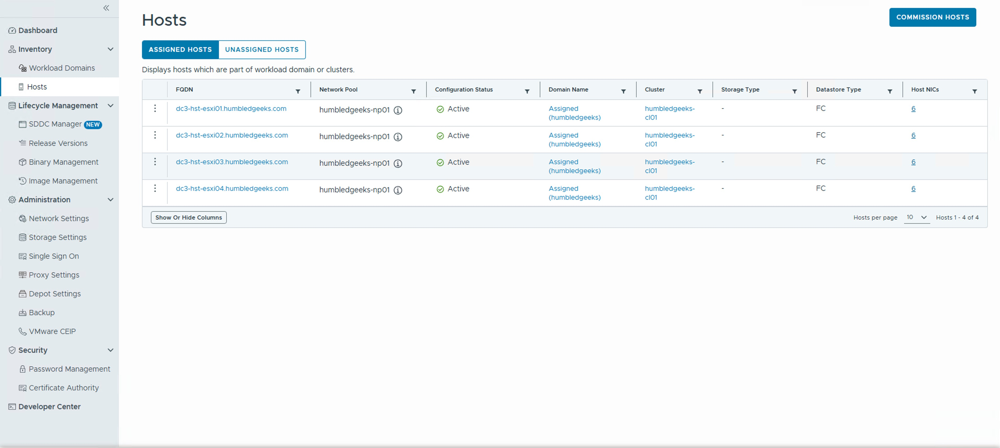

A closer look at those assigned hosts — all Active, all FC, all part of the management cluster.

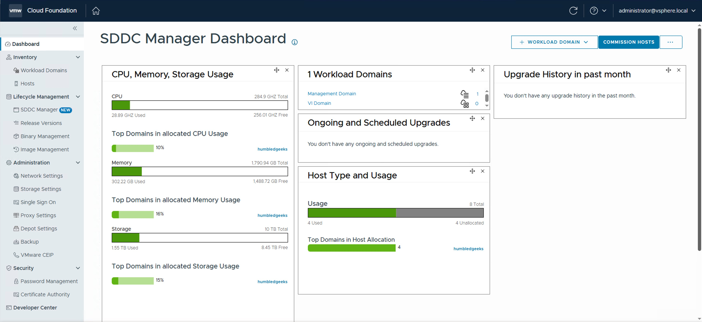

And the dashboard tells the story: **8 hosts total, 4 used, 4 unallocated.** The chassis is fully commissioned. Time to build the workload domain.

---

## Phase 2 — Start the VI Workload Domain Wizard

With four hosts unassigned, I kick off the workload domain from **SDDC Manager → Workload Domains → + Workload Domain → VI**. The 9.1 wizard runs eleven steps down the left rail — General Information through Validation — so I'll walk them in order. (Broadcom's [Deploy a VI Workload Domain Using the SDDC Manager UI](https://techdocs.broadcom.com/us/en/vmware-cis/vcf/vcf-9-0-and-later/9-0/building-your-private-cloud-infrastructure/working-with-workload-domains/deploy-a-vi-workload-domain-using-the-sddc-manager-ui.html) is the official version of this walkthrough if you want the docs alongside the screenshots.)

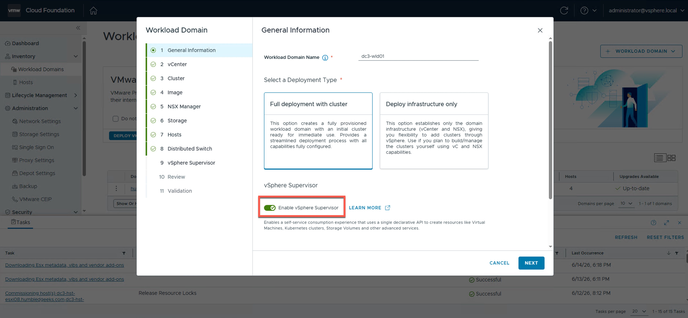

**Step 1 — General Information.** I name the domain `dc3-wld01` and choose **Full deployment with cluster** (the other option, *Deploy infrastructure only*, stands up just the domain infrastructure and lets you add clusters later). Note the **Enable vSphere Supervisor** toggle at the bottom — I switched it **on**. That single toggle is what makes this build more than a plain VI domain… and it's the reason I hit a wall a few steps from the finish line. Hold that thought.

## Phase 3 — The New vCenter

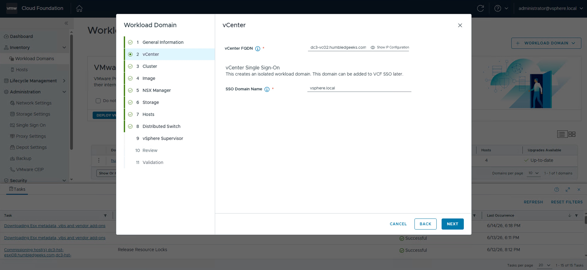

**Step 2 — vCenter.** A VI workload domain stands up its own vCenter; mine is `dc3-vc02.humbledgeeks.com`. Note the Single Sign-On text: *"This creates an isolated workload domain. This domain can be added to VCF SSO later."*

> **Gotcha (this changed in 9.x):** If you cut your teeth on earlier VCF, you probably expect a workload domain to *join* the management domain's SSO domain automatically. In VCF 9.1 a VI workload domain gets its **own isolated SSO domain** by default — you link domains into a shared VCF SSO afterward if you want one pane of glass. The Review screen later spells it out as "Creating new SSO domain." Don't let the familiar `vsphere.local` name fool you; it's a separate SSO instance.

> **Tip:** Make sure `dc3-vc02`'s forward and reverse DNS records resolve **before** this step — the wizard validates them, and a missing PTR record will stop you here.

## Phase 4 — Cluster

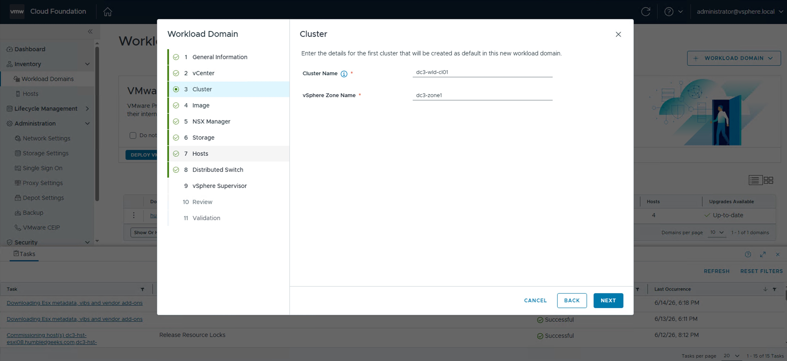

**Step 3 — Cluster.** The first cluster created in the new domain. I carry my naming convention forward: cluster `dc3-wld-cl01`, vSphere Zone `dc3-zone1`. The zone matters because I'm enabling Supervisor — vSphere Zones are how Supervisor maps availability.

## Phase 5 — Image

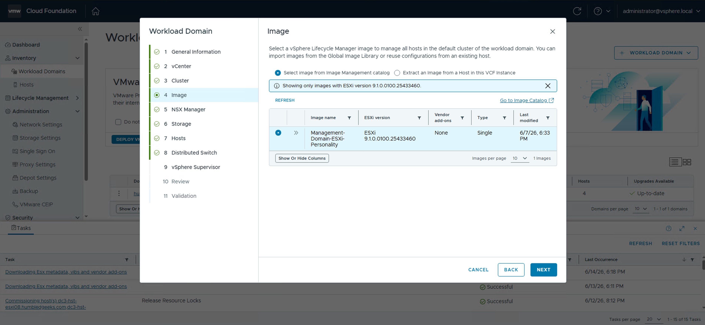

**Step 4 — Image.** This is vSphere Lifecycle Manager (vLCM) image-based cluster management. I select the existing **Management-Domain-ESXi-Personality** image (ESXi `9.1.0.0100`) so the new cluster is managed by the same desired-state image as the rest of the fleet. Consistent images across domains is what makes lifecycle operations sane later.

## Phase 6 — Networking and NSX (Sharing the Existing Instance)

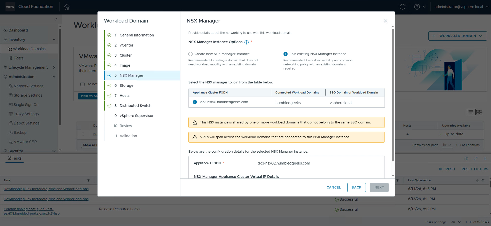

**Step 5 — NSX Manager.** This is where the shared-NSX decision from earlier becomes real. Instead of **Create new NSX Manager instance**, I pick **Join existing NSX Manager instance** and select the management domain's NSX (`dc3-nsx01`). VCF even warns me that this instance is shared and that **VPCs will span across the domains** connected to it — exactly the tradeoff I signed up for.

> **Gotcha:** This is the fork in the road. Choosing the existing instance here is what makes this a *shared-NSX* workload domain. If you want a dedicated networking fault domain, pick **Create new NSX instance** instead — and budget for the extra appliances.

## Phase 7 — Storage

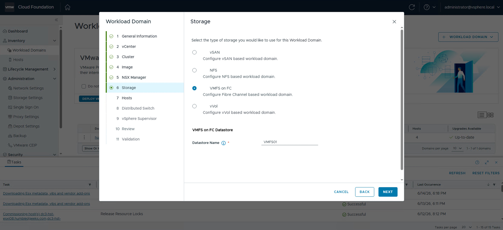

**Step 6 — Storage.** Four choices: vSAN, NFS, VMFS on FC, vVol. I pick **VMFS on FC** and name the datastore `VMFS01`. This is the payoff of committing to FC back at commission time — the host storage type and the domain storage type line up, and the [NetApp ASA A30](https://www.netapp.com/asa/) is already presenting the LUN to all four hosts over the FlexPod's Fibre Channel fabric.

## Phase 8 — Select the Hosts

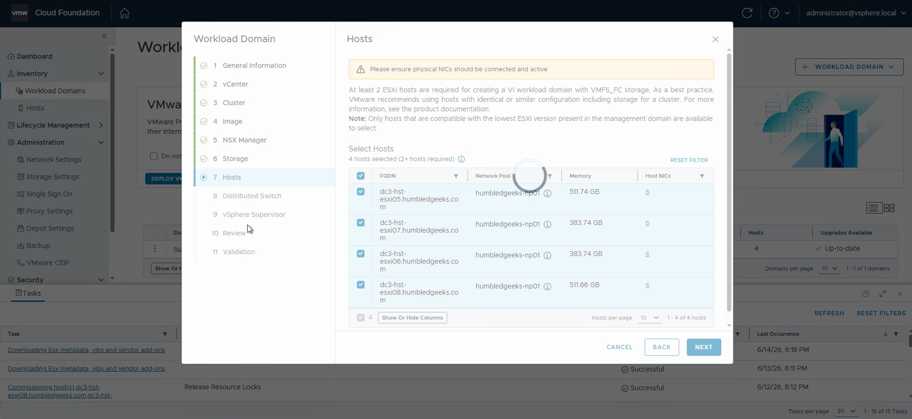

**Step 7 — Hosts.** The four blades I commissioned in Phase 1 show up here as available, and I select all four. Note the wizard's reminder that only hosts compatible with the lowest ESXi version in the management domain are selectable — another reason consistent images matter.

## Phase 9 — Distributed Switch

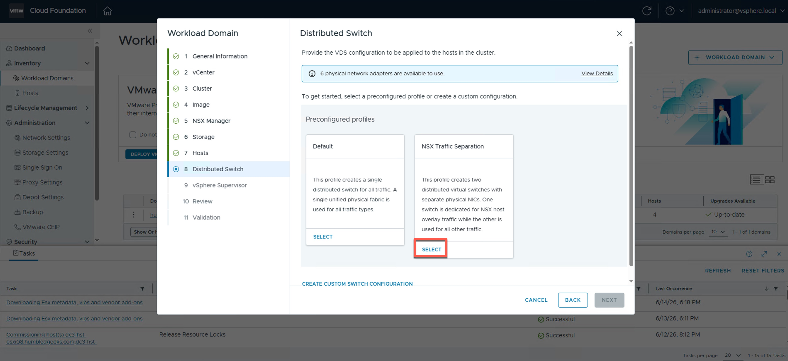

**Step 8 — Distributed Switch.** The wizard offers two preconfigured profiles. **Default** puts all traffic on one vDS; **NSX Traffic Separation** creates two vDSes — one dedicated to NSX overlay, the other for everything else. With six physical NICs to work with, I chose **NSX Traffic Separation** for cleaner overlay isolation.

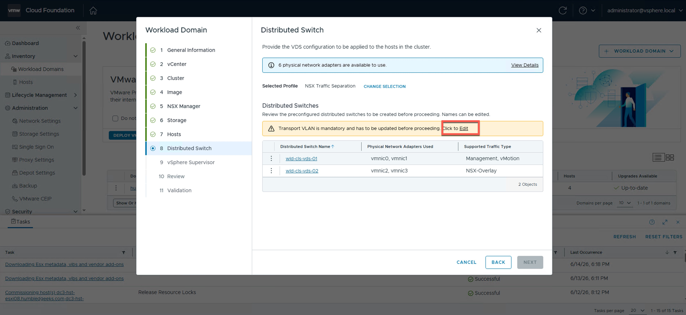

That profile lays out two switches — `wld-cls-vds-01` for Management/vMotion on `vmnic0,vmnic1`, and `wld-cls-vds-02` for NSX-Overlay on `vmnic2,vmnic3`. The yellow banner is the one to catch: **Transport VLAN is mandatory and has to be updated before proceeding.** Click to edit it.

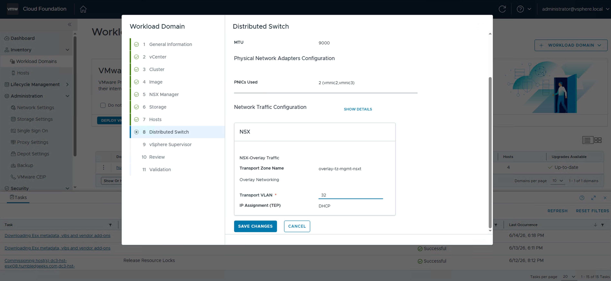

Inside the overlay switch config: **MTU 9000** (jumbo frames for the TEP network — this matters), the NSX-Overlay transport zone, **Transport VLAN 32**, and TEP **IP Assignment by DHCP**. I set the transport VLAN and **Save Changes**.

> **Tip:** That MTU 9000 isn't decorative. The overlay TEP network needs jumbo frames end-to-end, which means your physical underlay has to carry them too. If the fabric isn't set for 9000, overlay traffic breaks in ways that are miserable to diagnose after the fact.

## Phase 10 — vSphere Supervisor (and the Wall I Hit)

**Step 9 — vSphere Supervisor.** Because I toggled Supervisor on back in step 1, the wizard now asks me to configure it.

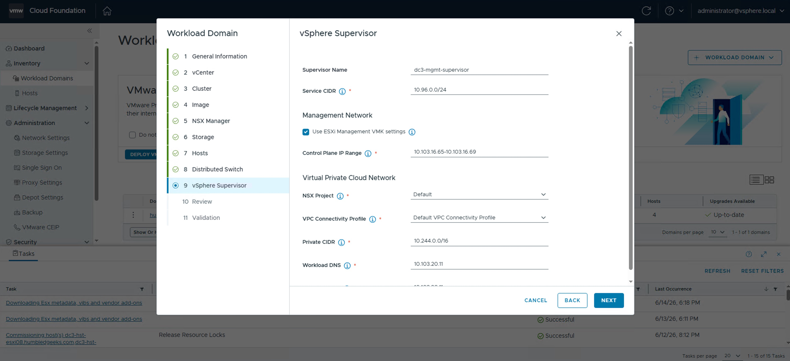

I name the Supervisor `dc3-mgmt-supervisor`, set the **Service CIDR** (`10.96.0.0/24`), reuse the ESXi management VMK settings, and give it a **Control Plane IP Range**. Then comes the **Virtual Private Cloud Network** section — NSX Project, **VPC Connectivity Profile**, Private CIDR, Workload DNS and NTP.

And here's the wall. The first time I reached this screen, the **VPC Connectivity Profile** dropdown was **empty**. Nothing to select, no way forward. Enabling Supervisor on a *shared* NSX instance assumes the NSX side already has the routing scaffolding — an edge cluster, a Tier-0 gateway, an external connection, and a VPC connectivity profile backed by all of it. My shared NSX had none of that yet, so the dropdown had nothing to show.

That empty dropdown is what sent me down a multi-day detour to build the NSX "spine." I documented the whole thing — edge nodes, edge cluster, Tier-0, external connection, and the VLAN/MTU gotchas that bit me along the way — in **[Building the NSX Spine: From an Empty Dropdown to a Working Tier-0](https://humbledgeeks.com/)**. <!-- TODO: swap in NSX Spine post URL once it's live --> If you're enabling Supervisor on shared NSX and this dropdown is blank, that post is the missing chapter.

With the spine built, the profile finally appears here — you can see **Default VPC Connectivity Profile** selected — and the wizard lets me continue. It's a small dropdown for the amount of work standing behind it.

## Phase 11 — Review

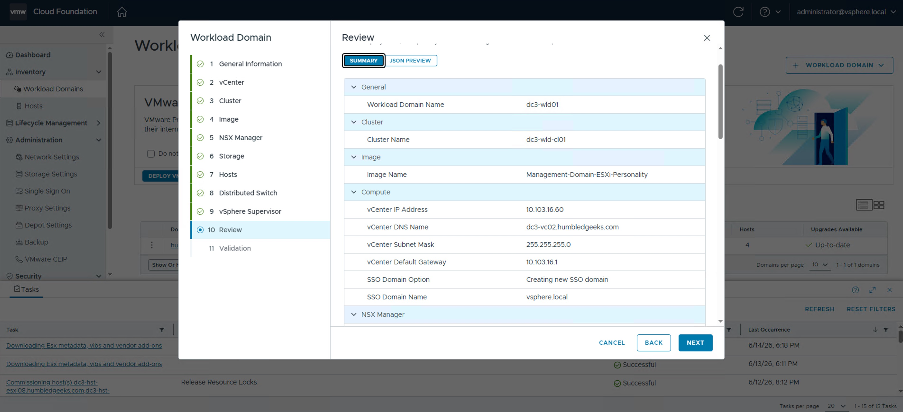

**Step 10 — Review.** The full spec on one screen: domain `dc3-wld01`, cluster `dc3-wld-cl01`, the vLCM image, `dc3-vc02` networking, and — note it here — **SSO Domain Option: Creating new SSO domain**, confirming the isolated-SSO behavior I flagged earlier.

> **Tip:** Switch to the **JSON Preview** tab on this screen and save it. It's your as-built record of the workload domain, and it's the fastest way to rebuild or script this domain later with a JSON-spec deployment.

## Phase 12 — Validation

Same safety net as the management-domain deploy: SDDC Manager runs a pre-flight against the whole spec before it builds anything.

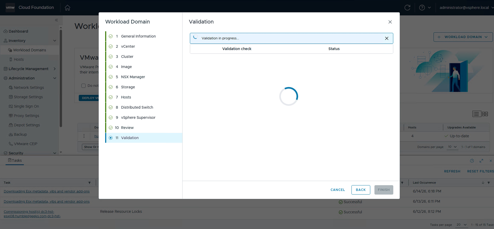

**Step 11 — Validation** kicks off the pre-flight checks.

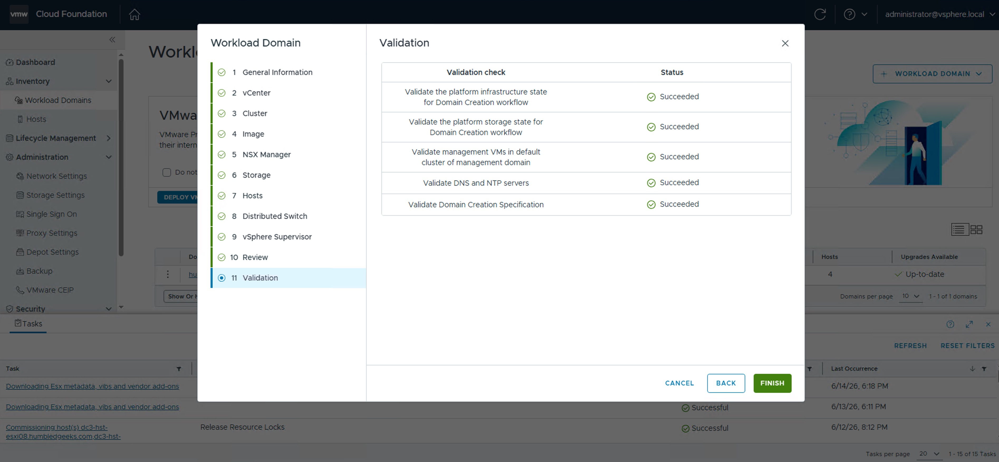

Five green checks: platform infrastructure state, platform storage state, management VMs in the default cluster, **DNS and NTP servers**, and the **Domain Creation Specification**.

> **Gotcha:** If validation flags the storage or platform-state checks, the FC LUN likely isn't visible to one or more hosts — back to the array/zoning, not the wizard. This is why FC LUN visibility was top of the prerequisites list.

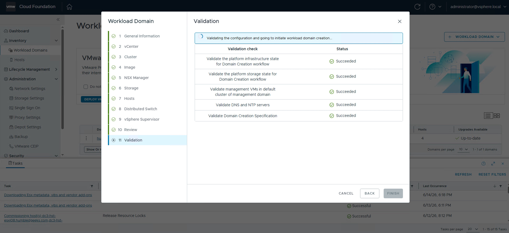

All checks pass, I hit **Finish**, and SDDC Manager initiates the build.

## Phase 13 — Deploy: Watching the Workload Domain Come Up

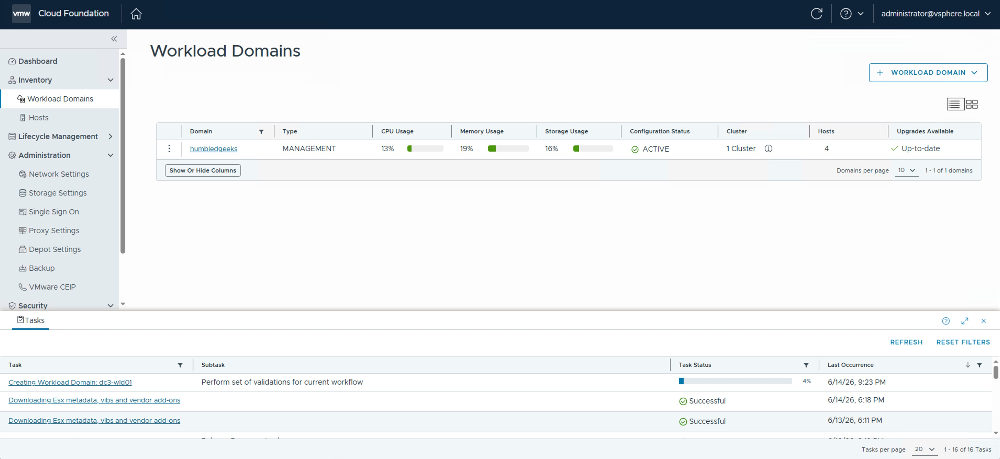

The **Creating Workload Domain: dc3-wld01** task appears in the Tasks pane and starts working through its subtasks — first another round of validations.

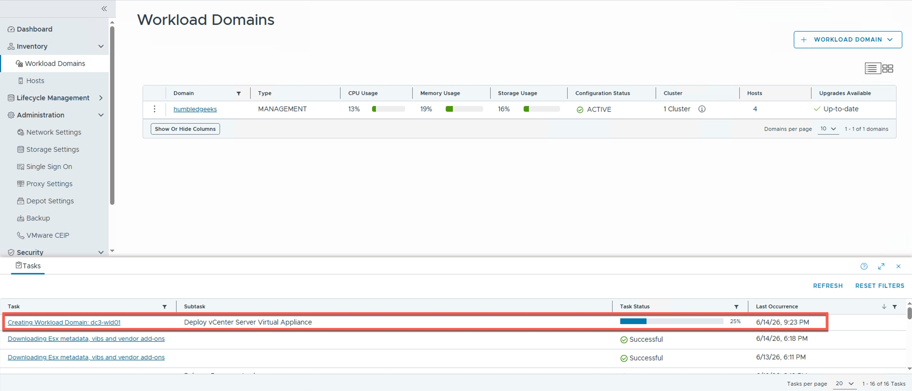

At 25%, it's deploying the **vCenter Server appliance** — `dc3-vc02` coming to life.

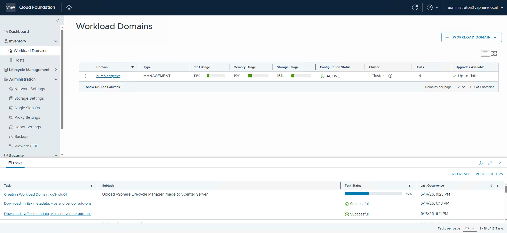

At 42%, it uploads the **vSphere Lifecycle Manager image** to the new vCenter so the cluster comes up on the desired-state image.

## The Payoff and What I Took Away

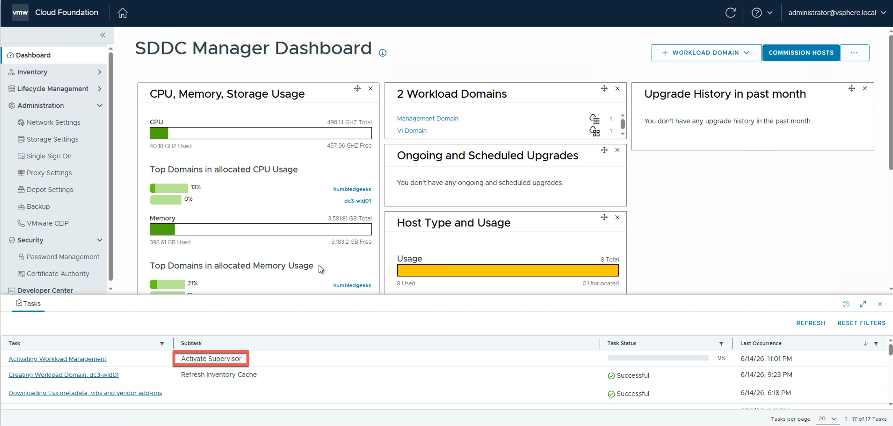

And there it is: **2 Workload Domains.** The dashboard shows the Management Domain and the new VI Domain side by side, all **8 hosts in use, 0 unallocated**, with a task already **Activating the Supervisor** on the new domain. I've got a second vCenter (`dc3-vc02`), a fresh four-host cluster, the shared NSX instance now managing the new cluster's transport nodes, and a VMFS-on-FC datastore mounted from the ASA A30 — all provisioned and lifecycle-owned by SDDC Manager. The chassis is fully in service.

A few honest takeaways from this build:

- **FC LUN visibility is the make-or-break prerequisite.** Get the array and zoning right before VCF ever looks at the hosts, and the storage steps are a formality. Get it wrong and the wizard stops you — correctly — at validation.
- **Shared NSX saves appliances but moves work elsewhere.** The resource savings are real, but "shared NSX" doesn't mean "NSX is done." If you're going to layer Supervisor on top, the shared instance needs an edge cluster and Tier-0 *first* — which is exactly the empty-dropdown wall I hit.
- **The isolated-SSO change is a real gotcha.** A 9.1 VI workload domain spins up its own SSO domain by default. If you assumed it'd join the management SSO automatically — like older VCF — plan for the linking step.
- **Repetition is the curriculum.** Every redeploy and every wall has made me faster and more confident, and it's the best exam prep I've found for the storage-heavy VCF exam I'm about to sit. You don't really know a platform until it breaks on you and you fix it.

The lab lesson that bears repeating from Part 1: **the storage and fabric work happens before VCF ever sees it.** A workload domain build is mostly VCF orchestration once the FC LUN is presented and the hosts are commissioned correctly — get those right and the wizard does the heavy lifting.

## What's Next

This post added the capacity. Next in the Zero to VCAP series, I'm tackling the two things every eval deployment eventually has to face:

- **License the environment** — applying license keys across the fleet in VCF Operations **before that 90-day evaluation clock runs out** (it started back in Part 1 and it does not reset per domain). Note that the 9.1 workload-domain wizard never asked me for a key — licensing in VCF is handled centrally now, which is its own post.
- **Prove that updates work** — running a lifecycle/patch cycle through SDDC Manager to confirm the fleet updates cleanly. Standing it up is one thing; keeping it patched is the part that actually matters in production.

And if you skipped ahead because *your* VPC Connectivity Profile dropdown was empty too — go read **[Building the NSX Spine](https://humbledgeeks.com/)** <!-- TODO: NSX Spine post URL -->. That detour is the bridge between this post and a Supervisor that actually activates.

Follow along on [HumbledGeeks.com](https://humbledgeeks.com), or connect with me on LinkedIn if you're on the same journey. As always — built in the lab, mistakes and all.
