Last week I shared that I passed the **VCAP-VCF Storage** exam (3V0-23.25). That
was a milestone, not a finish line — the journey is far from over, and the part
I enjoy most is that I get to keep building. My
[**FlexPod**](https://www.cisco.com/site/us/en/solutions/computing/converged-infrastructure/flexpod/index.html)
VCF 9.1 lab — [Cisco UCS](https://www.cisco.com/site/us/en/products/computing/servers-unified-computing-systems/index.html)
compute, [NetApp ASA30](https://www.netapp.com/asa/) storage — is still very much
a work in progress, and
the next thing it needed was to come out of evaluation mode and get properly
licensed. This post documents exactly that.

Your bring-up is done. The management domain is up, vCenter is running, the
hosts are in clusters — and across the top of VCF Operations there's a banner:
*"VCF Operations is not registered. Go to Licenses & Registration page to update
the VCF Operations registration and access the available licenses."* A fresh VCF
9.1 deployment runs in **evaluation mode for up to 90 days**, and until you
register and license it, that banner stays put. This post walks the greenfield
path from that evaluation state to a fully licensed environment.

If you came from vSphere 7/8-era licensing, throw out the muscle memory. There
are no 25-character keys to paste into vCenter anymore.
[VCF 9.x](https://www.vmware.com/products/cloud-infrastructure/vmware-cloud-foundation)
is subscription-only, licensed **by physical core**, and managed centrally through
**VCF Operations** talking to the **VCF Business Services console** at
`vcf.broadcom.com`. VCF 9.1 adds one more moving part: a mandatory **License
Server appliance** that holds your licenses inside your environment.

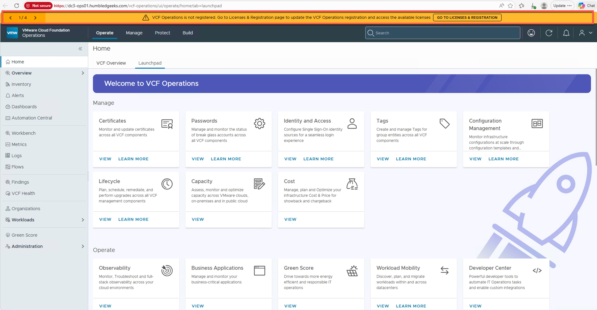

*Until you register, VCF Operations shows a "not registered" banner and runs in evaluation mode (up to 90 days).*

> **About this lab.** This walkthrough runs on my **FlexPod** — **Cisco UCS**
> compute with **NetApp ASA30** storage. That detail matters for exactly one
> step: my core count came in slightly above my subscription, and because I run
> UCS I can lower the active core count in the **UCS service profile's BIOS
> policy**. Under normal circumstances you would simply purchase the correct
> number of cores from Broadcom — trimming cores to fit is a convenience I happen
> to have in a lab, not the right answer for production.

---

## What changed in 9.1 (read this before you click anything)

Three concepts you have to hold in your head, because the UI assumes you know them:

**1. The three components.** Licensing involves *VCF Operations* (the console
you log into), the *License Server appliance* (a hardened OVA that stores your
license entitlements locally), and the *VCF Business Services console* at
`vcf.broadcom.com` (Broadcom's cloud portal where your subscription lives).
Licenses flow: Business Services console → License Server → assigned to vCenter.

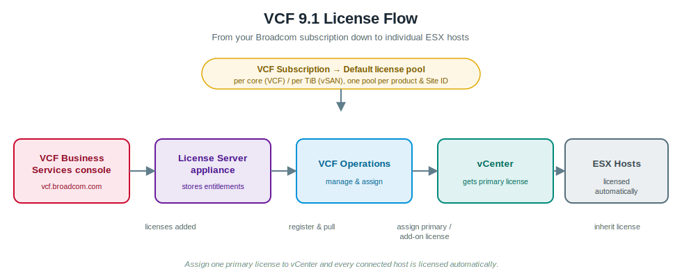

*How licenses flow in VCF 9.1 — from your Broadcom subscription down to individual hosts.*

**2. Default, primary, add-on, override.** When you buy a subscription, Broadcom
auto-creates a **default license** — a single pool of all your purchased
capacity for a product in a Site ID. From that pool you assign **primary**
licenses (`VMware Cloud Foundation (cores)` or `VMware vSphere Foundation`) and
**add-on** licenses (`VMware vSAN (TiB)` and `VMware Private AI Foundation with
NVIDIA (cores)`). An **override** license is one you pin directly to a single
asset (an ESX host or vSAN cluster) instead of letting it inherit the vCenter's
license. You must assign a primary license before any add-on.

**3. Cores, not sockets, not VMs.** You license *every physical core* on each
host — including BIOS-disabled cores — with a 16-core-per-CPU minimum. vSAN is
licensed separately by capacity in TiB.

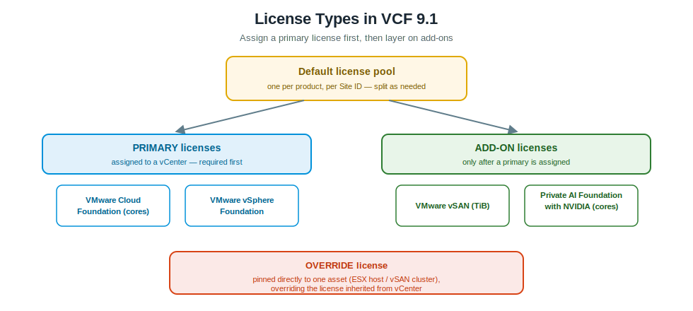

*The default pool splits into primary and add-on licenses; an override pins a license to a single asset.*

---

## Prerequisites

Before you start, confirm all of the following:

- A **valid VCF (or vSphere Foundation) subscription** tied to your Broadcom
  Site ID.
- **VCF Operations 9.1** deployed and reachable.
- The **VIM (Virtual Management Infrastructure) adapter** in VCF Operations is
  running — this is what lets VCF Operations manage licenses for vCenter.
- A Broadcom Support Portal account with one of: **User Administrator**,
  **Product Administrator**, or **Site Access** role. (Site Access alone needs a
  Tenant Administrator in the Business Services console to grant you **Tenant
  Administrator** or **License Administrator**.)
- The **Manage Licenses** permission in VCF Operations (the Administrator role
  has it by default).
- For connected mode: **outbound Internet** from VCF Operations (configure the
  HTTP proxy first if you use one).

> **Decide now: Connected or Disconnected mode.**
> Connected mode (recommended) uses an activation code, automates usage
> reporting, and makes license updates a one-click — or zero-click — operation.
> Disconnected mode requires manually shuttling registration, verification,
> confirmation, and license files back and forth. This post uses **connected
> mode** as the primary path and notes the disconnected differences where they
> matter.

---

## Pre-flight — Reconcile your core count with your subscription

Do this *before* you assign anything. VCF 9.1 licenses by physical core, and the
aggregate cores across all hosts under a vCenter cannot exceed the cores
allocated to the license. If you're over, hosts land in evaluation and
eventually disconnect. So step zero is a simple comparison: **cores you have**
vs. **cores you bought**.

**Read what you have (VCF Operations).** On **Manage > Licensing > Licenses &
Registration**, the **Assets License Status** panel (set the selector to **ESX
Hosts**) shows your **Core Count**. In my lab this read **264 total cores**
across **8 hosts**, all in Evaluation.

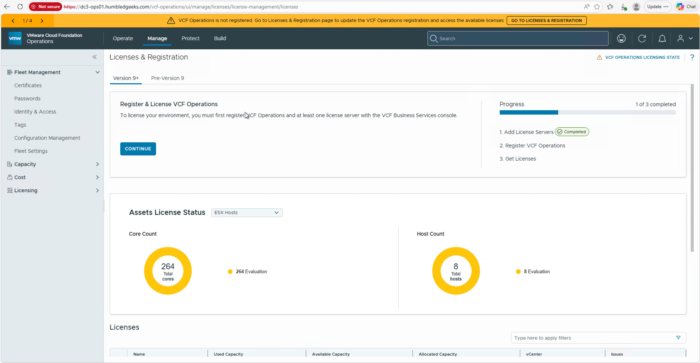

*Read your real core count in VCF Operations before licensing — here, 264 cores across 8 hosts, all in evaluation. This is the number you have to cover.*

**Read what you bought (VCF Business Services console).** At `vcf.broadcom.com`,
go to **License Management > Licenses**, **Version 9+** tab. Each default license
shows its **Allocated Capacity**. My subscription showed **VMware Cloud
Foundation (cores) = 256 Cores**, plus the bundled **VMware vSAN (TiB) = 256
TiB** and **VMware Private AI Foundation with NVIDIA (cores) = 256 Cores** — all
**Active**, 0 used.

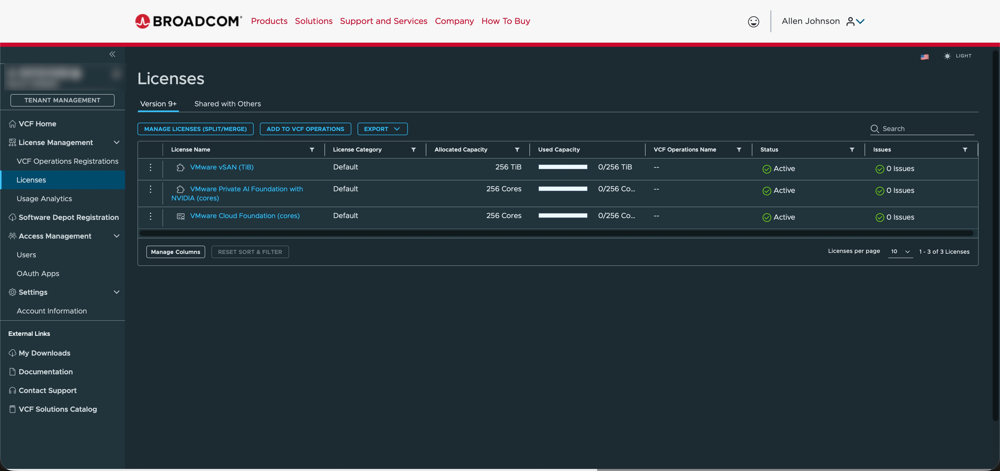

*Your subscription's Allocated Capacity is the ceiling. Here: 256 VCF cores (plus 256 TiB vSAN and 256 Private AI cores), all Active.*

**The mismatch.** 264 cores in the environment, 256 cores subscribed — **8 cores
over**. You have two honest ways to close that gap: **reduce physical cores** to
fit the subscription, or **increase the subscription** to cover the cores. There
is no third option that keeps you both over-provisioned and compliant.

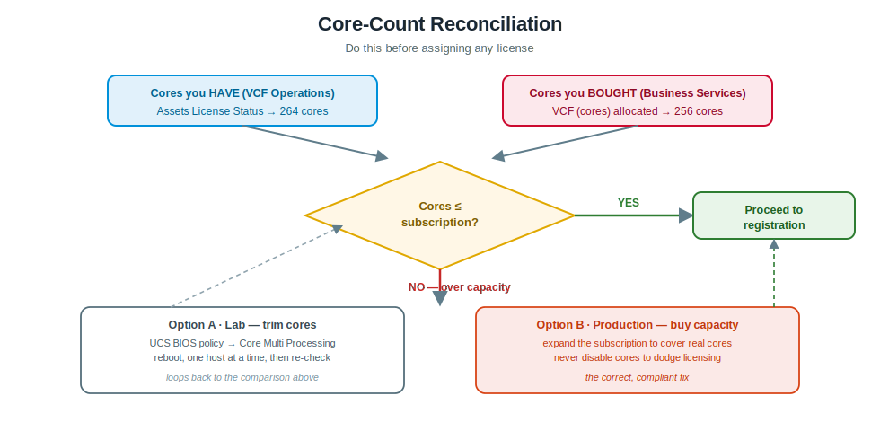

*Reconcile before you assign: trim cores (lab) or expand the subscription (production) until you're at or under your allocation.*

### Option A — Trim physical cores (lab approach, shown here)

On Cisco UCS this is a BIOS-policy change, which is the convenient part — you
don't touch hardware, you edit a policy. The BIOS policy is referenced by the
**UCS service profile**, so the change rolls out through the profile. On a
FlexPod, only UCS compute factors into the core count — the **NetApp ASA30**
storage layer is unaffected. It **does require a host reboot**, so plan for
maintenance mode and do it **one host at a time** until you're at or below your
allocation.

1. In **UCS Manager**, go to **Servers > Policies > root > Sub-Organizations >
   [your org] > BIOS Policies > [your BIOS policy]**.
2. Open the **Advanced** tab, then the **Processor** sub-tab.
3. Find **Core Multi Processing** and set it to the number of cores you want
   active per CPU (in my lab, **16**).
4. **Save Changes.** The associated service profiles will require a reboot to
   apply — put the host in **maintenance mode** (evacuate VMs), reboot, then
   bring it back.
5. Recheck the Core Count in VCF Operations and repeat on the next host until the
   total is at or under your subscribed cores.

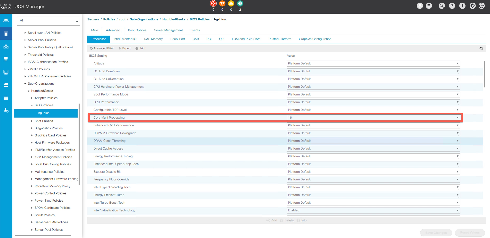

*On UCS, Core Multi Processing in the BIOS policy caps active cores per CPU — a reboot per host applies it.*

After the reboots, the Core Count in VCF Operations dropped from 264 to **256 —
an exact match for the 256-core subscription**.

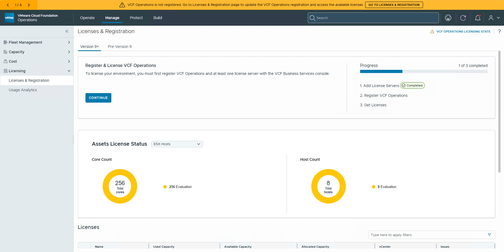

*After trimming, the Core Count matches the subscription — 256 cores, 8 hosts.*

> **Watch the headroom.** Landing *exactly* at your allocation (256 of 256) means
> zero slack. Add a host, or let a disabled core come back, and you immediately
> tip back into evaluation. In a lab that's fine; for anything you care about,
> leave margin between consumed cores and subscribed capacity.

### Option B — Buy the capacity (the production answer)

> **Do not trim cores to dodge licensing in production.** Disabling cores to
> squeeze under a subscription throws away compute you paid for in hardware and
> is a lab-only convenience. In production, size your VCF subscription to your
> actual deployed cores and keep it that way. Under-provisioning licenses to
> match artificially reduced cores is not "being licensed" — it's deferring a
> compliance problem. If you're over capacity, the correct fix is to expand the
> subscription before you assign licenses.

Once your core count is at or below your subscription, continue with the
registration workflow below.

---

## Step 1 — Confirm the License Server appliance is present

In VCF 9.1 the License Server appliance is **mandatory** and is **auto-deployed
during a new 9.1 installation**. (On an *upgrade* from 9.0.x you'll instead get
a banner telling you to deploy it manually from an OVA — see the sidebar.) For a
greenfield install, just confirm it's there.

1. Log in to **VCF Operations**.
2. From the navigation bar at the top, click **Manage**.
3. In the left navigation pane, click **Licensing > Licenses & Registration**.
4. On the **Version 9+** tab, look at the **Register & License VCF Operations**
   card's **Progress** panel on the right. It tracks three steps:
   **1. Add License Servers**, **2. Register VCF Operations**,
   **3. Get Licenses**. On a fresh 9.1 install, step 1 already shows
   **Completed** — the license server was deployed for you.

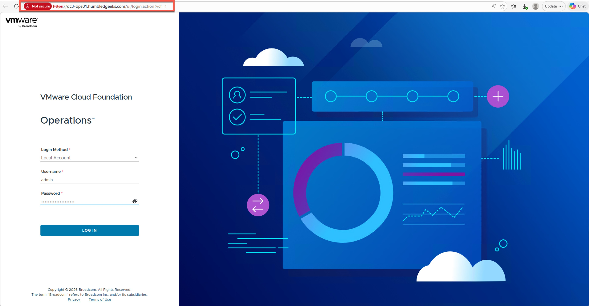

*Log in to VCF Operations (local admin account here, or your configured identity source).*

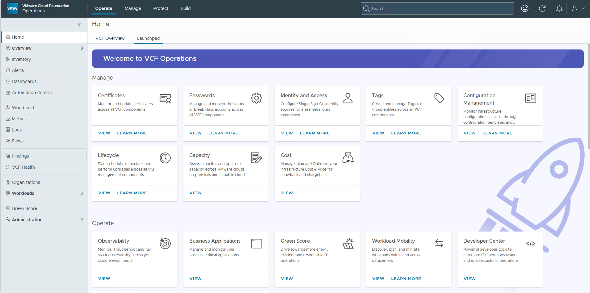

*After login you land on the Launchpad — head to Manage > Licensing > Licenses & Registration.*

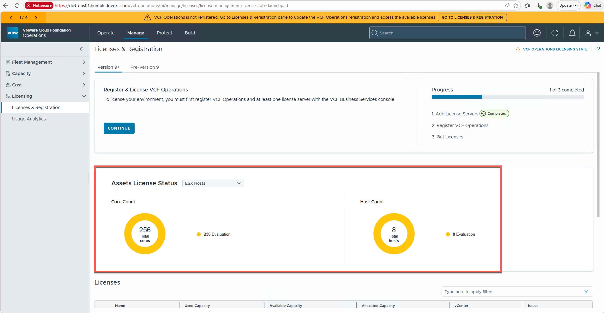

*On a greenfield 9.1 install the License Server is auto-deployed — the Progress tracker shows "Add License Servers" already Completed, leaving Register and Get Licenses. Note the assets are still in evaluation (256 cores / 8 hosts).*

> **Sidebar — Upgraded from 9.0.x? Deploy the appliance manually.**
> After upgrading VCF Operations to 9.1 you'll see a banner requiring a new
> license appliance. Under **Manage > Licensing > Licenses & Registration**
> you'll find a link to download the OVA and a **unique registration key** for
> it. Deploy the OVA into the management domain vCenter. **Field gotcha:** on the
> OVA "Customize template" step, leave the **Hostname** and **Domain Name**
> fields *blank* (rely on DNS). Populating both has produced a malformed
> `hostname.domain.domain` FQDN. The appliance is small (2 vCPU, 4 GB RAM, 3×4 GB
> disks) and uses an internal 172.x container IP you can't change. Power it on;
> it self-registers to VCF Operations with the key, then reaches
> `vcf.broadcom.com` and applies licenses automatically — allow ~15 minutes.

<!-- TODO screenshot 3b (upgrade path only): OVA "Customize template" page with Hostname/Domain Name fields left empty. Caption: "Upgrade path only: leave Hostname and Domain Name blank to avoid a doubled FQDN." -->

---

## Step 2 — Start registration and choose Connected mode

1. Still in **Manage > Licensing > Licenses & Registration**, in the **Register
   & License VCF Operations** pane, click **Continue**. The *Register and
   License VCF Operations* workflow opens. (The first step is already complete —
   the license server was auto-deployed.)
2. In the **Select Connection Mode** card, click **Start**, then **Continue**.
3. On the **Select Connection Mode** page, select **Connected**, then click
   **Continue**.
4. Move to the **Registration** section. The wizard now tracks **six** sub-steps:
   Add License Server, Select Connection Mode, Get Activation Code, Enter
   Activation Code, Add Licenses, and Download Licenses.

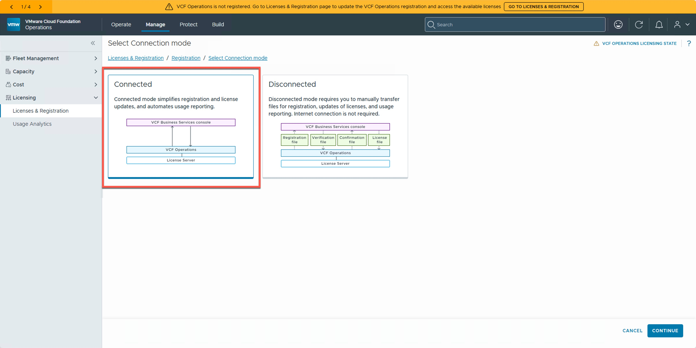

*Connected mode automates usage reporting and license updates — recommended for any Internet-connected environment.*

You may briefly see a "Waiting for license servers to be registered" spinner
while the wizard confirms the license server.

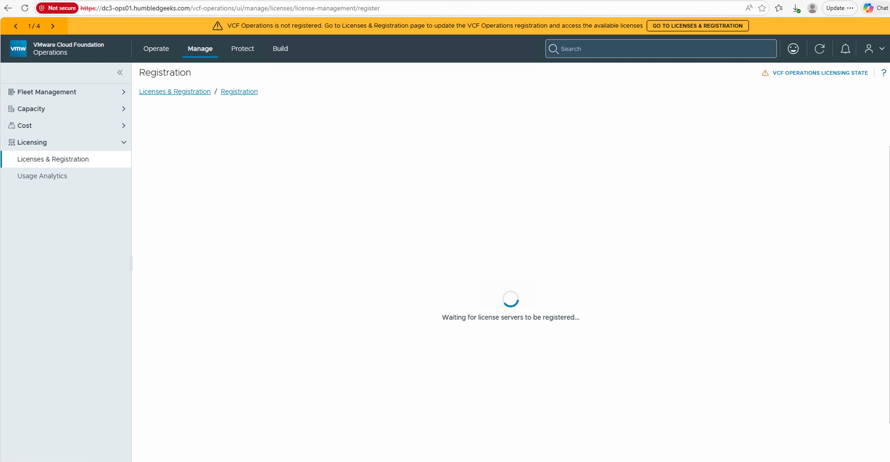

*A short wait while the wizard confirms the license server before continuing.*

---

## Step 3 — Get the activation code from the Business Services console

This step bounces you out to `vcf.broadcom.com` to generate an activation code,
then back into VCF Operations to paste it.

1. In the **Get Activation Code from VCF Business Services console** card, click
   **Start**. The Business Services console opens in a new browser tab.
2. Log in with your **Broadcom Support Portal** credentials.
3. Select the **Site ID** you want to register this VCF Operations instance to,
   and click **Next**. (If you have only one site, it's preselected.)
4. In the console's **Register & License VCF Operations** page, go to the
   **Registration** part of the workflow.
5. In the **Name VCF Operations** pane, click **Start**, enter a **unique
   display name** for this VCF Operations instance, and click **Save**.
   *(Tip: set a deliberate name. If you skip it, the instance FQDN is used by
   default.)*
6. In the **Generate Activation Code** card, click **Start**. A dialog shows the
   activation code.
7. Click **Copy**, confirm you've copied it, and click **Finish**.

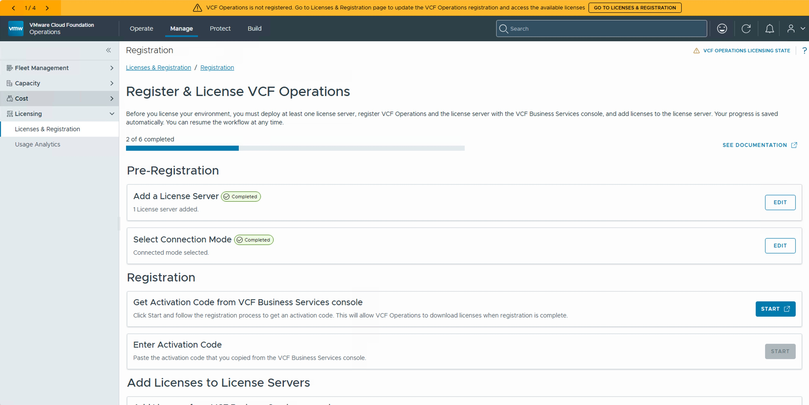

*In VCF Operations, the Get Activation Code step sends you to the Business Services console — click Start.*

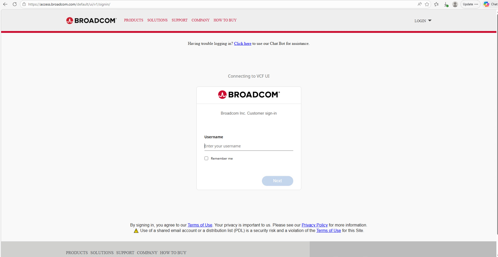

*Sign in with your Broadcom Support Portal credentials.*

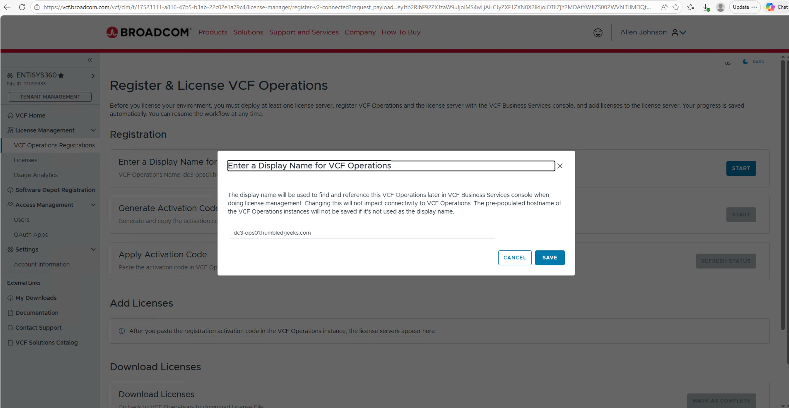

*Name the instance deliberately — if you skip it, the FQDN is used by default.*

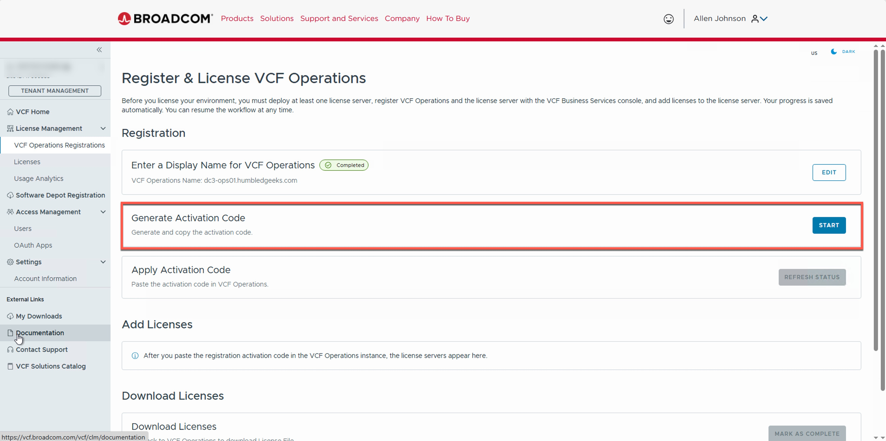

*Click Start on the Generate Activation Code step.*

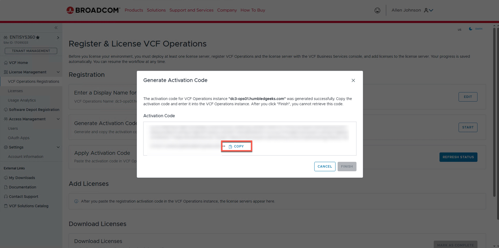

*Generate the activation code and copy it — you cannot retrieve it after you click Finish, so paste it into VCF Operations first.*

> **Redact before publishing.** This dialog and the surrounding console pages
> expose your **activation code**, **tenant name**, and **Site ID**. Blur all
> three in any screenshot you post.

Now return to the VCF Operations tab:

8. In the **Paste Activation Code** card, click **Start**.
9. Paste the activation code into the text field and click **Activate**.

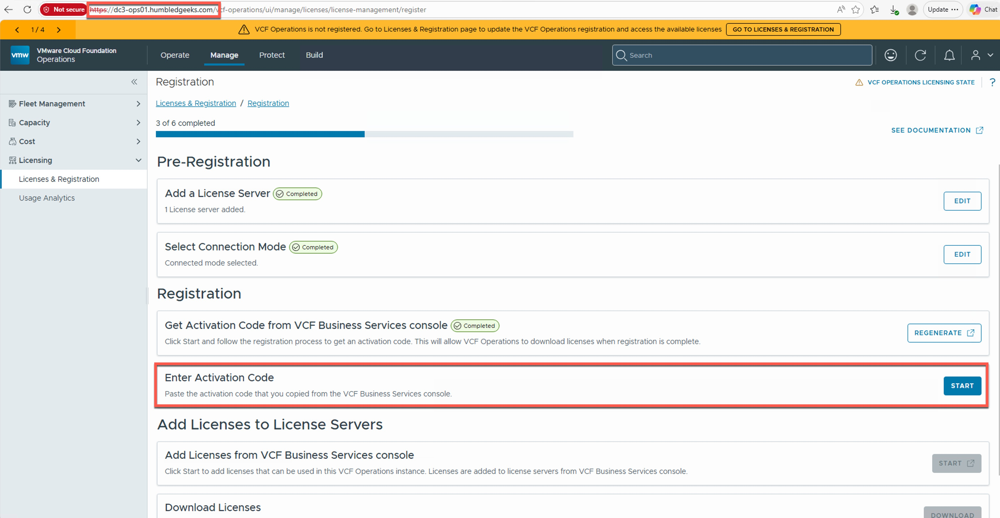

*Back in VCF Operations, the Enter Activation Code step — click Start to open the paste dialog.*

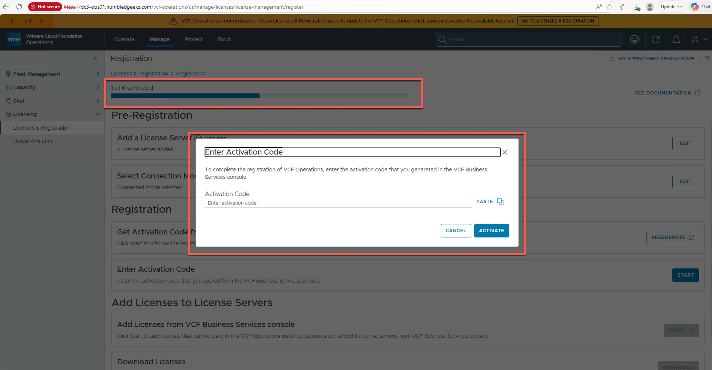

*Paste the code back into VCF Operations and click Activate to establish the connection.*

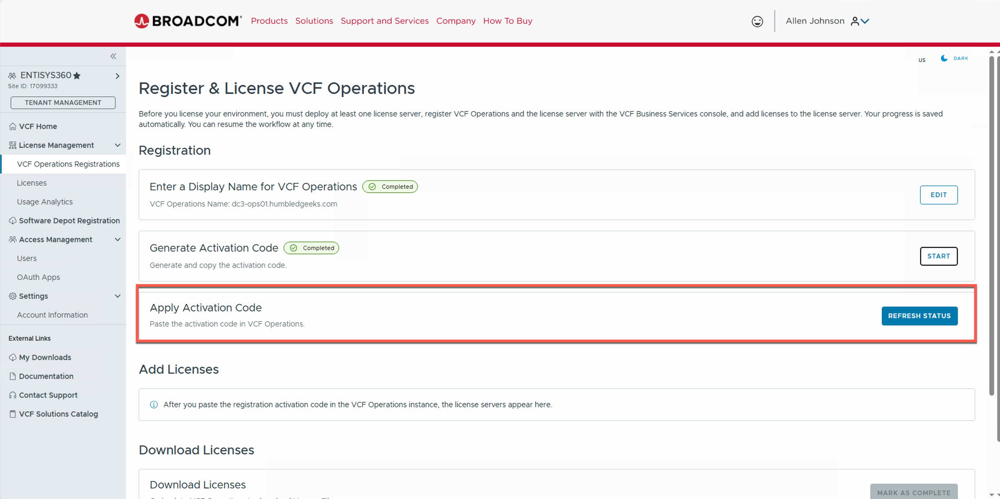

*Back in the console, the Apply Activation Code step completes once the code is activated — use Refresh Status if it lags.*

> **Disconnected mode instead?** You won't use an activation code. You'll
> download a **registration file** from VCF Operations, upload it to the console,
> then exchange a **verification file** (console → VCF Ops) and a **confirmation
> file** (VCF Ops → console) to complete the handshake. Everything else below is
> the same in spirit, with file uploads replacing the live connection.

---

## Step 4 — Add licenses to the License Server

With the instance registered, allocate licenses from your default pool to the
license server.

1. In the **Add Licenses from VCF Business Services console** card, click
   **Start**. The console opens in a new tab.
2. Confirm the **Site ID** (preselected) and click **Next**.
3. In the **Add Licenses** section, on the card for your license server, click
   **Start**.
4. On the **Allocate Licenses** page, enter a **display name** for the license
   server.
5. *(Optional)* To carve up your capacity, click the **vertical ellipsis** next
   to a license:
   - **Split** the default license: select it, click **Create**, then name it
     and set its core/TiB capacity.
   - **Change capacity** of an existing split: enter the new value in the **New
     Capacity** column.
   - Click **Save**.
6. Select the licenses to add from the table and click **Next**. You must add at
   least **one primary license** (`VMware Cloud Foundation (cores)`).

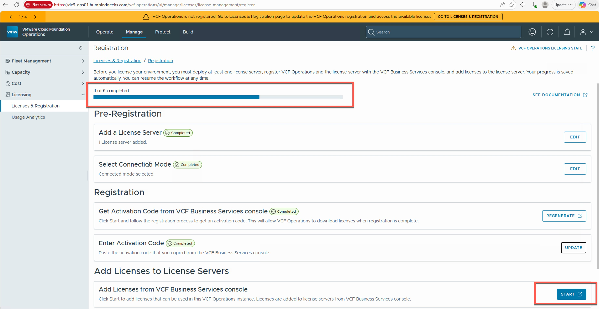

*With registration done, the wizard advances to Add Licenses (step 4 of 6).*

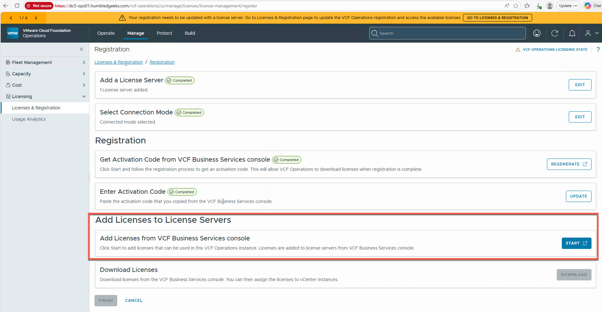

*Click Start on the "Add Licenses from VCF Business Services console" card to jump to the console.*

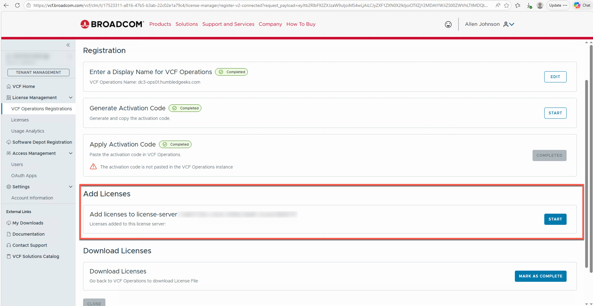

*In the console, start adding licenses to your license server. (A warning shows here if the activation code wasn't pasted in VCF Operations yet.)*

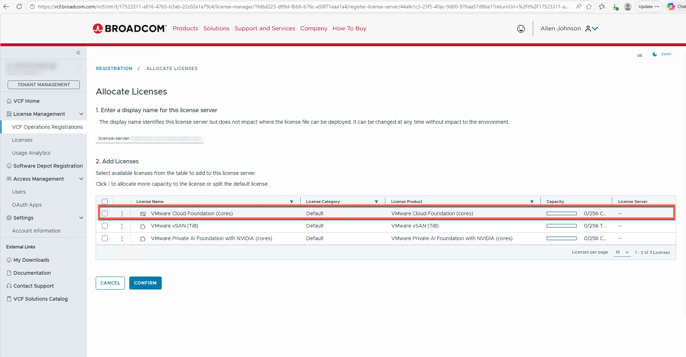

*Allocate at least one primary license (VCF cores) to the license server. Split the default pool here if you need separate allocations, then Confirm.*

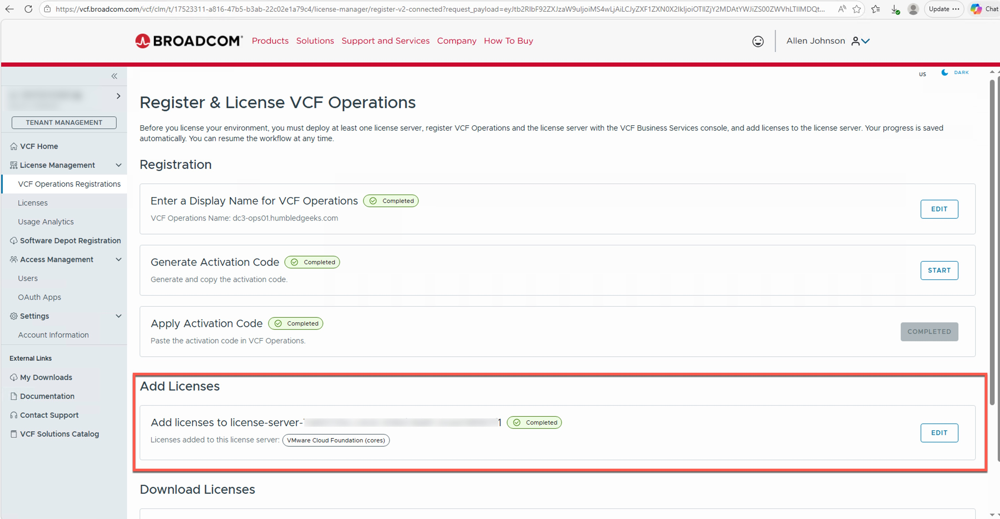

*The console confirms the license is added to the license server.*

---

## Step 5 — Download and import the license file (finish registration)

1. Back in VCF Operations, go to the **Licenses** page of the workflow.
2. In the **Add Licenses to License Servers** section, in the **Download** card,
   click **Start**, then **Save** to download the license file.
3. Click **Finish** on the **Register and License VCF Operations** page.

In connected mode you can also keep licenses current automatically: under
**Licensing > Licenses & Registration**, **Update Licenses** pulls the latest
file on demand, and setting **Update Licenses Mode** to *automated* downloads new
license files within 24 hours of any change.

To confirm what landed: go to **Licensing > Licenses** and select the
**Version 9+** tab.

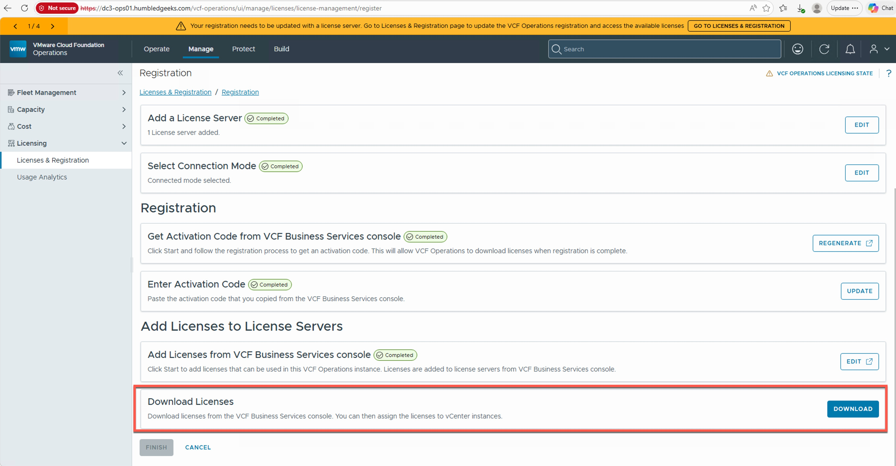

*Download the license file in VCF Operations to pull your allocated licenses down to the instance.*

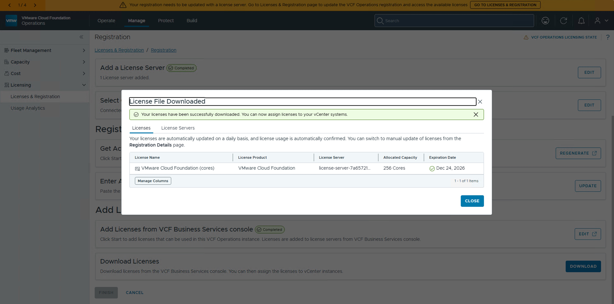

*Confirmation that the licenses downloaded — you can now assign them to your vCenter systems.*

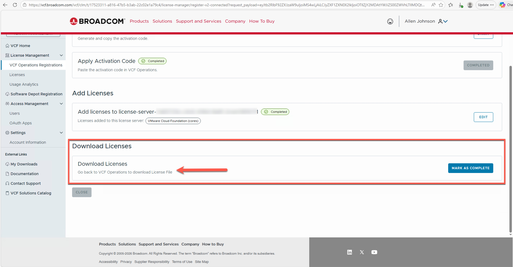

*On the console side, the Download Licenses step points you back to VCF Operations to grab the file.*

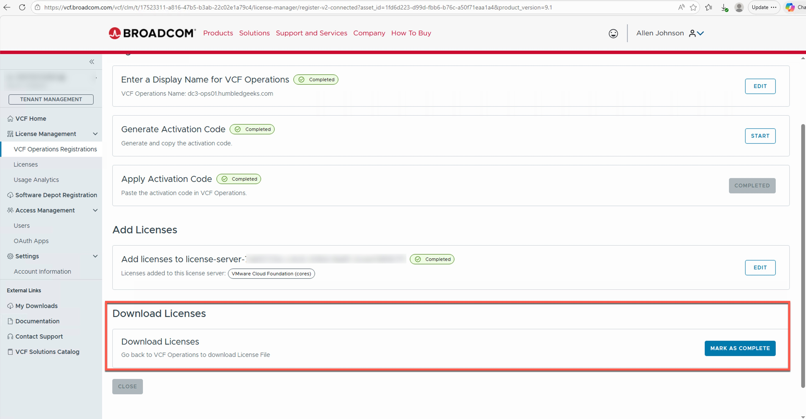

*After downloading in VCF Operations, click Mark as Complete in the console.*

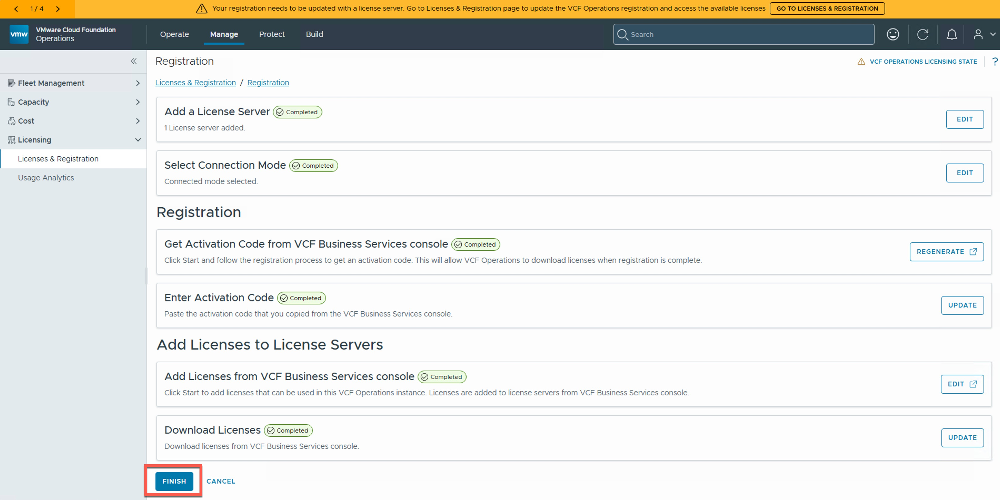

*All six registration steps complete — click Finish.*

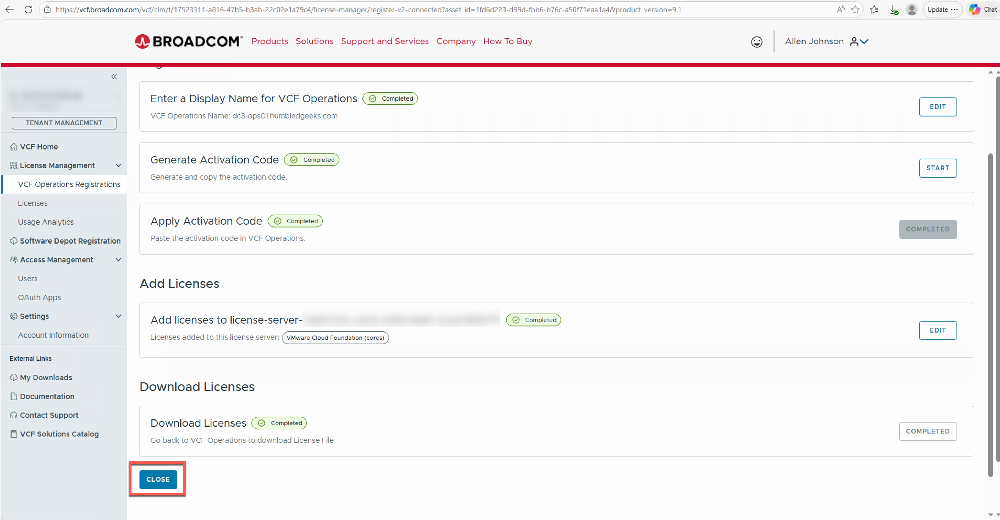

*The console shows the full registration workflow complete — click Close.*

> **Disconnected mode note:** instead of a live update, you'll **Import License
> File** here (Browse → upload → Complete), and you must **Mark as Complete** in
> the console to close the loop.

---

## Step 5b — Confirm registration and usage in the Business Services console

Back at `vcf.broadcom.com`, the registration status walks through a few states
before it settles. Right after you generate the code it reads **Pending
Activation**; after activation but before licenses are pulled it reads **Not
Licensed**; once the license file is downloaded it flips to **Licensed**.

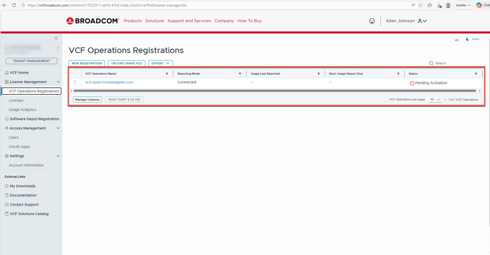

*Pending Activation — the code is generated but not yet activated in VCF Operations.*

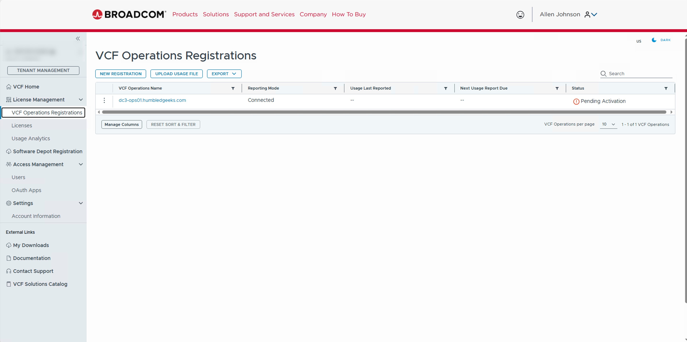

*The registrations list, reporting mode Connected.*

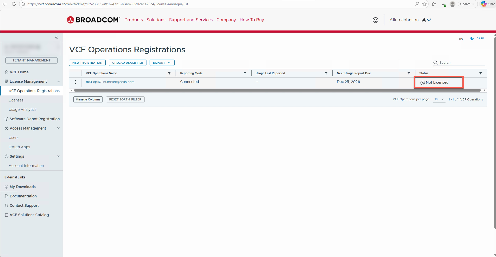

*Not Licensed — activated, but licenses haven't been pulled down yet.*

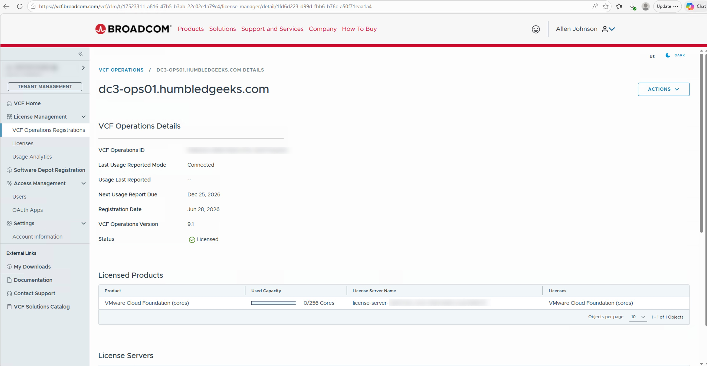

*Licensed — registration date, version 9.1, Connected reporting mode, and the next usage report due date.*

**Usage sync takes time.** In connected mode the console reconciles usage with
your VCF Operations instance automatically, but **it can take up to ~30 minutes
for usage to sync and the dashboards to reflect it**. Don't panic if the used
capacity shows 0 immediately after assignment — give it time.

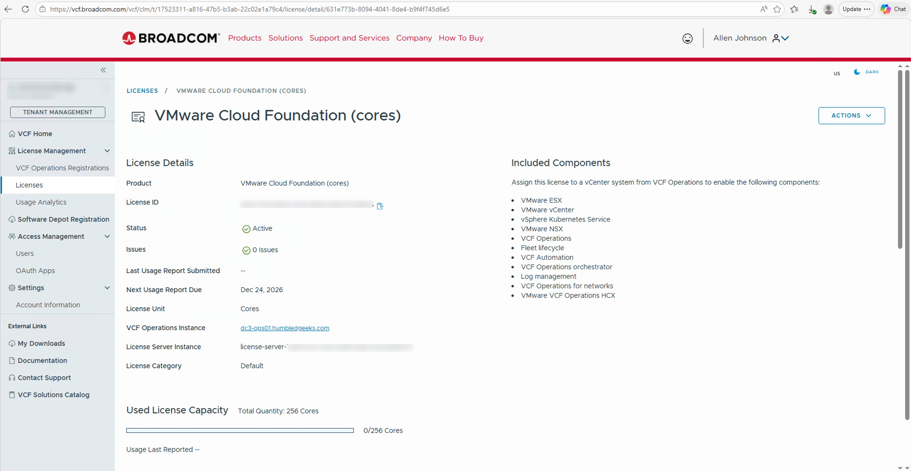

*The license detail in the console: used capacity and the next usage-report due date. This is where you confirm consumption once it syncs.*

<!-- TODO screenshot (optional, add later): Business Services console Usage Analytics / license usage page after the ~30-minute sync, showing consumed cores against the 256-core subscription. Caption: "After the sync completes, the console shows actual usage against your subscription." -->

> **Redact before publishing.** These console pages show your **tenant name**,
> **Site ID**, **VCF Operations instance ID**, **license-server name**, and host
> **FQDNs**. Blur them in any published screenshot.

---

## Step 6 — Assign the primary license to vCenter

This is the step that actually licenses your hosts. Assign a primary license to
the vCenter instance, and every connected ESX host inherits it automatically.

1. Log in to **VCF Operations**.
2. Click **Manage** > **Licensing > Licenses & Registration**.
3. Select the **Version 9+** tab.
4. In the **vCenter Systems** table, select one or more vCenter instances.
   *(Only v9+ vCenters managed by this VCF Operations instance appear. A vCenter
   added for monitoring only won't show here. After bring-up it can take up to
   **20 minutes** for a vCenter to appear.)*
5. Click **Assign Primary License**. A list of primary licenses appears;
   anything you can't assign drops to the bottom with **Assignable = No**.
6. Select a license and click **Assign**. (Only **one** primary license per
   vCenter.)

Confirm the result in the **Primary Licenses** column of the vCenter Systems
table.

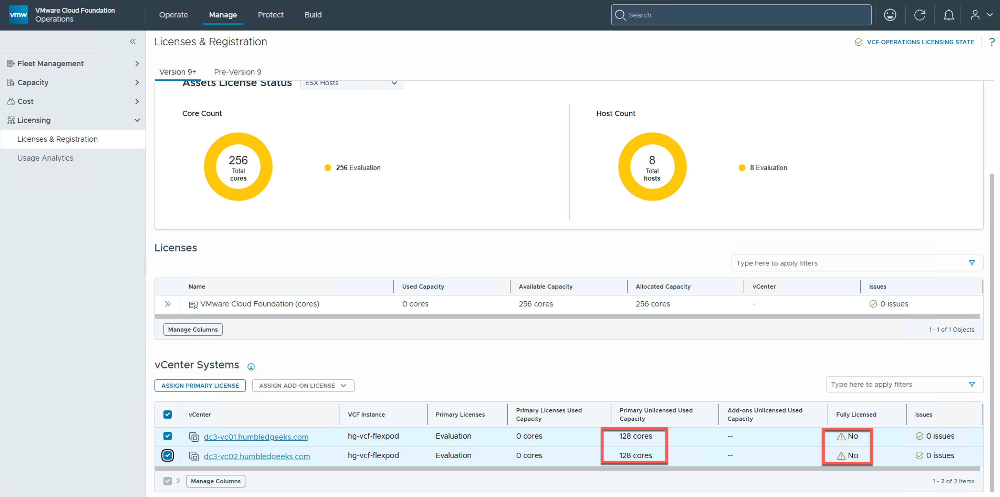

*Before assignment: both vCenters show Evaluation and Fully Licensed = No, with 128 unlicensed cores each.*

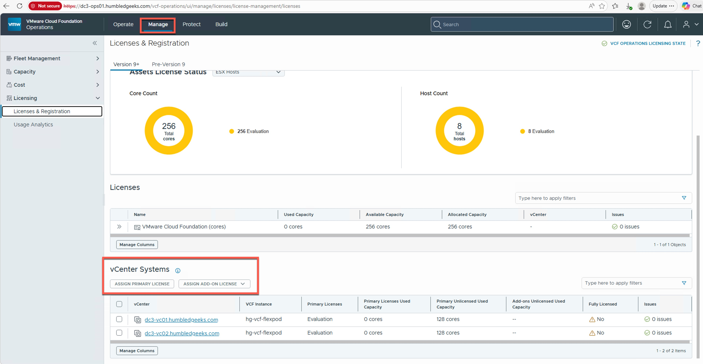

*Select your vCenter(s), then click Assign Primary License.*

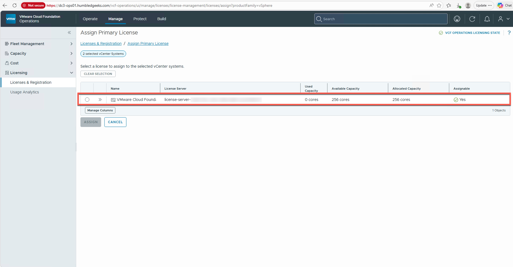

*Select the primary VCF (cores) license — Assignable shows Yes when there's enough capacity.*

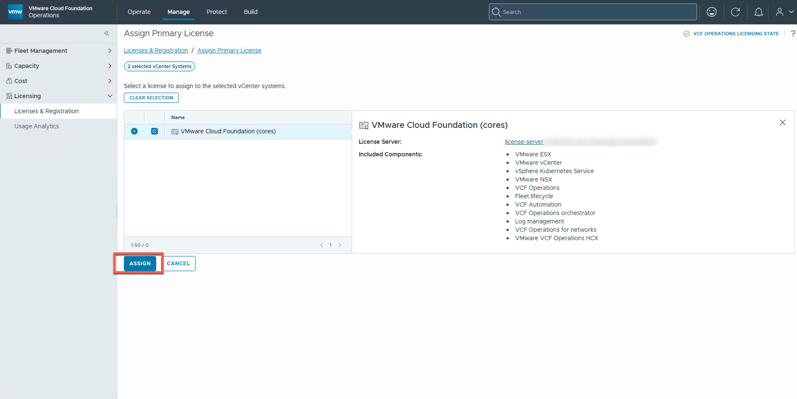

*The detail pane lists what the primary license includes — ESX, vCenter, NSX, vSphere Kubernetes Service, VCF Operations, VCF Automation, HCX, and more. Click Assign.*

> **Capacity check before you assign.** Aggregate host cores across *all*
> vCenters under one VCF Operations instance can't exceed the license's allocated
> cores. If a host's cores exceed remaining capacity, it's added in evaluation
> mode; once its 90-day host evaluation ends without capacity, it disconnects
> from vCenter (running VMs stay intact, but you can't power on new ones).

---

## Step 7 — Assign add-on licenses (vSAN, Private AI)

Add-ons only work *after* a primary license is assigned to the vCenter.

1. In **Manage > Licensing > Licenses & Registration**, **Version 9+** tab,
   select the vCenter instance(s) in the **vCenter Systems** table.
2. Click **Assign Add-on License**.
3. From the drop-down, select the product — e.g. `VMware vSAN (TiB)` or
   `VMware Private AI Foundation with NVIDIA (cores)`.
4. Select a license with sufficient capacity (insufficient ones show
   **Assignable = No**) and click **Assign**.

To verify, click the vCenter in the table and review its assigned licenses. If
an assignment failed, click **View Details** in the banner above the table and
hover the info icon in the **Status** column.

*In this walkthrough only the primary VCF license was assigned, so the add-on
assignment screen isn't shown here.*

<!-- TODO screenshot 10 (not captured in this run): "Assign Add-on License" drop-down showing vSAN (TiB) and/or Private AI options. Caption: "Add-on licenses (vSAN TiB, Private AI) attach after the primary license. vSAN ships with every VCF subscription." Capture this screen if/when you assign the vSAN or Private AI add-ons. -->

> **Private AI note:** assigning a `VMware Private AI Foundation with NVIDIA`
> license to the **management domain** is what activates the guided deployment UI
> in the vSphere Client — but the capacity is consumed only by GPU-enabled
> workload domains, not the management domain itself.

---

## Step 8 — Verify the environment is fully licensed

Don't trust "no banner" as proof. Check explicitly:

- **VCF Operations > Licensing > Licenses (Version 9+ tab):** every license shows
  expected capacity and consumed/remaining cores/TiB look right.
- **vCenter Systems table:** each vCenter shows a primary license in the
  **Primary Licenses** column, and the add-ons you expect.
- **No host in evaluation:** no ESX host is flagged as evaluation/over-capacity.
- **Registration health:** Registration Status = **Registered** and Connectivity
  to VCF Operations = **Connected** for the license server.
- **The evaluation banner is gone.**

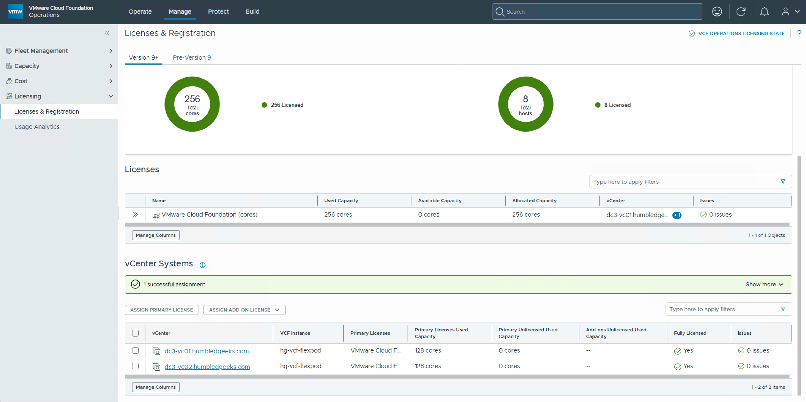

*Fully licensed: 256/256 cores and 8/8 hosts licensed, both vCenters show Fully Licensed = Yes, and the evaluation banner is gone.*

---

## Gotchas and things that will bite you later

- **Usage reporting is not optional.** License usage must be reported at least
  **once every 180 days** to keep licenses valid. Connected mode does this
  automatically; disconnected mode requires you to generate and upload a usage
  file on a calendar reminder.
- **Two different 90-day clocks.** One is the *deployment* evaluation window (up
  to 90 days to register and license a new 9.1 instance). The other is the
  *post-expiration* grace period (90 days after a license expires before
  management operations are blocked, hosts disconnect, and you can't start
  workloads). Don't confuse them.
- **License Server downtime = no license operations.** If the appliance is
  unavailable you can't assign licenses, generate usage reports, or import
  license files. It's small — protect it like any other management component
  (backup/snapshot, monitoring).
- **The appliance is air-gapped by design.** The License Server has *no*
  external network requirements and doesn't talk to the Internet itself; it
  needs a network path to VCF Operations with ≤ 300 ms latency.
- **SDDC Manager licensing is legacy.** Lifecycle and licensing have moved into
  VCF Operations. Don't go hunting for license keys in the old SDDC Manager UI.

---

## Wrap-up

*The whole journey at a glance: prepare, register and load, then assign and verify.*

Licensing VCF 9.1 from evaluation is a five-stop journey: confirm the License
Server appliance, register VCF Operations with the Business Services console
(connected mode), allocate licenses to the license server, assign a primary
license to each vCenter, then layer on add-ons. Get the primary-before-add-on
ordering and the per-core capacity math right and the rest is just clicking
through the workflow.

With the FlexPod now fully licensed and out of evaluation, the lab is ready for
the next round of building — which is exactly where this series is headed.

---

## Next steps

With the environment licensed, here's the path forward in the series — in order,
because each step builds on the one before it:

1. **Tie VCF to Active Directory.** Configure Humbledgeeks AD as the identity
   source (LDAPS) for SSO and role-based access. Foundational — it comes first so
   everything after has clean RBAC.
2. **Deploy NetApp ONTAP tools / VASA Provider.** Deploy the OVA as a VM in the
   management domain and present a vVols datastore for policy-based VM storage.
3. **Deploy Kubernetes (VKS).** Supervisor was enabled with the workload domain,
   so create a vSphere Namespace and stand up a vSphere Kubernetes Service (VKS)
   cluster.
4. **Run the "Doom" pod.** Deploy *Kubedoom* into the VKS cluster as the container
   use case — William Lam's VKS walkthrough has a ready-to-use manifest:
   [Configuring vSphere Kubernetes Service (VKS)](https://williamlam.com/2025/08/ms-a2-vcf-9-0-lab-configuring-vsphere-kubernetes-service-vks.html).
5. **Cross-vCenter migration.** Migrate a VM from my legacy vSphere 8.0U3
   environment into the VCF 9.1 workload domain via Advanced Cross vCenter
   vMotion — a non-critical VM, not a production domain controller.
6. **Backup and recovery.** Show VCF-native backup/restore plus the NetApp
   SnapCenter plug-in (Veeam stays the production tool).

Rounding out the series: lifecycle management, and certificates once an internal
CA is in place.

*Next post in the series: [Connecting My FlexPod VCF 9.1 Deployment to Active Directory (VCF Single Sign-On)](https://humbledgeeks.com/connecting-my-flexpod-vcf-91-deployment-to-active-directory-vcf-single-sign-on/).*
