# Zero to VCAP: When vSphere Supervisor Hit a Wall — Building an NSX Edge Spine in VCF 9.1

I was deploying a [**VMware Cloud Foundation 9.1**](https://techdocs.broadcom.com/us/en/vmware-cis/vcf/vcf-9-0-and-later/9-1.html) workload domain with **vSphere Supervisor** (vSphere Kubernetes) enabled, on the last four Cisco UCS B200 blades in my chassis. The workload-domain wizard walked along fine until the **vSphere Supervisor** step, where it asked for a **VPC Connectivity Profile** — and the dropdown was **empty**. No profile, no Supervisor, no finishing the deploy. Dead stop.

This post is the whole story of clearing that wall — start to finish, nothing else. It turned into a multi-day detour through the physical underlay and a from-scratch NSX edge build, and I grabbed a screenshot at every screen so you can follow the diagnosis and the fix end to end. (The routine part — standing up the workload domain in the wizard — gets its own post <!-- TODO: WD build post URL -->; this one is purely about the failure and the fix.)

Same warning as always: this is a long one. I'd rather over-document than leave you guessing at a screen. Grab a coffee.

> **Following along in your own lab?** Everything here runs on VMware Cloud Foundation 9.1, NSX, and vSphere Supervisor — and you don't need a datacenter to get the bits. A [**VMUG Advantage**](https://www.vmug.com/membership/vmug-advantage-membership/) membership is how a lot of us on the VCAP / Broadcom Knight path build these labs: it knocks $125 off the certification exam, and Broadcom now grants [personal-use VCF home-lab licenses to certified members](https://blogs.vmware.com/cloud-foundation/2025/04/14/free-home-lab-licenses-for-vmware-certified-professionals/). Grab the bits, nest VCF, and you can reproduce this exact edge spine end to end.

**The root cause, and the heads-up I didn't see coming:** my workload domain shares the management domain's NSX instance — and sharing NSX does **not** hand you a usable Supervisor networking stack. You inherit transport nodes and overlay segments, but the north-south routing spine (an edge cluster, a Tier-0 gateway, and IP blocks) doesn't exist yet, and the Supervisor step won't let you proceed until it does. That's the trap, and the rest of this post is how I climbed out of it.

## Why It Failed: a Shared-NSX Workload Domain Has No Spine

When I built this workload domain I made a deliberate lab call: instead of deploying a second NSX Manager cluster, I attached it to the management domain's **existing** NSX instance. In a lab that's the right resource-saving move — a dedicated NSX Manager cluster is a lot of appliances, and sharing keeps me inside my host budget.

The catch nobody warns you about: that shared NSX gave me overlay networking — transport nodes and segments — but it never built the **north-south spine** that [vSphere Supervisor's VPC networking](https://techdocs.broadcom.com/us/en/vmware-cis/vcf/vcf-9-0-and-later/9-0/vsphere-supervisor-installation-and-configuration/supervisor-networking-with-virtual-private-clouds/supervisor-architecture-with-vpc-networking.html) needs. A VPC connectivity profile is only real if there's an NSX **edge cluster**, a **Tier-0 gateway**, and **IP blocks** standing behind it. None of that existed yet, so the dropdown had nothing to show and the workload-domain deploy couldn't finish.

**Gotcha:** in production, sharing NSX is a real tradeoff — shared networking fault domain and lifecycle — and it means the Supervisor spine is *yours* to build. If you need hard isolation between the management plane and tenant networking, or a turnkey edge stack, deploy a dedicated NSX instance for the workload domain instead.

So the fix is a build: repair the physical underlay so it can carry the overlay, pre-create the IP blocks, run the NSX edge/Tier-0 wizard, finish the routing by hand, and validate — until that empty dropdown finally has a profile to select. Five objects have to chain together — **edge nodes → edge cluster → Tier-0 → external connection → VPC connectivity profile** — and the last one is the thing Supervisor is waiting on.

Everything below lands on the **management** domain, because the edge cluster is the routing and NAT spine for the whole fabric. The edge appliances deploy onto the management cluster `humbledgeeks-cl01`, its `VMFS01` datastore, and the VM-management port group on VLAN 16, right alongside the NSX managers:

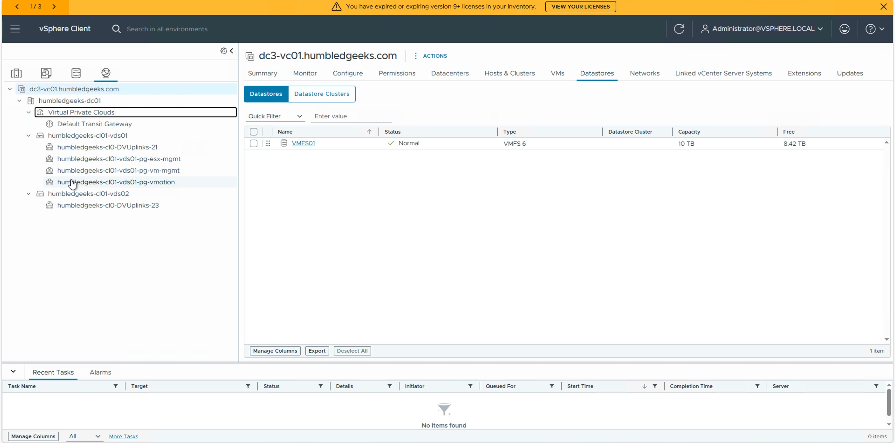

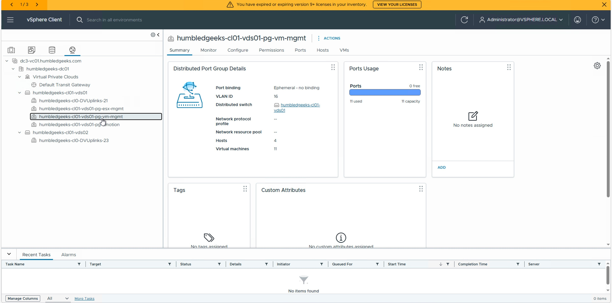

---

## The Wall: an Empty VPC Connectivity Profile

Here's the wall itself — the workload-domain wizard parked on **Step 9, vSphere Supervisor**, with the **VPC Connectivity Profile** dropdown empty, a red error on the field, and **NEXT** greyed out. You cannot finish the deploy:

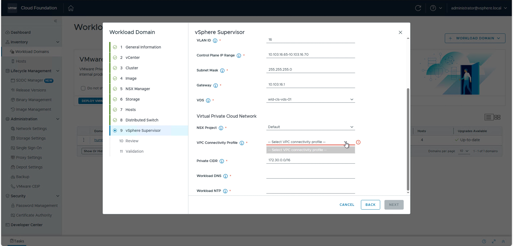

Before building anything, I went looking in NSX for what *should* have been behind that empty dropdown — and the emptiness was everywhere. Here's the NSX Overview at the start: one lonely Transit Gateway and **zero** of everything that makes it useful — 0 Tier-0 Gateways, 0 External Connections, 0 Segments:

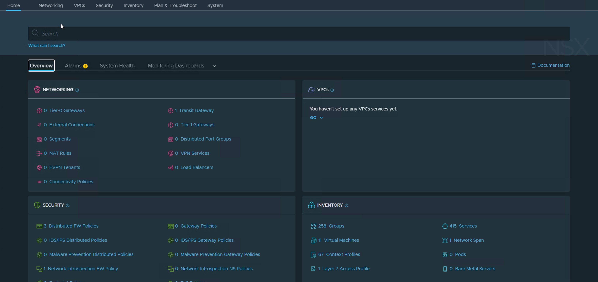

Drill into that Default Transit Gateway and it's an honest empty shell — Connectivity **Not Set**, External Connections **0**, Connected VPCs **0**. The one "Connectivity Profile" it claims to have is the empty one the wizard kept refusing:

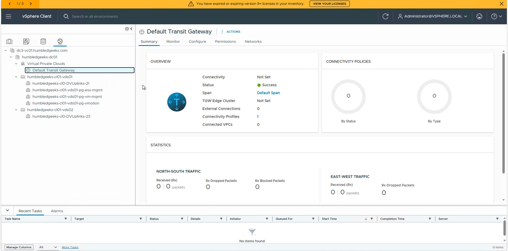

And the VPC "Get Started" page says the quiet part out loud — step one, *Setup Network Connectivity*, had never been done:

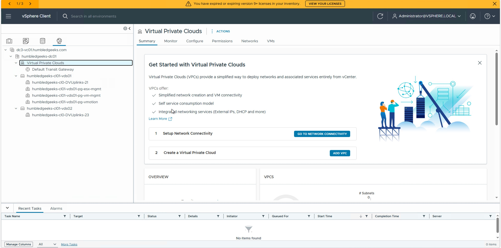

That's the diagnosis: nothing was wrong with my hosts or storage — the workload-domain deploy stalled because the NSX spine it needed had never been built. Time to build it, starting one layer lower than you'd expect: the physical wire.

---

## The Detour: a Physical Underlay That Couldn't Carry the Overlay

The obvious move was "just build an edge cluster." But the NSX overlay needs **jumbo frames (≥1600 MTU)** end to end for its tunnel endpoints (TEPs), and in dc3 the Meraki **MX** is the L3 gateway for every VLAN at a hard **1500**. The moment edge TEP traffic got routed by the MX, it would fragment and the overlay would break. The fix: move the L3 gateways for the TEP VLANs *off* the MX and *onto* the **MS425 switch stack**, which runs jumbo, so TEP traffic never touches the 1500-byte MX.

Here's the dc3 switching fabric I was working with — two MS350-48 in a "Core" stack and two MS425-32 in the "STACK 40GB" stack that carries the high-MTU east-west traffic:

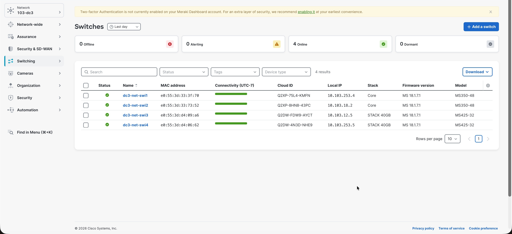

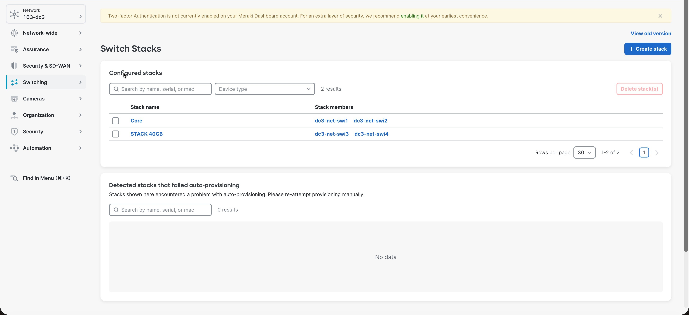

The whole detour rests on one number. The MS switch default MTU is set to **9578** — that's the jumbo island the TEPs will live on:

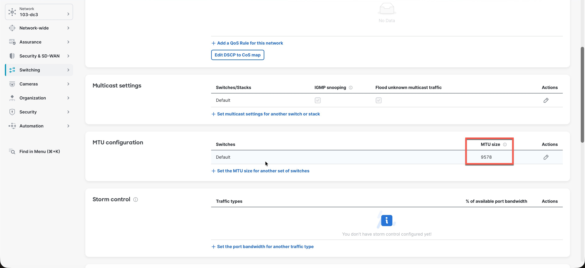

And the 40 Gb aggregates back to the UCS fabric interconnects (FI-A / FI-B) are trunked, so the host TEP VLAN reaches every blade:

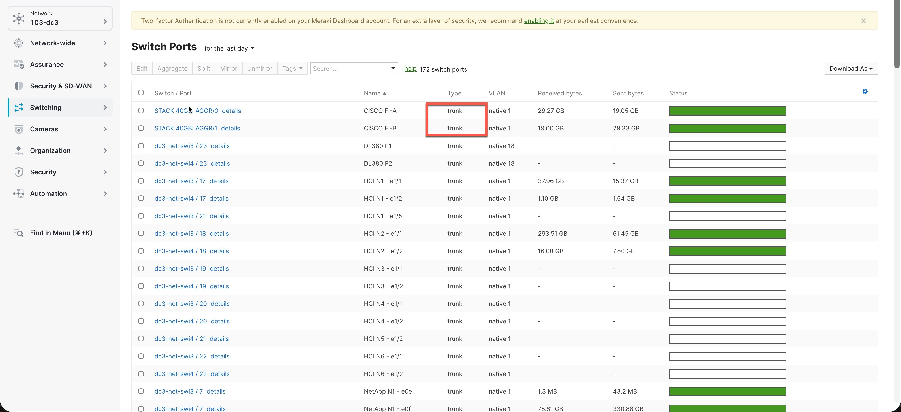

### The MX side: routed mode, the VLANs, and the static route out

The MX is in **Routed** mode and owns the VLAN gateways for the lab. Here's the VLAN/SVI inventory — note NSX32 (host TEP), NSX42 (the edge TEP VLAN I *thought* I'd need), NSX44 (the T0 uplink VLAN), and the external VLAN:

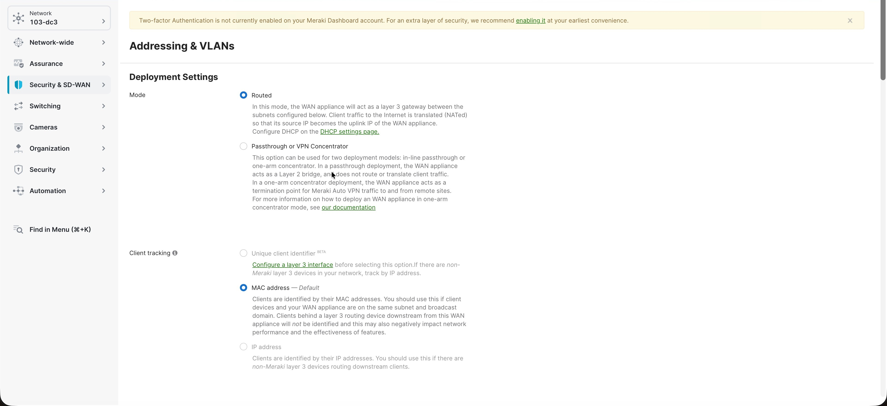

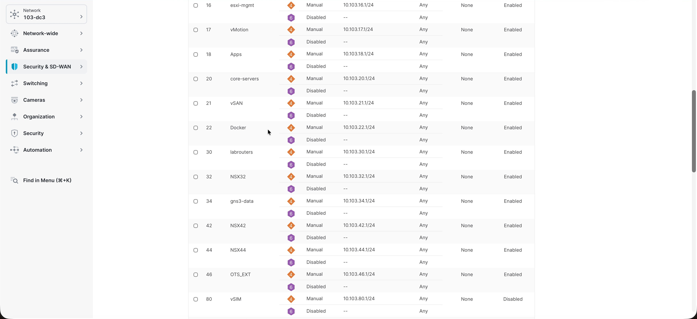

Before any routing changes, the MX had **no** static routes — there was no path to the VPC external range yet:

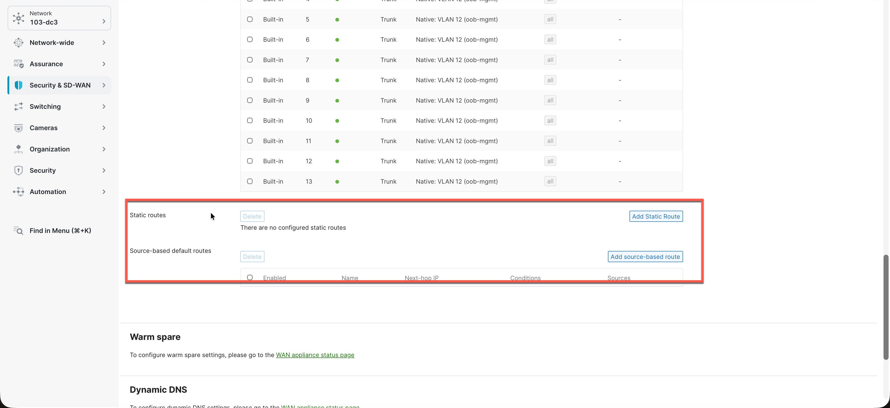

I reserved the low end of the NSX VLANs out of DHCP so the edge uplinks and TEPs could use static/pool addresses without collisions — VLAN 44 reserved `.2–.14`, VLAN 42 reserved `.2–.15`:

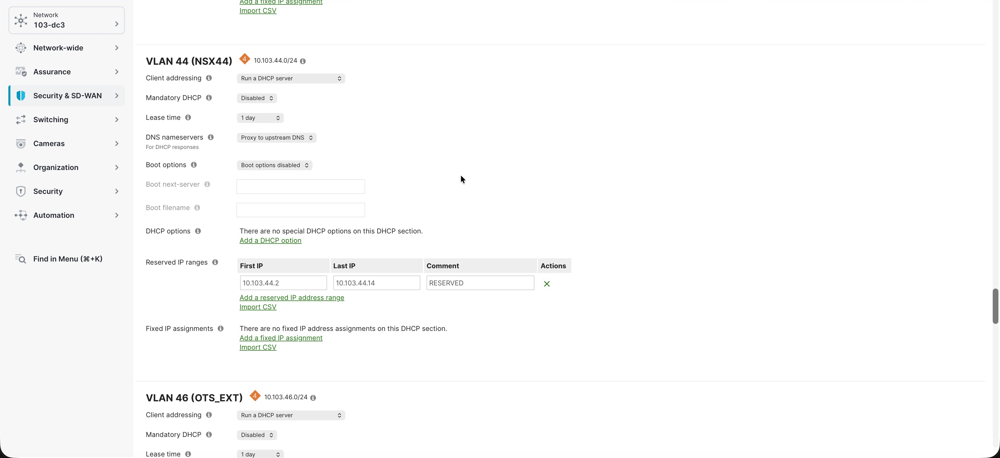

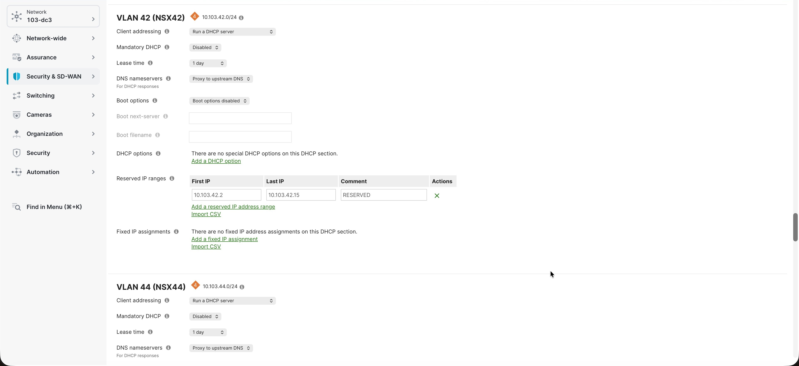

Then the static route the *whole environment* needs to reach VPC-external space — `10.103.50.0/24` — pointed (for now) at the first edge uplink, `10.103.44.11`. I'll repoint this at the HA VIP later once the Tier-0 exists:

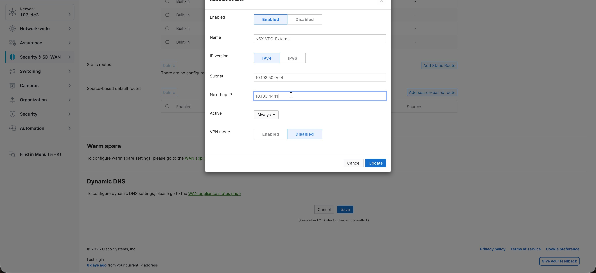

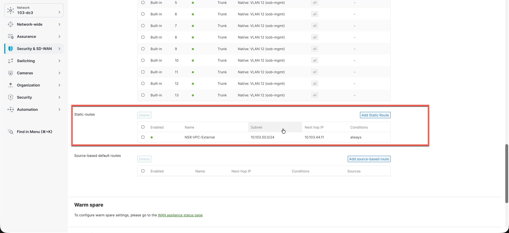

### Moving the TEP gateways onto the jumbo stack

This is the heart of the fix: the TEP VLAN gateways have to live on the **STACK 40GB** switch (9578 MTU), not the MX (1500). Layer-3 on the switch stack starts empty:

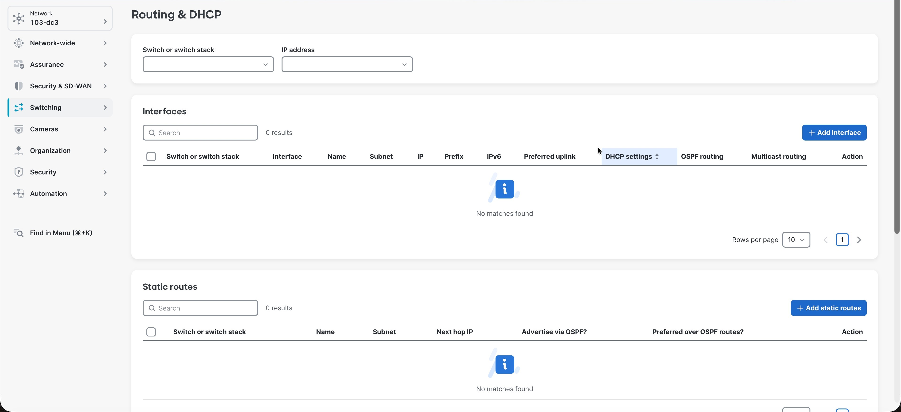

I gave the stack a route to the VPC-external range as well, so the jumbo island has its own path:

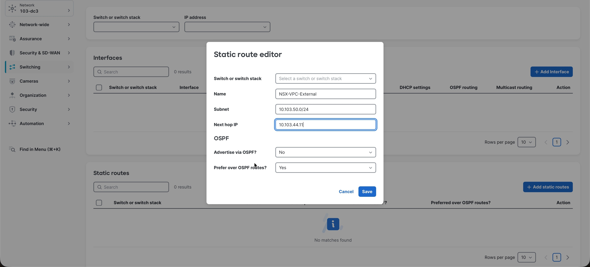

Then the SVIs. First a small **transit** interface on VLAN 99 (`10.103.99.0/30`) so the stack has somewhere to send its own default route — back to the MX — without putting the MX in the TEP data path:

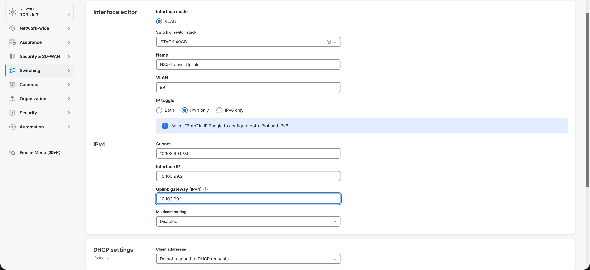

**Gotcha — the one that cost me an hour:** when you add the *first* L3 interface on a Meraki switch, it demands a `defaultGateway`. You can't just start dropping isolated TEP SVIs; the platform forces a default route on the very first interface:

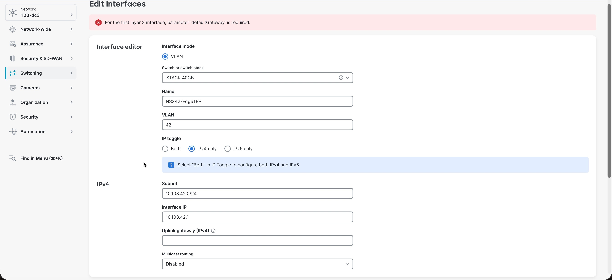

That's exactly why the tiny transit VLAN 99 exists — it satisfies the default-gateway requirement and hands the stack a clean way back to the MX. With that in place, the TEP SVIs go on without complaint. Here are two interfaces up (transit 99 and edge-TEP 42):

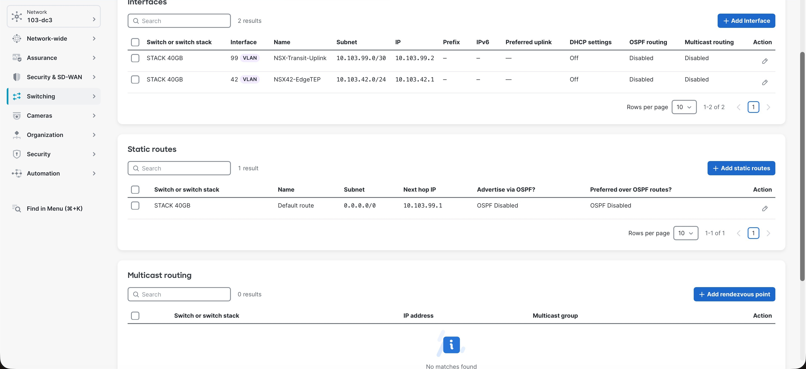

The host TEP VLAN (32) gets a DHCP server *on the stack* so hosts pull TEP addresses from the jumbo island, not the MX:

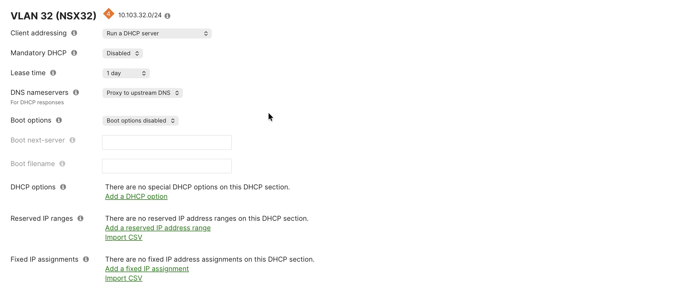

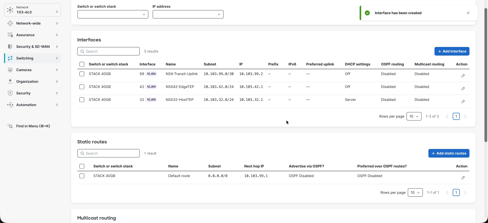

And the finished underlay — **three SVIs on STACK 40GB**: transit VLAN 99, edge-TEP VLAN 42, and host-TEP VLAN 32, all routed at 9578. This is the jumbo island the overlay will ride:

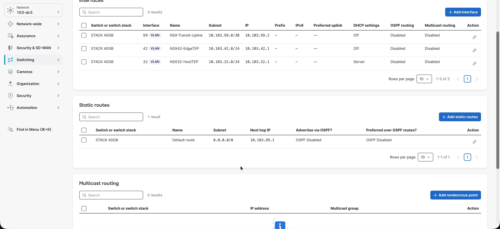

**The short version:** jumbo has to be *true on the wire* before NSX will pass its Run Check. The full underlay write-up — every Meraki field and the transit-VLAN trick — lives in the companion underlay post <!-- TODO: underlay post URL -->, but the screens above are the load-bearing ones.

> **A candid heads-up that pays off later:** I built a *separate* edge TEP VLAN (42) here and routed it at jumbo. Hold that thought — the VCF edge wizard is going to quietly ignore it and collapse the edge TEP onto the host TEP VLAN (32). Part of this underlay wall was self-inflicted.

---

## Pre-Creating the NSX IP Blocks

One more prerequisite the edge wizard assumes you've already done: the **VPC IP blocks** must exist as objects in NSX *before* the wizard will let you select them. The fields are lookups, not free-text — type a CIDR and you get "No Items Found."

Two blocks, created under **Networking → IP Address Management → IP Address Blocks**:

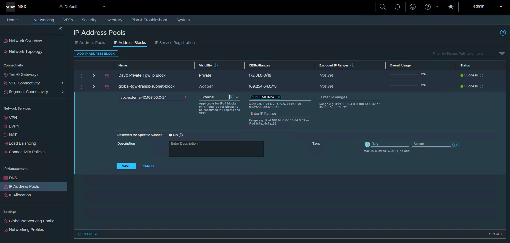

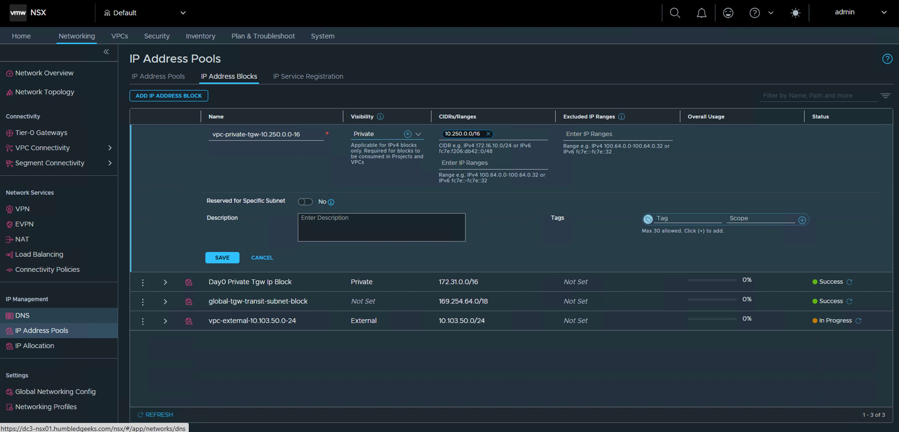

When both are in, the list shows them alongside NSX's built-ins:

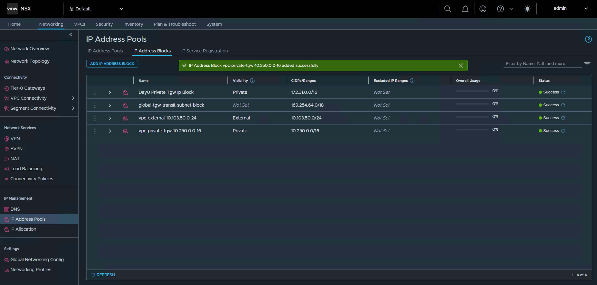

**Gotcha — the single most common Supervisor trip-up:** the **private [Transit Gateway](https://techdocs.broadcom.com/us/en/vmware-cis/vcf/vcf-9-0-and-later/9-0/advanced-network-management/administration-guide/virtual-private-cloud-in-nsx/transit-gateways/configure-a-transit-gateway.html) block must be a `/16`.** A `/24` fails VKS/Supervisor provisioning later with a cryptic carve error that has no obvious connection back to this screen. And don't reuse NSX's pre-created "Day0 Private Tgw Ip Block" — it's `172.31.0.0/16`, AWS default VPC space. I made my own: `vpc-private-tgw-10.250.0.0-16`.

---

## Building the Spine: the Edge + Tier-0 Wizard

With the underlay carrying jumbo and the IP blocks in place, I built the spine from the **management vCenter** (`dc3-vc01`), not raw NSX Manager — doing it here keeps the objects VCF-aware so SDDC Manager doesn't flag drift later. The path: vCenter object → **Networks → Transit Gateways → Setup Network Connectivity**. This is the guided [Set up Centralized Connectivity with Edge Clusters](https://techdocs.broadcom.com/us/en/vmware-cis/vcf/vcf-9-0-and-later/9-0/advanced-network-management/administration-guide/setting-up-network-connectivity/setting-up-centralized-connectivity-with-edge-clusters.html) flow Broadcom added in VCF 9 — and a [walkthrough of why it exists](https://blogs.vmware.com/cloud-foundation/2025/06/25/vpc-centralized-network-connectivity-with-guided-edge-deployment/) is worth a read if you want the design rationale.

The Transit Gateways tab before I started — the Default Transit Gateway sits there with Connection **None** and External Connection **Not Set**. That's the empty shell:

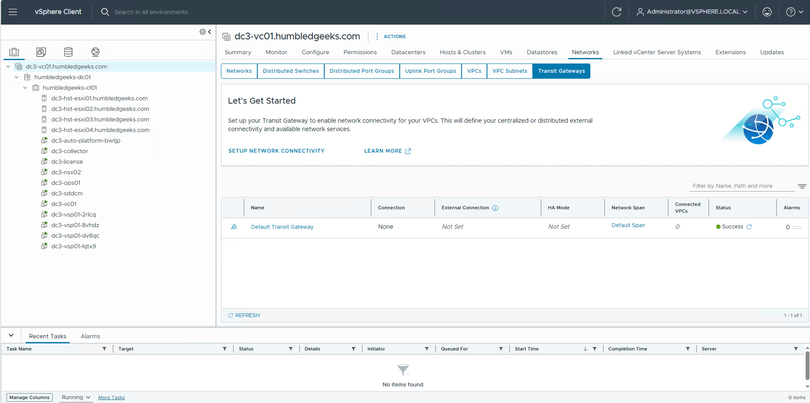

### Step 1 — Centralized Connection

The wizard opens on Transit Gateway Connectivity. I keep the span at **Default Span** and choose **Centralized Connection** — it attaches the Transit Gateway to a Tier-0 for external communication, and that Tier-0 is what hosts the stateful services (NAT, load balancing) Supervisor depends on. The "Distributed VLAN Connection" alternative wires VPC subnets straight to a physical VLAN with no Tier-0 — simpler, but no stateful services, so it can't carry a Supervisor.

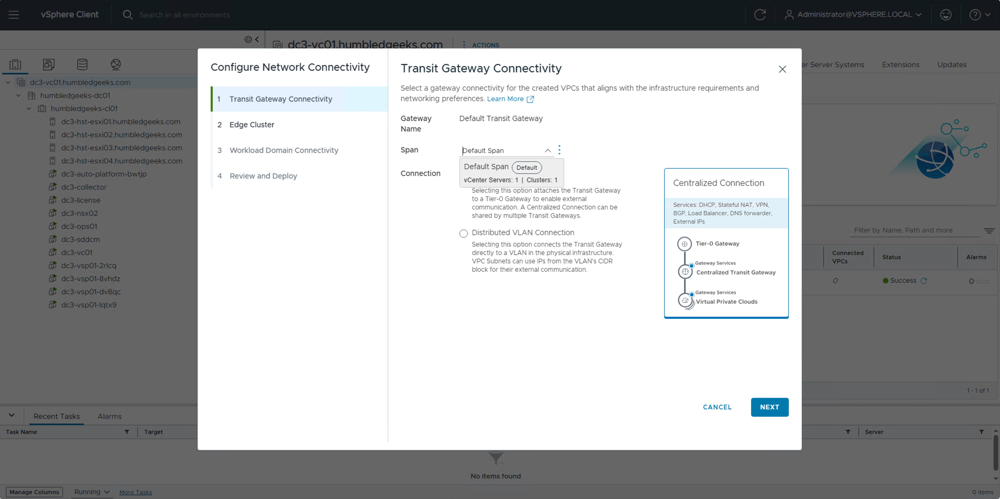

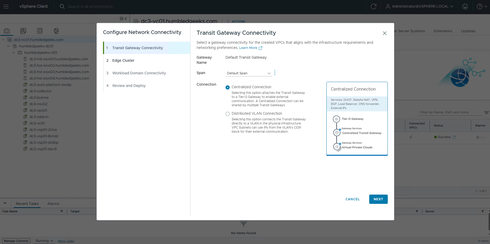

Click NEXT and NSX throws up a **Networking Prerequisites** modal — an acknowledgment checklist that's essentially a recap of the underlay and DNS work. It starts unchecked with Continue disabled; **Select All** unlocks it. The two BGP lines are conditional on dynamic routing — they don't apply to a static design:

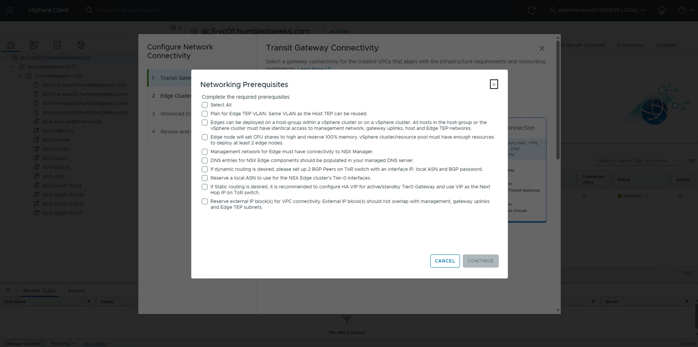

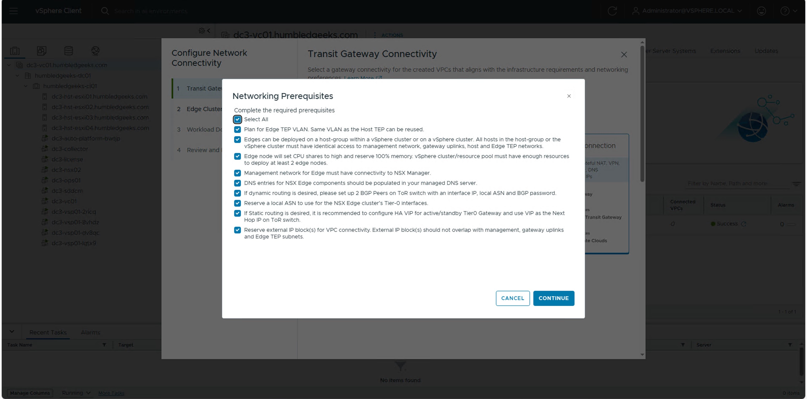

### Step 2 — the Edge Cluster

The Edge Cluster step starts empty. Cluster name `dc3-mgmt-edge-cl01`, **Tunnel Endpoint MTU 9000** (that's the overlay frame size the edges push onto the TEP network — the entire reason the underlay had to do jumbo), and Node Form Factor **Large**:

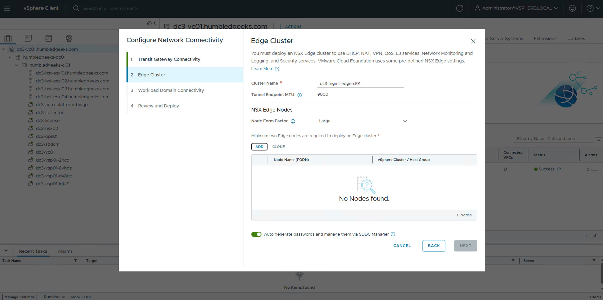

#### Adding the first edge node

Most of the Add Node dialog is identity and placement — node `dc3-nsx-edge01.humbledgeeks.com`, cluster `humbledgeeks-cl01`, datastore `VMFS01`, static management `10.103.16.138/24`, gateway `10.103.16.1`. The wizard helpfully reminds you the Management CIDR is required if you skip it:

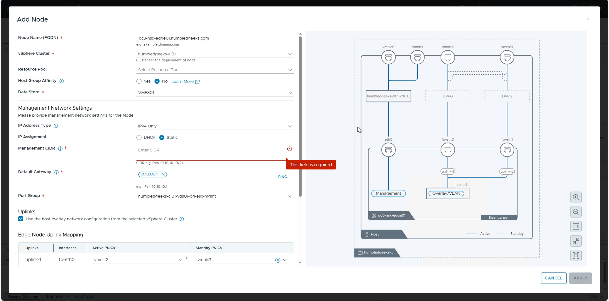

**One field that matters:** the **Port Group**. The wizard defaults to the host vmkernel management PG (`…-pg-esx-mgmt`). Change it to `…-pg-vm-mgmt`. Both ride VLAN 16, so esx-mgmt would technically work — but the edge is a VM appliance, like the NSX managers, and belongs on the VM-management PG with them, not the host vmkernel network:

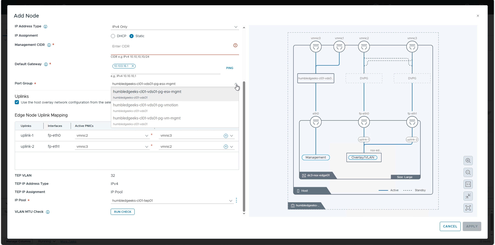

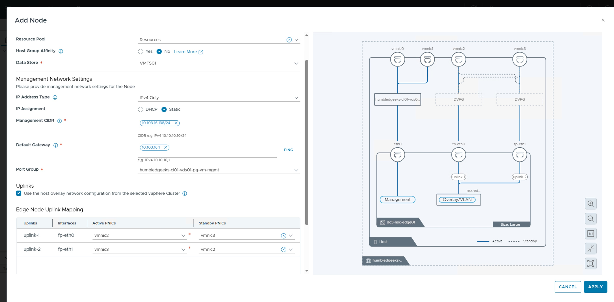

#### The edge TEP twist: the wizard collapses it onto the host VLAN

Now the field that quietly decides your whole TEP design. I'd planned a *separate* edge TEP VLAN (42) and routed it at jumbo in the underlay — so my instinct was to **uncheck** "Use the host overlay network configuration" and set the edge TEP to VLAN 42.

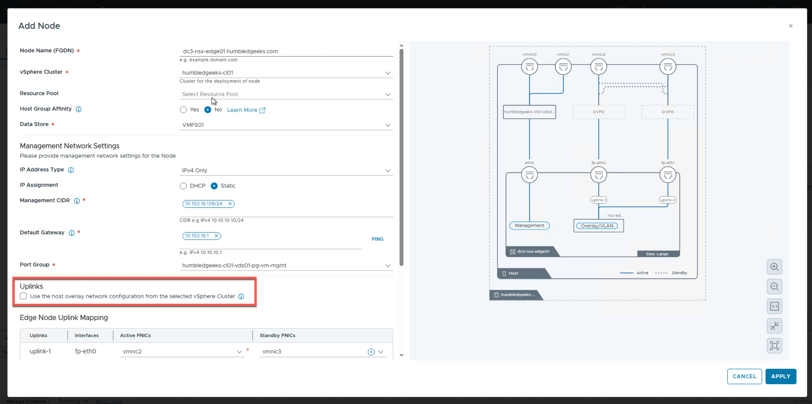

Unchecking the box *does* expose the TEP fields — but the **TEP VLAN field is read-only at 32**, inherited from the host TEP configuration, with no way to type 42. The only editable control is the IP pool. So I re-checked the box and went collapsed: edge TEP on **VLAN 32**, sharing the host TEP pool `humbledgeeks-cl01-tep01`:

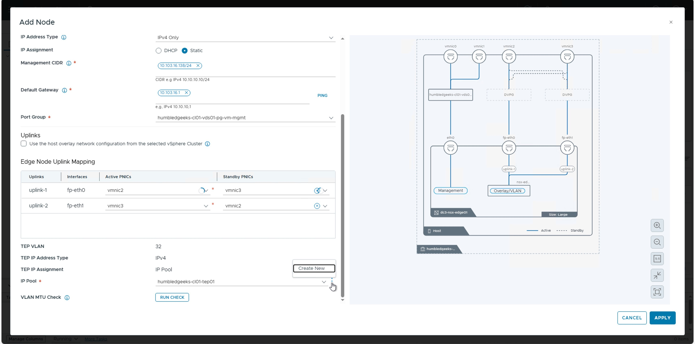

> **The lesson:** this consolidated VCF wizard only builds the *collapsed* TEP model — the edge TEP shares the host TEP VLAN. A separate edge TEP VLAN is not an option on this path. To force one, you'd abandon the wizard and hand-build the edge transport nodes in NSX Manager with a custom uplink profile — which then jeopardizes the VCF integration this wizard exists to produce. Being honest: my separate VLAN 42 SVI and its routing are now unused scaffolding. Harmless, but if I did this again I wouldn't split the TEP VLANs at all. Only the host TEP VLAN needs to carry jumbo.

#### The detour inside the detour: "not enough IP addresses"

APPLY didn't succeed the first time. NSX threw **`[Fabric] Not enough IP address available in the given ip pool … (Error code: 15000)`** — against the very TEP pool the edge was pulling from:

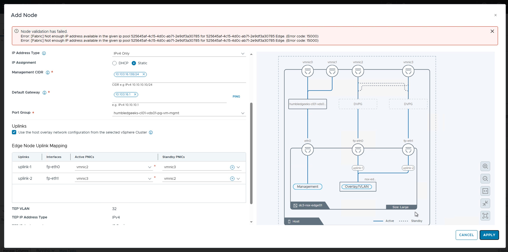

That was a head-scratcher, because the pool spanned roughly a hundred addresses on `10.103.32.0/24` — far more than four hosts plus two edges need. A pool that big reporting "not enough" almost always means **stale or leaked allocations** from earlier failed attempts. The pool had two ranges (`.2–.9` and `.10–.100`):

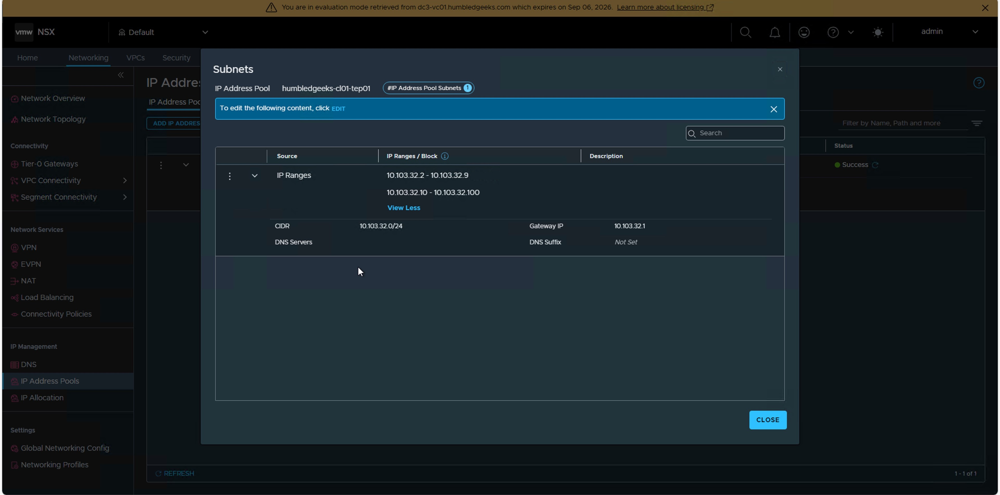

I confirmed the pool was actually clear, then trimmed it to a single clean range — `10.103.32.2–10.103.32.16` — and the edge applied:

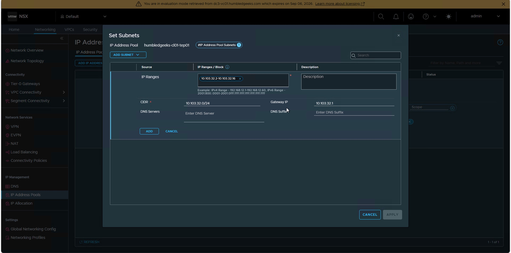

**The rule:** never shrink or remove a range on a TEP pool that has *live* allocations — you can orphan a running host TEP that way. Verify the pool is clear, or only *add* a fresh range. And when a pool that's obviously big enough says "not enough," believe the allocation table, not your mental math.

#### The Run Check: proving the jumbo island

With the TEP on VLAN 32 and the trimmed pool, the **VLAN MTU Check** returns a green **"4 SUPPORTED HOSTS."** That single line is the entire underlay detour paying off — it passes only if VLAN 32 carries a 9000-byte frame, unfragmented, from the edge TEP across the STACK 40GB fabric to every host TEP, with the gateway on the jumbo stack and *not* the 1500-byte MX:

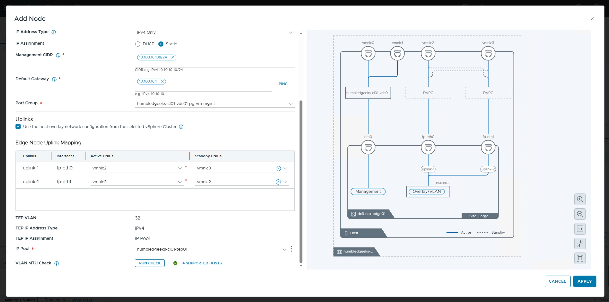

First edge node is in the cluster list:

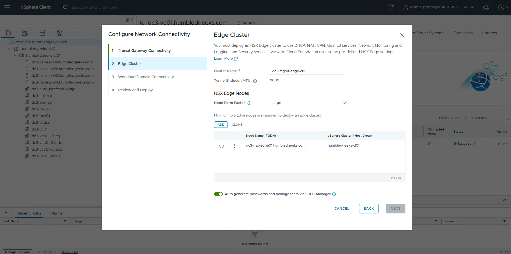

#### Edge node 2: clone, don't retype

The second edge is a clone of the first — change only the identity fields: name `dc3-nsx-edge02.humbledgeeks.com` and management `10.103.16.139/24`. Everything else, including the collapsed VLAN 32 TEP and the host pool, carries forward, and its Run Check comes back green the same way:

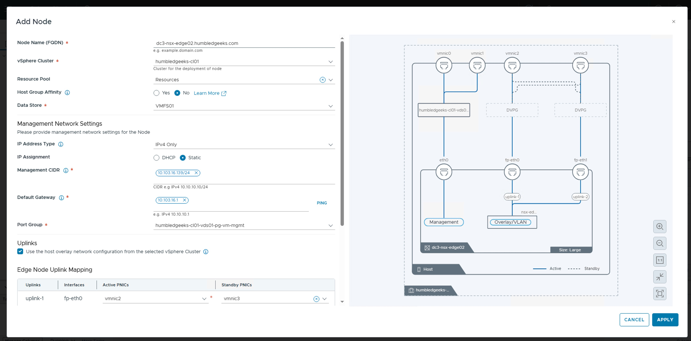

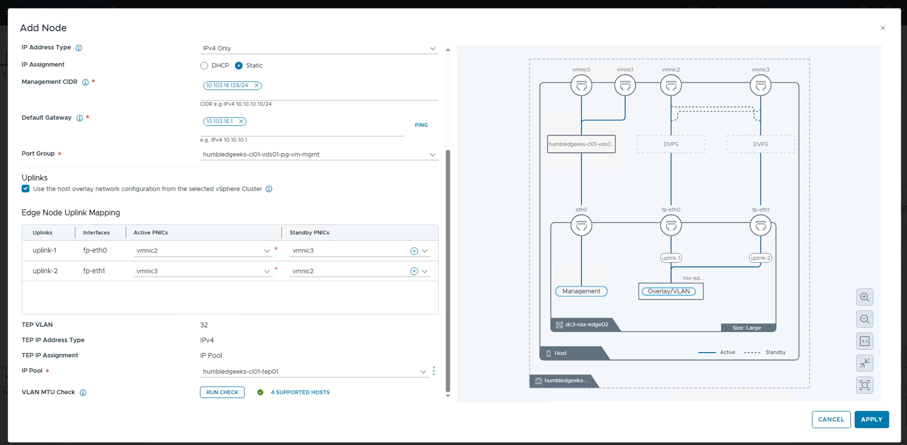

Two edges — the active/standby pair a Tier-0 needs for HA. Step 2 is done:

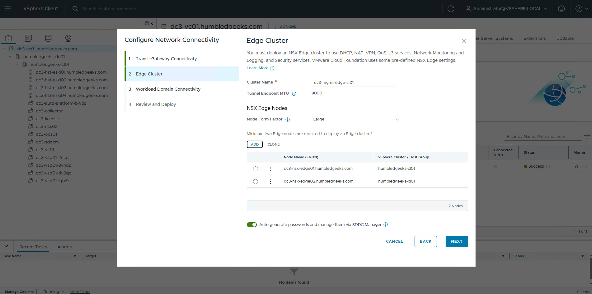

### Step 3 — Workload Domain Connectivity (the Tier-0 + uplinks + IP blocks)

This is where the Tier-0 gets its identity, its uplinks, and the VPC IP blocks — and where I hit three surprises in a row.

**Surprise one: BGP defaults to On.** The step opens with BGP toggled on and a Local ASN field marked required. For a static-routing design this does nothing useful, but it blocks NEXT until you either fill the ASN or toggle BGP off:

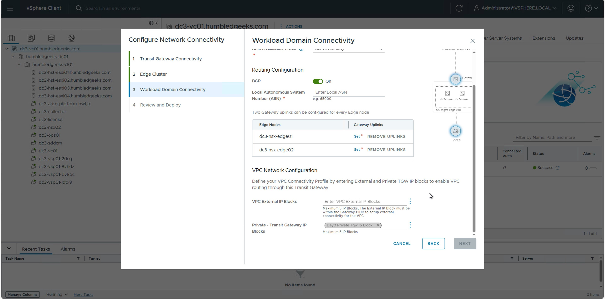

Toggle BGP **off**, name the gateway `dc3-mgmt-t0-gw01`, HA mode **Active/Standby**:

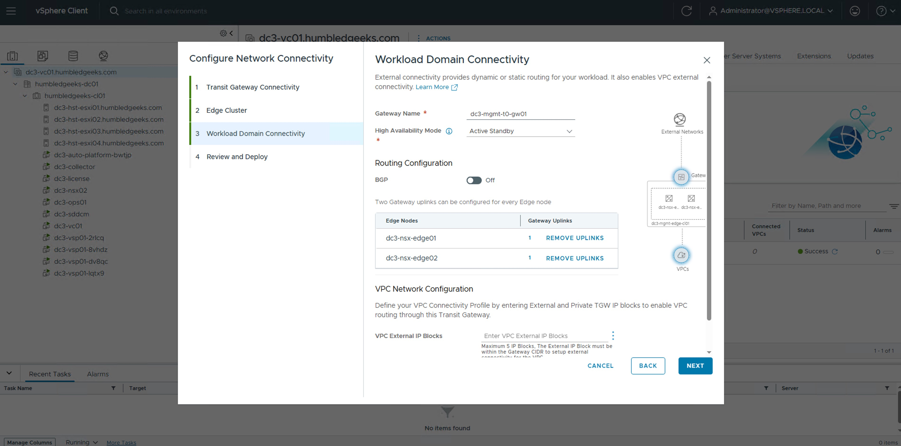

**Why static, not BGP?** The MX's BGP support is limited, and a lab T0 with one static default route is simpler. The trade-off — no dynamic route failover — is fine here because the HA VIP handles edge failover at L2. And **Active/Standby** is required for the stateful services (NAT, LB) Supervisor layers on top.

Each edge gets one **uplink on VLAN 44** — edge01 `10.103.44.11/24`, edge02 `10.103.44.12/24`, MTU **1500** (these face the physical world through the MX, so ordinary MTU, not overlay):

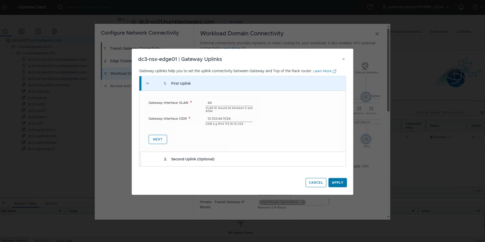


**Surprise two: the uplink modal has no next-hop field.** For static routing, there's nowhere here to enter `10.103.44.1`. The T0 default route is a *post-deploy* step in NSX Manager — the wizard only configures the interface, not the route.

**Surprise three: the VPC IP block fields are lookups, not free-text.** Type `10.103.50.0/24` into the VPC External IP Blocks field and you get "No items Found" — which is exactly why I pre-created the blocks earlier:


Select the pre-created blocks from the dropdowns — external `vpc-external-10.103.50.0-24`, and for the private side **pick your own `/16`, not the Day0 172.31 block**:


With the Tier-0 named, BGP off, both uplinks set, and both VPC blocks selected, Step 3 is complete:


### Step 4 — Review and Deploy

The review summary lays out the whole spine: edge cluster `dc3-mgmt-edge-cl01`, 2 Large edges, gateway `dc3-mgmt-t0-gw01`, Active/Standby, BGP Off, and both IP blocks. Click **DEPLOY**:


The Transit Gateways tab confirms immediately: *"Request for setting up network connectivity is successfully submitted. The deployment of Edge Nodes is in progress."*


Watch it under **Configure → Edge Clusters**. Both edges clone in parallel — Recent Tasks shows two "Deploy OVF template" tasks running together at ~30% each. Total time in this lab: roughly 15 minutes:


The cluster passes through "Success but connectivity Not Available" while the edges finish coming up — normal — and then goes fully green: Node Connectivity Status **2 Up**, Status **Success**:


The T0 exists, the edge VMs are running, and the overlay tunnels are up. But the T0 still has **no default route, no HA VIP, and no SNAT** — the wizard doesn't set any of those for a static design. They're all post-deploy steps in NSX Manager.

---

## Post-Deploy: the Three Things the Wizard Doesn't Do

All of this is in NSX Manager (`dc3-nsx01`). The Tier-0 is deployed and shows **Success** in the list:


### POST-1 — the static default route

Edit the T0, expand **ROUTING**, and click **Set** next to Static Routes. The list is empty; **ADD STATIC ROUTE**. The network pre-populates with `0.0.0.0/0` — name it `default-route-to-mx`:


Click **Set** next to Next Hops and enter the MX SVI on VLAN 44 — IP `10.103.44.1`, Admin Distance `1`:


Save it. The route shows **Uninitialized** for a moment — normal — then transitions to **Success** once it's pushed to the active edge dataplane:


The T0 now has a way out: anything without a more-specific match goes to `10.103.44.1`, the MX SVI on VLAN 44.

### POST-2 — the HA VIP

Still in the T0 edit panel, click **Set** next to HA VIP Configuration. **ADD HA VIP CONFIGURATION**, select both edge uplink interfaces (both show as `External-interface44`), enter `10.103.44.10/24`, and toggle Enabled to **Yes**:


The VIP `10.103.44.10` now floats to whichever edge is active. This is the single address the MX will point at, so edge failover becomes transparent to the physical world. The T0 saves with one static route and one HA VIP:


### POST-3 — Provider Outbound SNAT

This one isn't on the T0 — it's on the **External Connection** (VPC Connectivity → External Connections → `Gateway-connection-dc3-mgmt-t0-gw01` → Edit → Advanced Settings). Start state, SNAT off:


Toggle **Provider Outbound SNAT** on, and select the external block. **Gotcha:** enabling SNAT *requires* an **External IP Block** on the same connection — without it, SAVE fails with error `640103` ("NAT config ip_block must be present when SNAT is enabled"). The separate "SNAT IP Blocks" dropdown is a different object type and is *not* what the error is asking for:


After save, NSX auto-populates the SNAT IP Blocks field from the External IP Block selection, and the connection reports updated:


**Why all three matter:** no default route = the T0 has no way out. No VIP = the MX has no single address to follow across edge failover. SNAT off = egress keeps its private source IP, the MX has no return path, and connections just hang.

---

## Point the MX at the VIP

Last routing change: update the MX static route for `10.103.50.0/24` from the interim `10.103.44.11` to the **VIP `10.103.44.10`**, so it follows whichever edge is active:


---

## Validation and the Payoff

The external connection converges from **In Progress** to **Success**, and the Default Transit Gateway is finally linked to a real external connection:


Compare the NSX Overview now to where this post started — **1 Tier-0, 1 External Connection, 2 Segments, 1 Edge Cluster** where there used to be zeros:


All four hosts are prepared for NSX in `humbledgeeks-cl01`:


And the proof the jumbo island works end to end: both edges show **Tunnels ↑4** — one tunnel to each host TEP — with edge TEPs on `10.103.32.x`, confirming the collapsed-VLAN-32 design and the `tep01` pool are doing their job:


Two edges, a Tier-0, an external connection on VLAN 44, the IP blocks, and the routing finished by hand — and the Default Transit Gateway that had been an empty shell is now a real, backed **VPC connectivity profile**. Which means the thing this entire detour was for: I can go back to the workload domain wizard's **vSphere Supervisor** step, open that dropdown, and pick **"Default VPC Connectivity Profile"** from a list that's no longer empty.

And there it is — the same Supervisor step that stopped me cold, now with **Default VPC Connectivity Profile** selected, the Service CIDR, Control Plane range, and `/16` Private CIDR filled in, and **NEXT** finally lit. Same screen, no more wall:


## Finishing the Workload Domain — Field Notes for the Supervisor Step

With the profile in place, the rest of the VI WD / Supervisor wizard goes in. A few values worth carrying, because they're the ones that cost time if you get them wrong:

- **Step 5 — NSX Manager:** **Join existing** `dc3-nsx01`, *not* create new. Reusing the existing NSX is what lets this WD see the profile we just built; creating a new NSX would orphan the entire spine.
- **Step 8 — host TEP:** set a **static IP pool** (`humbledgeeks-wld-host-tep01`, range `10.103.32.20–.60`), **not DHCP**. DHCP was deliberately removed from VLAN 32 to avoid colliding with the edge pool, so a DHCP host TEP would get no answer, fall back to APIPA, and break the overlay. **Gotcha:** this DHCP→static choice generally **cannot** be changed in the UI after deploy — it's one-shot.
- **Step 9 — vSphere Supervisor:** select **Default VPC Connectivity Profile**; put the **Service CIDR** on a dedicated unused block (e.g. `10.96.0.0/24`) — *not* the TEP subnet; put the **Control Plane** range in the management subnet (`10.103.16.65–.69`); and make the **Private CIDR** a **`/16`** (`10.244.0.0/16`). Reusing the `.32` TEP subnet for the Service CIDR or Control Plane is the root cause of the two most common red errors here.

## Where It Stands

The workload domain's compute, storage, and NSX transport are provisioned and lifecycle-owned by SDDC Manager. The underlay carries jumbo where it has to, the edge spine is built, the routing is finished, and the VPC connectivity profile finally exists — so the vSphere Supervisor enablement can proceed.

The lab lesson that bears repeating: **enabling vSphere Supervisor on a *shared* NSX instance quietly makes you responsible for the entire north-south spine** — an edge cluster, a Tier-0, IP blocks, the underlay jumbo path, and the routing — none of which the workload-domain wizard builds for you. That empty connectivity-profile dropdown isn't a bug; it's the wizard telling you the spine doesn't exist yet. Build it — underlay first, then the edges and Tier-0, then finish the routing by hand — and the dropdown fills itself.

## References & Further Reading

The Broadcom docs and blogs I leaned on for this build — bookmark-worthy if you're walking the same path:

- [VMware Cloud Foundation 9.1 — Documentation](https://techdocs.broadcom.com/us/en/vmware-cis/vcf/vcf-9-0-and-later/9-1.html) and the [9.1 Release Notes](https://techdocs.broadcom.com/us/en/vmware-cis/vcf/vcf-9-0-and-later/9-1/release-notes/vmware-cloud-foundation-9-1-0-0-release-notes.html)
- [Setting up Network Connectivity](https://techdocs.broadcom.com/us/en/vmware-cis/vcf/vcf-9-0-and-later/9-0/advanced-network-management/administration-guide/setting-up-network-connectivity.html) → [Set up Centralized Connectivity with Edge Clusters](https://techdocs.broadcom.com/us/en/vmware-cis/vcf/vcf-9-0-and-later/9-0/advanced-network-management/administration-guide/setting-up-network-connectivity/setting-up-centralized-connectivity-with-edge-clusters.html)
- [Configure a Transit Gateway](https://techdocs.broadcom.com/us/en/vmware-cis/vcf/vcf-9-0-and-later/9-0/advanced-network-management/administration-guide/virtual-private-cloud-in-nsx/transit-gateways/configure-a-transit-gateway.html)
- [Supervisor Architecture with VPC Networking](https://techdocs.broadcom.com/us/en/vmware-cis/vcf/vcf-9-0-and-later/9-0/vsphere-supervisor-installation-and-configuration/supervisor-networking-with-virtual-private-clouds/supervisor-architecture-with-vpc-networking.html)
- VCF Blog: [Simplify Workload Connectivity and Enhance Network Scale with VCF 9.1](https://blogs.vmware.com/cloud-foundation/2026/05/05/simplify-workload-connectivity-and-enhance-network-scale-and-performance-with-vcf-9-1/) and [VPC Centralized Network Connectivity with Guided Edge Deployment](https://blogs.vmware.com/cloud-foundation/2025/06/25/vpc-centralized-network-connectivity-with-guided-edge-deployment/)
- [Free Home-Lab Licenses for VMware Certified Professionals](https://blogs.vmware.com/cloud-foundation/2025/04/14/free-home-lab-licenses-for-vmware-certified-professionals/) · [VMUG Advantage Membership](https://www.vmug.com/membership/vmug-advantage-membership/)

## What's Next

- **Finish the Supervisor enablement** now that the connectivity profile exists — select it, deploy, and confirm vSphere Kubernetes comes up on the new domain.
- **License the environment** — applying license keys across the fleet before the 90-day evaluation clock runs out (it started back in Part 1 and does not reset per domain).
- **Prove that updates work** — running a lifecycle/patch cycle through SDDC Manager to confirm the fleet updates cleanly.

Follow along on [HumbledGeeks.com](https://humbledgeeks.com), or connect with me on LinkedIn if you're on the same journey. As always — built in the lab, mistakes and all.
