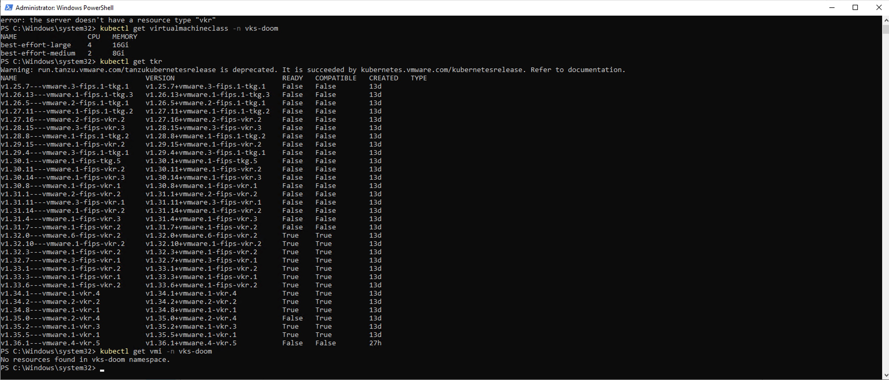
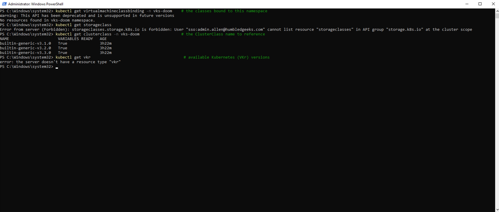
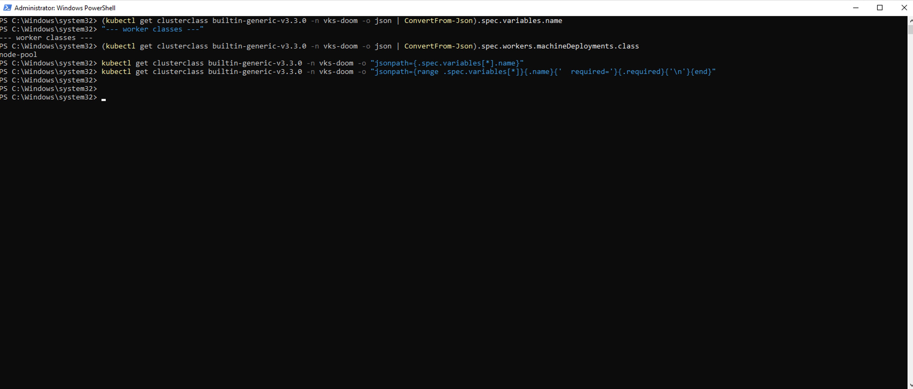
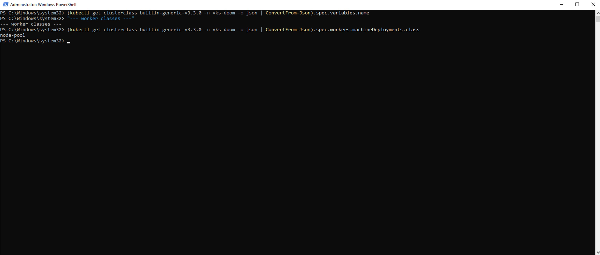
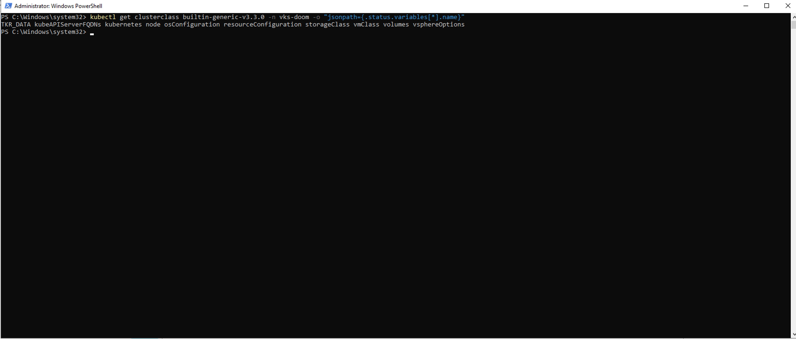
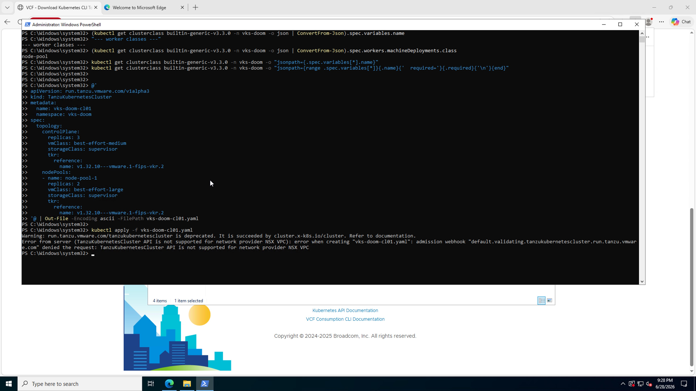
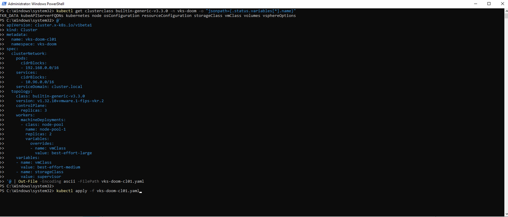
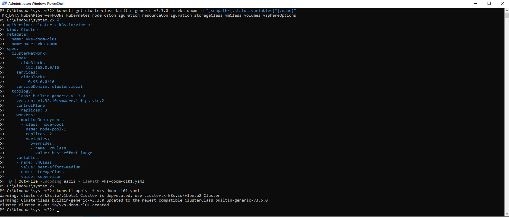
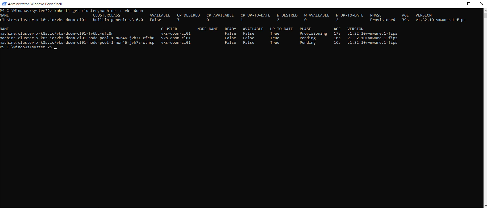
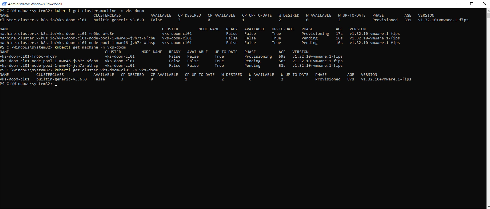

<!-- PRESERVED 2026-06-29 — the original CLI/kubectl manifest version of Steps 8-9
(VKr v1.32.10, ClusterClass builtin-generic-v3.3.0). Replaced in the published draft
by the GUI "CREATE CLUSTER" wizard path (v1.35.5 / v3.6.0) that actually shipped.
Kept verbatim here for the companion troubleshooting post or a future "declarative
alternative" sidebar. Nothing deleted — just relocated. -->

## Step 8 — Create the VKS cluster (3 control-plane + 2 workers)

**Discover the real values** in your namespace — never hard-code from a blog (including this
one). First, the available Kubernetes (VKr) versions:

```powershell
kubectl get tkr
```



*Pick one that's **Ready** AND **Compatible**. I chose the latest 1.32 — `v1.32.10+vmware.1-fips-vkr.2` — to keep Kubedoom (validated on 1.32) on known-good ground.*

Then the VM classes, storage class, and ClusterClass:

```powershell
kubectl get virtualmachineclass -n vks-doom
kubectl get storageclass            # may be forbidden at cluster scope — fine; the namespace's policy is 'supervisor'
kubectl get clusterclass -n vks-doom
```



*`best-effort-medium` / `best-effort-large`, and ClusterClasses `builtin-generic-v3.1.0/v3.2.0/v3.3.0`. The storageclass "forbidden at cluster scope" is just RBAC — the namespace's policy `supervisor` is the class.*

Now the tricky part — the `builtin-generic` ClusterClass **doesn't expose variables in
`.spec.variables`** (that query comes back empty), and its worker class is `node-pool`:

```powershell
kubectl get clusterclass builtin-generic-v3.3.0 -n vks-doom -o "jsonpath={.spec.variables[*].name}"      # empty!
kubectl get clusterclass builtin-generic-v3.3.0 -n vks-doom -o "jsonpath={.spec.workers.machineDeployments[*].class}"  # node-pool
```





*The empty result is a trap. The variables exist — they're resolved into `.status.variables`, not `.spec.variables`.*

The real variable names live in **`.status.variables`**:

```powershell
kubectl get clusterclass builtin-generic-v3.3.0 -n vks-doom -o "jsonpath={.status.variables[*].name}"
# TKR_DATA kubeAPIServerFQDNs kubernetes node osConfiguration resourceConfiguration storageClass vmClass volumes vsphereOptions
```



*There they are. The two we set are `vmClass` and `storageClass`.*

> **The NSX-VPC gotcha that cost me real time:** my first instinct was the classic
> `TanzuKubernetesCluster` manifest. On NSX VPC, the webhook **rejects it outright** —
> *"TanzuKubernetesCluster API is not supported for network provider NSX VPC."* You must use
> the CAPI `Cluster` form below.



*The webhook handing you the answer: on NSX VPC, use the modern `Cluster` + ClusterClass API.*

So here's the `Cluster` manifest — 3 control-plane (medium) + 2 workers (large via override),
VKr 1.32.10:

```yaml
# vks-doom-cl01.yaml
apiVersion: cluster.x-k8s.io/v1beta1
kind: Cluster
metadata:
  name: vks-doom-cl01
  namespace: vks-doom
spec:
  clusterNetwork:
    pods:
      cidrBlocks: ["192.168.0.0/16"]
    services:
      cidrBlocks: ["10.96.0.0/16"]
    serviceDomain: cluster.local
  topology:
    class: builtin-generic-v3.3.0
    version: v1.32.10+vmware.1-fips-vkr.2
    controlPlane:
      replicas: 3
    workers:
      machineDeployments:
      - class: node-pool
        name: node-pool-1
        replicas: 2
        variables:
          overrides:
          - name: vmClass
            value: best-effort-large
    variables:
    - name: vmClass
      value: best-effort-medium
    - name: storageClass
      value: supervisor
```



```powershell
kubectl apply -f vks-doom-cl01.yaml
```



*`cluster.cluster.x-k8s.io/vks-doom-cl01 created`. The `v1beta1`-deprecated and "ClusterClass rolled to the newest compatible (v3.6.0)" warnings are cosmetic.*

---

## Step 9 — Watch it provision

```powershell
kubectl get cluster,machine -n vks-doom -w
```





*The Cluster reaches Provisioned, then 5 Machines (3 control-plane + 2 workers) go Pending → Provisioning → Running as the node VMs clone from the 1.32.10 VKr OVA on the NetApp datastore, boot, and join. Allow ~10–20 minutes. The 2nd/3rd control-plane machines only appear after the first is up — that's etcd quorum building in order, not a stall.*

**Done looks like:** all 5 machines `Running`/`READY True`, cluster `AVAILABLE: True`,
`CP AVAILABLE: 3`, `W AVAILABLE: 2`.
