<!-- ============================================================
Zero to VCAP: VLAN 18 on the WLD + cross-vCenter vMotion PoC.
Voice: first person, engineer to engineer, honest about wrong turns.
HARD RULES: no em dashes, no marketing language, no claim that VCF
"approved" the out-of-band NSX change (state only what was observed),
do not present the NFC disk-path stack selection as a universal law
(frame it as how it behaved in this build). CLI verbatim in code blocks.
Screenshots: vlan-images/vlan-NN-*.jpg in workflow order.
============================================================ -->

If you have been following the Zero to VCAP series, you know I stood up a new VCF 9.1 environment along the way. Now comes the part that actually matters at work: getting off the aging vSphere 8.0U3 environment sitting right next to it.

There is more than one road out of 8.0U3, and plenty of them leave the vSphere family entirely. You could rebuild the workloads on Proxmox or Hyper-V, land them on HPE VM Essentials, lift them somewhere else with HCX, or fall back to a plain backup and restore into a fresh estate. Those are all real options, and for some shops one of them is the right call.

I am not walking those here. This is a VMware Cloud Foundation journey, so I am deliberately staying in the vSphere family and moving forward on the platform I already run. That still leaves a choice, because staying in the family is not a single road. There are two, and both land me on vSphere 9.x.

The first road is an in-place upgrade of the legacy environment. I could converge that 8.0U3 estate straight into this VCF instance, but I wanted to take the opportunity to show VVF (VMware vSphere Foundation) instead. That means upgrading the old vCenter and hosts in place to 9.x as VVF rather than folding them under VCF. The bulk of the fleet would ride that upgrade with no network surgery.

The second road is cross-vCenter vMotion. Here I leave the legacy environment where it is and move workloads across onto the VCF 9.1 domain a VM at a time.

Both keep me in the family, and I plan to walk the VVF in-place upgrade in its own post. This one is about the vMotion road, because it is the one with the interesting failure modes.

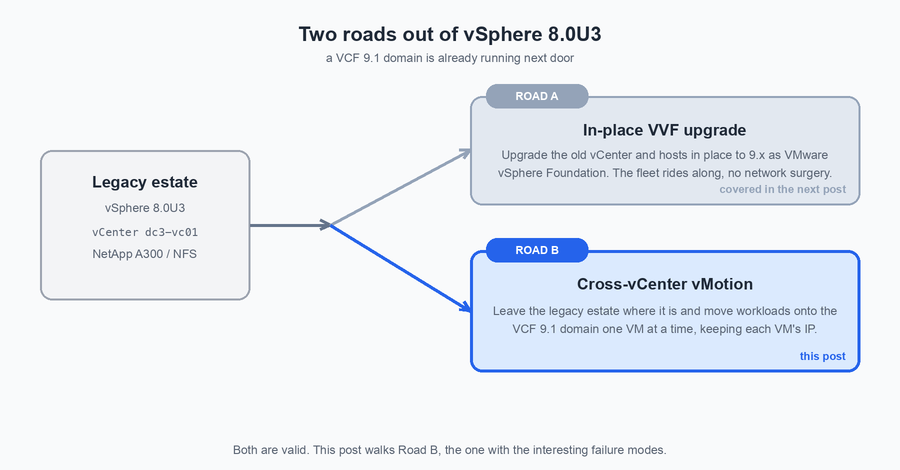

Before I move a single production VM with cross-vCenter vMotion, I want proof that the new environment actually works. Not a dashboard that says healthy, but a real workload living on the new domain: pulling an address, routing out, and behaving exactly as it did on the old side.

Trusting production to a new platform on faith is how you turn a planned migration into an outage. So the whole point of this post is validation. I build the destination the way production will need it, put a throwaway workload on it, and prove the environment end to end before anything that matters goes near it.

Because I am not converging the 8.0U3 environment, nothing recreates its networks for me. The production VMs I plan to move are VLAN-backed, and every VLAN they sit on has to be hand-built on the workload domain as its own NSX segment.

Production spans a lot of these VLANs. Rather than build all of them blind, I picked one network, VLAN 18 (Apps), to validate the whole approach on a single low-risk segment first. Get the build and the proof right once and it becomes a template: the same segment build repeats for every remaining network, and the same validation confirms each one.

Keeping these workloads VLAN-backed rather than overlay is also what preserves their IPs, so a migrated VM keeps the same subnet, the same gateway, and the same address it always had.

This post is also a record of two wrong turns, because the wrong turns are the useful part. One of them I diagnosed correctly. The other I got flat wrong and had to walk back, and walking it back is the honest core of this whole thing.

## The goal and the constraints

The workload network here is VLAN-backed, not overlay. That is the whole reason the IPs survive. An overlay segment would pull these VMs behind the Tier-0 and change their routing story. A VLAN-backed segment keeps them on the same broadcast domain the Meraki MX already routes, so the VM does not know or care that it changed vCenters.


A few constraints I was not allowed to break:

- Keep it VLAN-backed. Do not attach the segment to a Tier-1 or the Tier-0. The Meraki MX owns the gateway `10.103.18.1` and owns DHCP.
- Do not touch the Tier-0. The NSX north-south spine on this domain is for VPC and Supervisor workloads. This migration does not go near it.
- Mode must stay Standard on the workload host switch. These NICs do not support Enhanced Datapath. ENS previously threw realization error 609679 (KB 404412), so Enhanced Datapath is off the table on this hardware.

The environment, for reference:

- Management domain: vCenter `dc3-vc01.humbledgeeks.com`, shared NSX `dc3-nsx01.humbledgeeks.com`.
- New workload domain: vCenter `dc3-vc02.humbledgeeks.com`, cluster `dc3-wld-cl01`, four hosts `dc3-hst-esxi05` through `08` at `10.103.16.55` to `.58`. Transport Node Profile `dc3-vc02-dc3-wld-cl01`. Host switch is VDS `wld-cls-vds-02` on `vmnic2` and `vmnic3`, Mode Standard.
- Transport zones in play: `overlay-tz-mgmt-nsxt` (overlay, already bound to the WLD host switch), `nsx-vlan-transportzone` (VLAN, tagged Default, the correct non-system VLAN TZ to use), and `nsx-system-vlan-transport-zone` (system and locked, do not use).
- VLAN 18 (Apps) is `10.103.18.0/24`, gateway `10.103.18.1` on the Meraki MX, DHCP served by the MX. Meraki ports trunk all VLANs, so VLAN 18 already reaches the WLD uplinks. No Meraki change was needed.
- Storage: the WLD is a NetApp ASA A30 over FC, surfaced as datastore `VMFS01`. Legacy is a NetApp A300 over NFS.

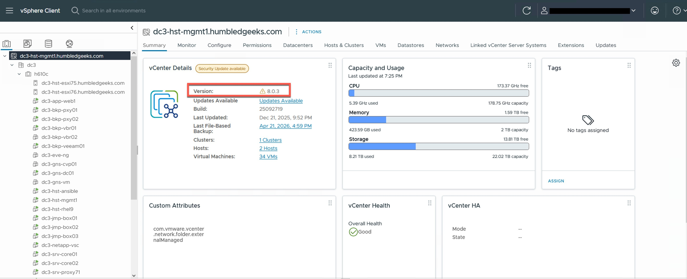

## Dead end one: the system VLAN TZ that went green and published nothing

My first attempt was the one that looked like a shortcut. I created the VLAN 18 segment on `nsx-system-vlan-transport-zone`. It went green. NSX reported Success. By every indicator on the NSX side, I was done.

Then I went to `dc3-vc02` to pick up the port group, and there was nothing there. vCenter search found no matching distributed port group. Back in NSX, the segment showed zero ports. It had realized against nothing that vCenter could see.

The lesson is short: the system VLAN transport zone does not publish a vCenter-facing distributed port group on this workload host switch. Green in NSX told me the object existed, not that it was usable. And a segment's transport zone cannot be changed after creation, so there was no editing my way out of it. The fix was to delete the segment and rebuild it on the correct TZ.

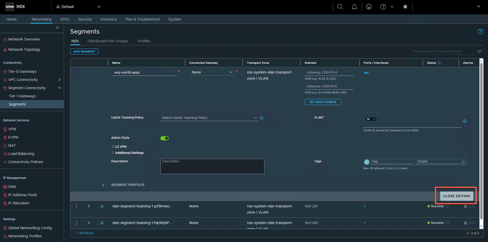

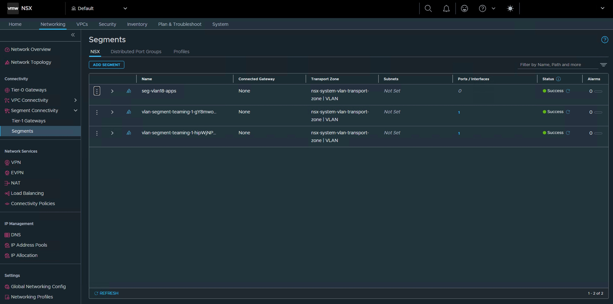

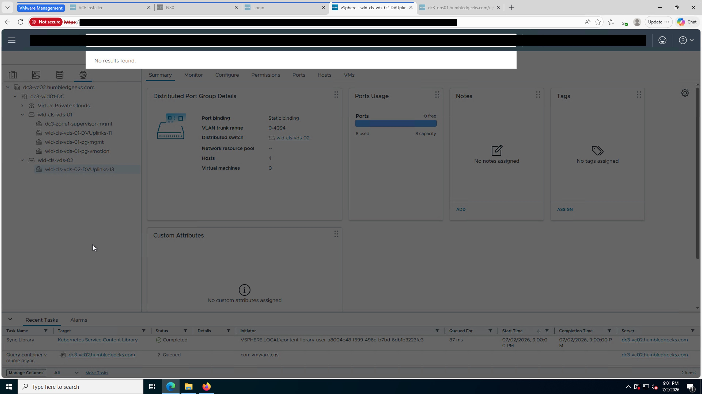

## Dead end two: the greyed APPLY I misread as a VCF lock

The correct TZ, `nsx-vlan-transportzone`, had zero transport nodes attached, which meant it was not yet wired to the workload host switch. So before I could build the segment there, I had to add that VLAN TZ to the host switch. I opened the Transport Node Profile, went into the host switch editor, and added `nsx-vlan-transportzone` alongside the existing overlay TZ.

Both transport zones showed correctly. Mode was Standard. The uplinks were intact. There was no red error anywhere. And the APPLY button was greyed out.

I jumped to a conclusion, and it was the wrong one. I decided VCF was locking the workload domain's Transport Node Profile and refusing out-of-band commits. It was a tidy story. It fit my expectation that VCF guards its managed objects. It was also incorrect.

APPLY was greyed because the inline host-switch row edit was never committed. The NSX host switch editor stages your row-level change and waits for you to commit that row with its own ADD button before the modal-level APPLY will enable. I had staged the transport zone addition but never pressed ADD on the row, so from the editor's point of view there was no completed change to apply. The moment I committed the row with ADD, APPLY lit up, and the profile saved without complaint.

NSX allowed the edit. VCF did not block anything. The real gotcha was a UI commit step I had skipped, not a platform guardrail. I am spelling this out because I spent real time convinced the platform was stopping me when the platform had nothing to do with it.

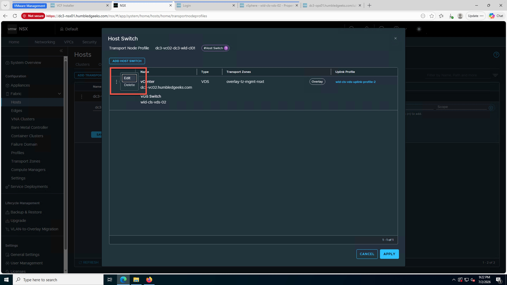

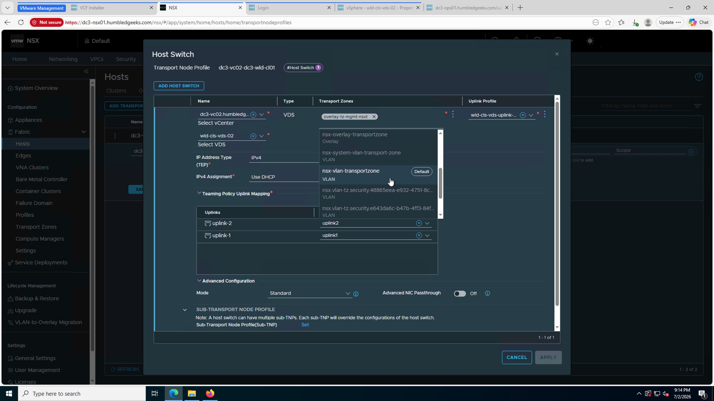

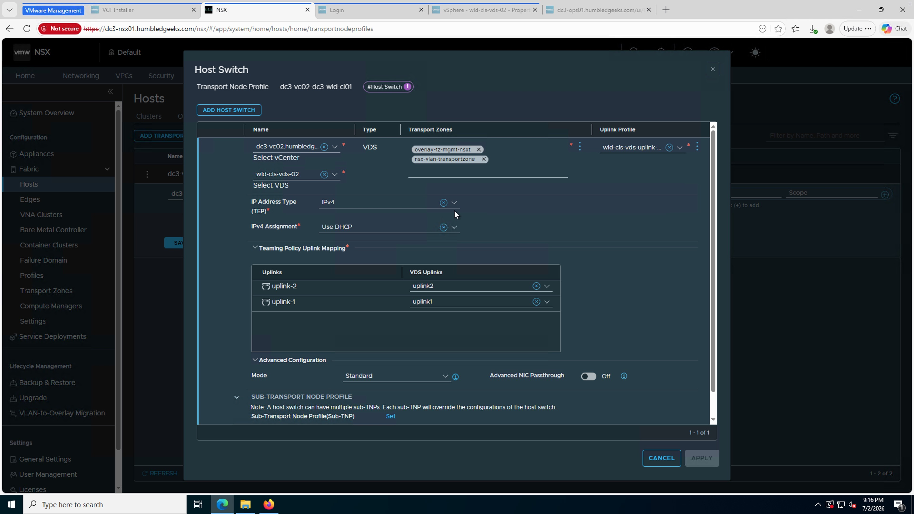

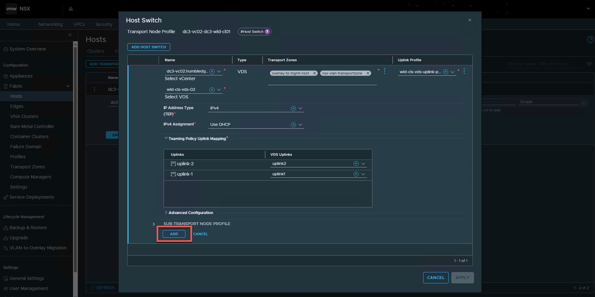

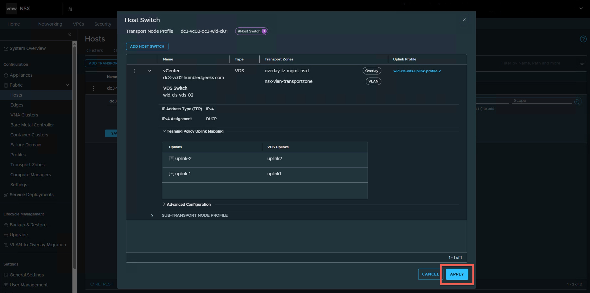

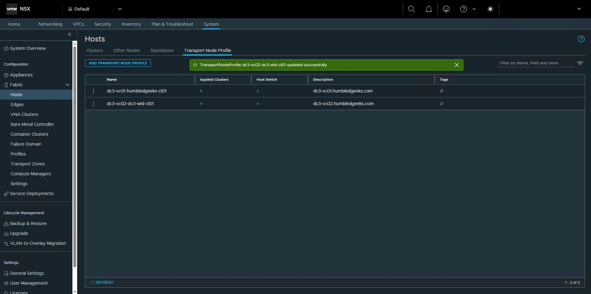

## The working method and the segment build

With the lesson learned, the method is boring in the good way:

1. Edit the WLD Transport Node Profile.
2. Open the host switch.
3. Add `nsx-vlan-transportzone` alongside the existing overlay TZ.
4. Commit the row with ADD.
5. Click APPLY.
6. SAVE.

The overlay TZ stayed bound. Mode stayed Standard. Nothing about the existing overlay networking changed.

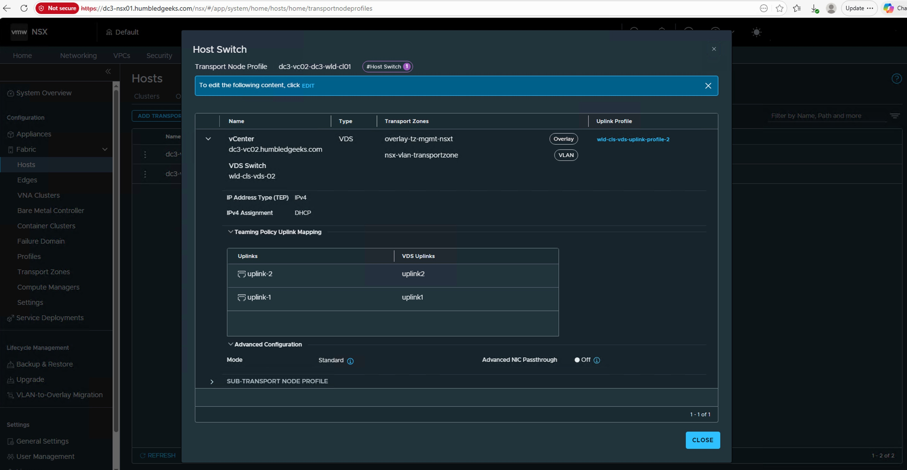

Then I rebuilt the segment on the correct transport zone. `seg-vlan18-apps` on `nsx-vlan-transportzone`, Connectivity None, VLAN 18, no gateway CIDR and no DHCP in NSX. The Connectivity None part is deliberate: this segment must not attach to a Tier-1 or Tier-0. And I left the gateway and DHCP empty on purpose because the Meraki MX already owns `10.103.18.1` and hands out the leases. NSX is providing L2 here and nothing more.

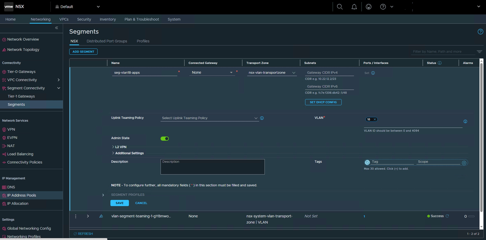

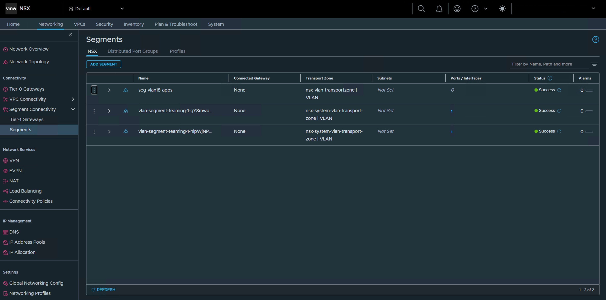

VLAN 18 is not the only network coming across. Production spans a lot more VLANs than one, and I picked 18 to validate the whole approach on a single, low-risk network before I trust it with the rest. That is the point of doing this build carefully once: it is a template, not a one-off. The transport zone is the same, Connectivity None is the same, and the empty gateway and DHCP are the same for every one of these networks, because the Meraki MX owns all of these subnets. The only things that change per VLAN are the segment name and the VLAN ID. Validate the pattern on VLAN 18, then it is the same three fields with different numbers for every remaining network.

## Proving it for real, not trusting Success

The first dead end taught me the rule for the rest of this post: Success in NSX is not proof. Green means the object exists, not that a guest can use it. So I set a proof standard and made the segment clear all of it before I believed anything.

The chain: the segment has to resolve as a distributed port group on `wld-cls-vds-02` in `dc3-vc02`, it has to be selectable in a VM NIC dropdown, and a guest placed on it has to get a real VLAN 18 DHCP lease and route out. Nothing short of that counts.

Here is what actually cleared the bar:

All four workload hosts re-realized the TNP change to Success, Status Up, zero alarms. One honest anomaly is worth a sentence: `esxi06` showed Tunnels Not Available while the other three showed 16. That is an overlay TEP status, not a VLAN failure. VLAN 18 traffic does not ride TEP tunnels, so it did not block anything here. I noted it and moved on rather than pretend it was not on the screen.

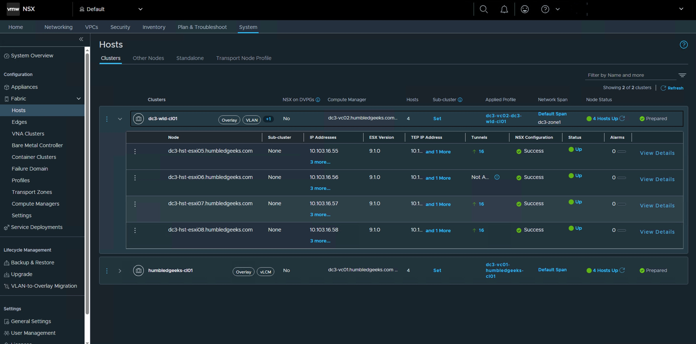

Mode confirmed Standard in Advanced Configuration. ENS was not enabled, which is exactly what this hardware requires.

`nsx-vlan-transportzone` went from 0 transport nodes to 4 once it was bound to the host switch. That is the object that proves the TZ is actually attached to the four hosts, not just defined.

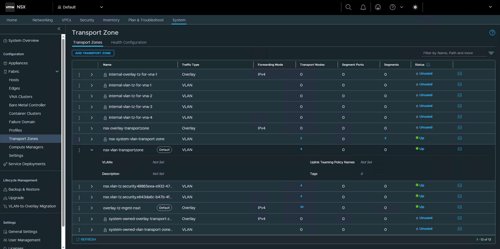

`seg-vlan18-apps` published as a distributed port group on `wld-cls-vds-02`: VLAN ID 18, port binding Ephemeral (expected for an NSX VLAN segment), four hosts. This is the thing the system VLAN TZ never gave me.

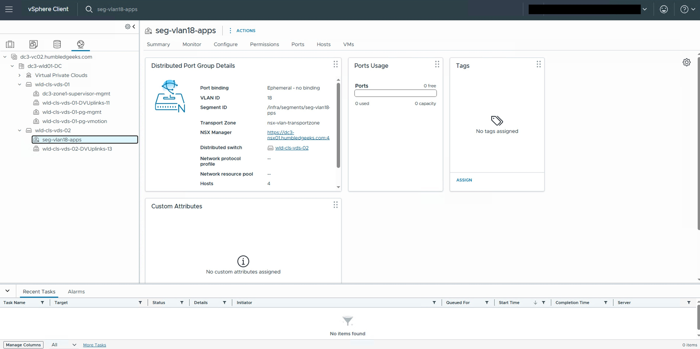

It was also selectable in the VM network adapter dropdown, which is the difference between an object that exists and an object a workload can actually use.

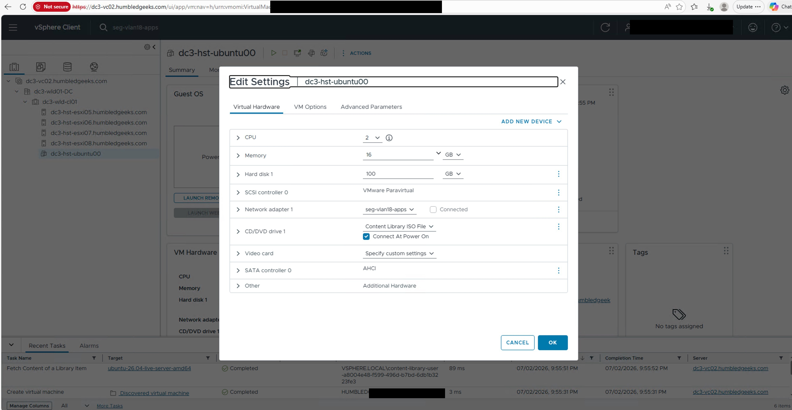

Then the real test. A throwaway Ubuntu VM on the segment pulled `10.103.18.118/24` from the MX and reached `us.archive.ubuntu.com`. That single result proves more than it looks like. The DHCP lease proves L2 on the segment, the correct VLAN 18 tag, the Meraki trunk actually delivering VLAN 18 to the host uplinks, and the MX DHCP responding. The mirror fetch proves routing out through `10.103.18.1`, DNS resolution, and egress. That closed goal one: I can create new VMs on VLAN 18 on this domain, permanently.

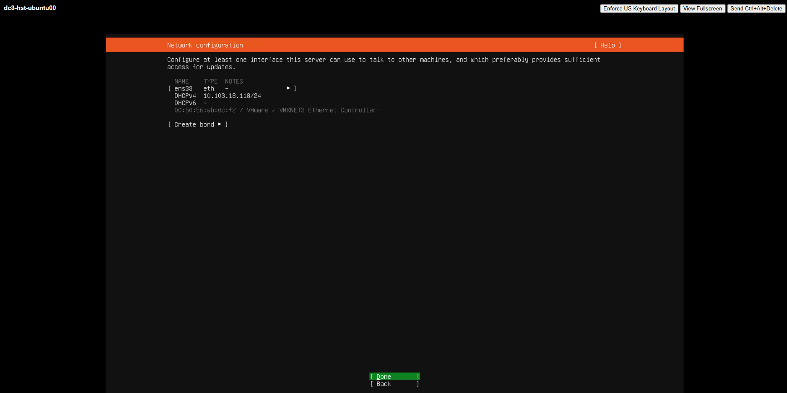

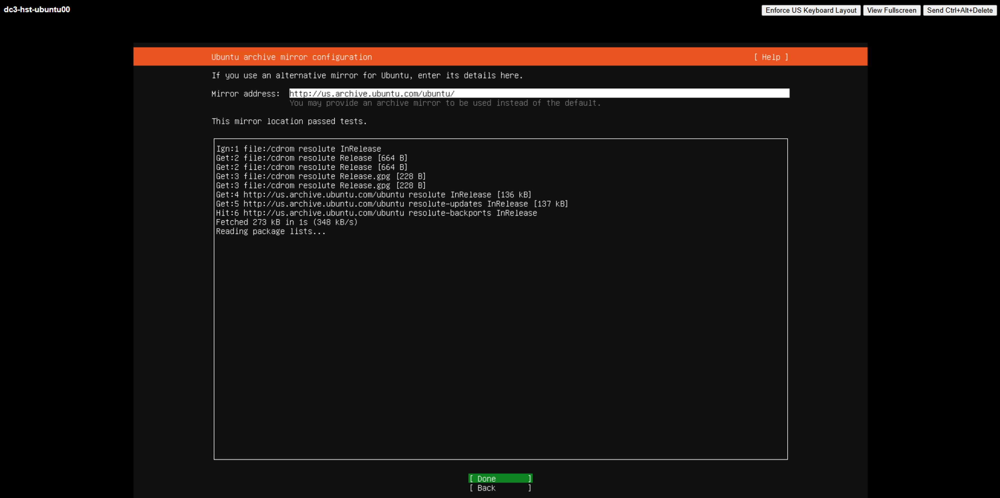

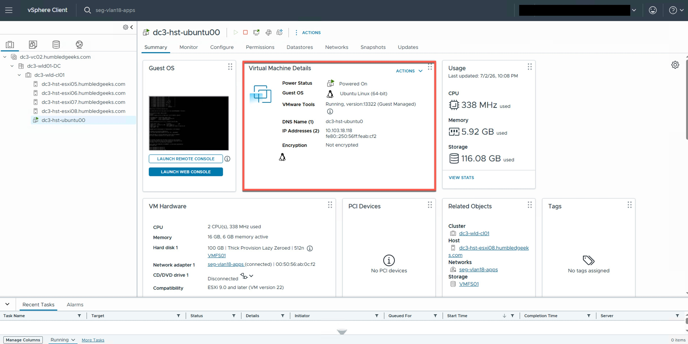

## What VCF drift detection can and cannot see

I did that host switch edit directly in NSX, outside VCF. The obvious open question was whether VCF would treat it as configuration drift.

I checked the instruments I had. VCF Health returned zero findings. The DVPG view was clean. SDDC Manager, which is deprecated in 9.x and redirects to the management-domain SSO, showed the domain ACTIVE with no failed tasks.

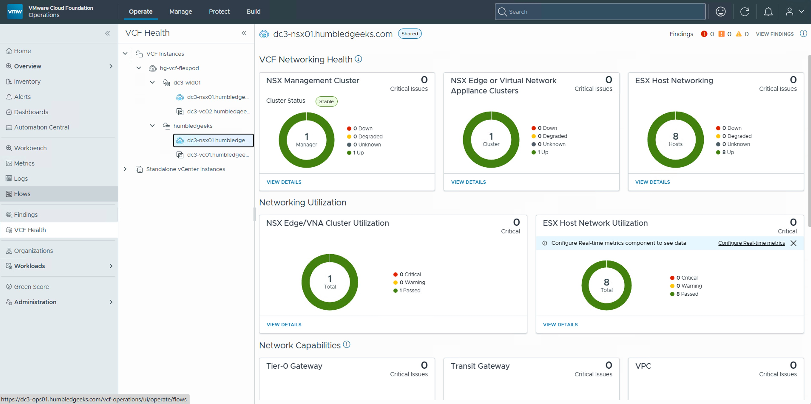

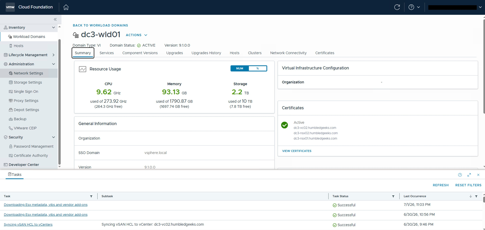

Here is the honest finding, stated as only what I observed: none of those instruments inspect NSX Transport Node Profile transport-zone membership. The VCF 9 Configuration Drift feature covers vCenter and host-cluster settings governed by vSphere Configuration Profiles. It does not cover NSX. So a green dashboard means nothing complained, not that the change was sanctioned. I am not going to tell you VCF blessed this edit, because I have no evidence that it evaluated it at all.

The only real test of whether VCF will preserve this transport zone is a lifecycle operation on the workload domain, such as adding or removing a host or running an upgrade. That is when the TNP gets re-applied and I will find out whether my out-of-band addition survives. For a proof of concept I accepted that residual risk and moved on, with my eyes open about what I do not yet know.

## Migration prep: EVC, keep-IP, storage

With new-VM creation proven, the second goal was moving an existing legacy VLAN 18 VM onto the domain with its IP intact, using Advanced Cross vCenter vMotion (no shared SSO), shared-nothing, moving both compute and storage onto the workload domain in one operation with the disk landing on the A30 FC datastore `VMFS01`.

A few decisions I made deliberately rather than by accident:

EVC is a decision input, not a hard gate. A powered-on cross-vCenter migration is a vMotion and it enforces CPU compatibility between source and destination. Powered off is a cold relocate with no CPU check. So powering the VM off is a clean, intentional bypass of the CPU-compatibility question, not something that happens to me.

Keep-IP survives a cold migration because the IP is guest configuration bound to the vNIC, not something the hypervisor reassigns. There is one Windows landmine on the AD domain controller leg: do not let the migration upgrade the VM hardware version, because Windows can re-enumerate the NIC and strand the static IP on a hidden ghost adapter. Cross-vCenter migration does not upgrade the hardware version on its own, so this is about not opting into it.

A clean guest shutdown followed by a cold migration does not cause AD USN rollback. USN rollback comes from a snapshot revert, a clone, or an image restore, not from a power cycle and relocate. So the cold path is safe for a DC as long as it is a real shutdown and move.

Storage: `VMFS01` on the A30 FC is mounted on the WLD hosts with capacity, and it is expandable. One watch-item I hit: a VM created there defaulted to Thick Provision Lazy Zeroed. On an NFS-to-VMFS move that means I need to choose the disk format deliberately at migration time, or I inflate the A30 for no reason.

## The two vMotion network paths

My first instinct about the network was that it was a non-issue, because the old and new hosts share a physical switch. That was wrong, and it is worth being explicit about why. Same switch gives you L1 and L2 adjacency. It does not prove the vMotion vmkernels can actually talk. The legacy vMotion runs on a dedicated vMotion TCP/IP stack with its own gateway, which means it is built to route, and a routed stack can be adjacent on copper and still fail to complete a flow.

There are two independent network paths to prove for a shared-nothing cross-vCenter vMotion, not one. Miss either and the migration stalls in a way that is annoying to diagnose after the fact.

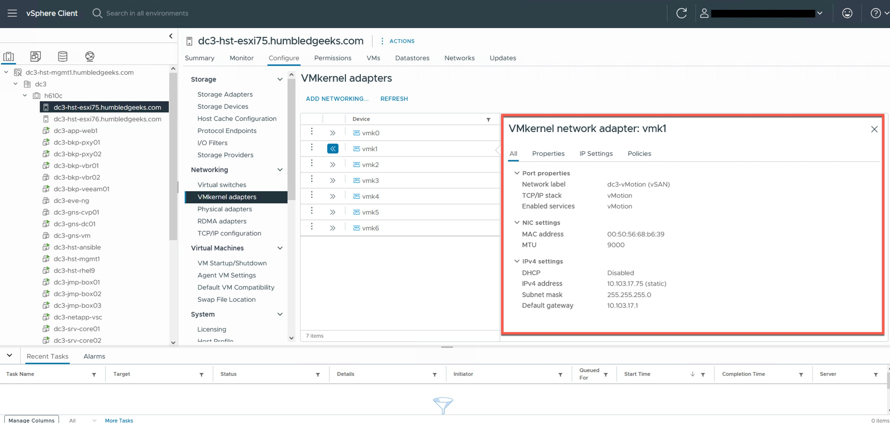

Path one is the vMotion stack itself. It must be tested on that stack, not on management, and it must be tested with jumbo frames and don't-fragment, because both sides run MTU 9000. A standard ping will pass even when the jumbo path is broken, which is exactly how you convince yourself it works right before it does not.

```
vmkping -S vmotion -d -s 8972 [destination vMotion IP]
```

Run it in both directions. Success proves reachability and 9000 end to end, including the far vmkernel's MTU, because an 8972-byte don't-fragment packet cannot complete to a 1500 endpoint or across a 1500 hop. It either gets there whole or it fails, and that is what makes it a real test. In this build both vMotion vmkernels turned out to be on the same VLAN 17 and the same `10.103.17.0/24`, so there was no routed hop, but I only knew that after I checked, not before.

Both directions came back clean: 0% packet loss with 8980-byte replies, which is the 8972-byte payload plus the 8-byte ICMP header arriving whole. That is the jumbo path proven, not assumed. From the WLD side, `esxi05` reached the legacy vMotion vmkernel `10.103.17.75`; from the legacy side, `esxi75` reached the WLD vMotion vmkernel `10.103.17.53`.

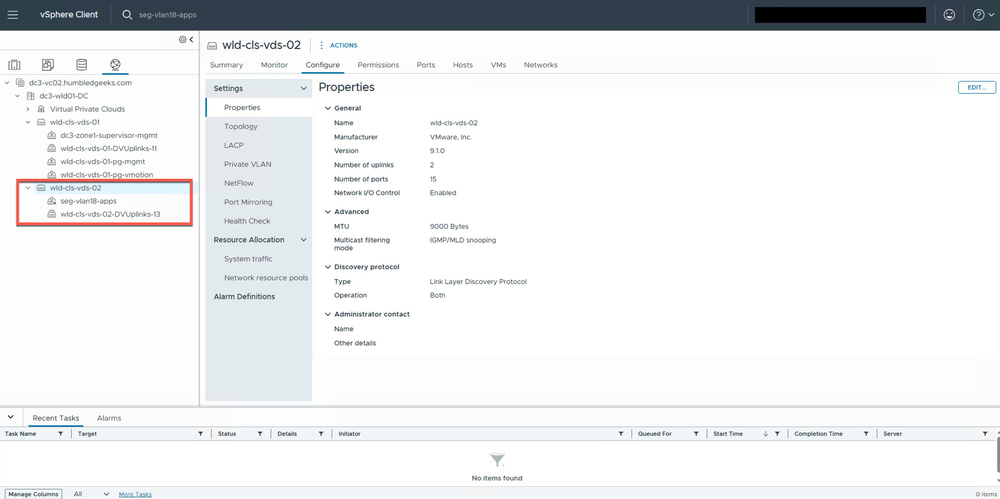

Path two is the disk copy, and it does not use the vMotion network at all. Shared-nothing moves the disk, not just memory. On Advanced Cross vCenter vMotion with no shared SSO, the disk transfer runs over NFC. In this build the NFC copy used the Management stack, because NFC uses the Provisioning stack if one exists and falls back to Management if it does not, and I had no Provisioning stack configured. That is how it behaved here, not a law you can assume on your own gear, so check which stack your NFC traffic actually rides. Management is a different subnet from VLAN 17, so I proved it separately on the default stack, in both directions.

```
vmkping [destination management IP]
```

The lesson to land is simple: prove both paths, in both directions, and use the jumbo don't-fragment test wherever the vMotion network is 9000. Same switch is not proof. A standard ping is not proof for a jumbo path.

## Performing the cross-vCenter vMotion

With both goals de-risked, new-VM creation proven and both network paths tested, I moved a real VM. The proof-of-concept subject was `dc3-hst-rhel9`, a RHEL 9 guest sitting on the legacy `dc3-app` port group. Because there is no shared SSO between the legacy 8.0U3 vCenter and the VCF 9.1 vCenter, this is an Advanced Cross vCenter vMotion, driven from the destination side with the Import VMs workflow. The source vCenter does not need to be in linked mode and the two do not need to share an SSO domain.

The entry point is not where I first looked for it. It hangs off the destination host's own Actions menu, not the cluster. On `dc3-hst-esxi05` in `dc3-vc02`, Actions then Import VMs opens the wizard.

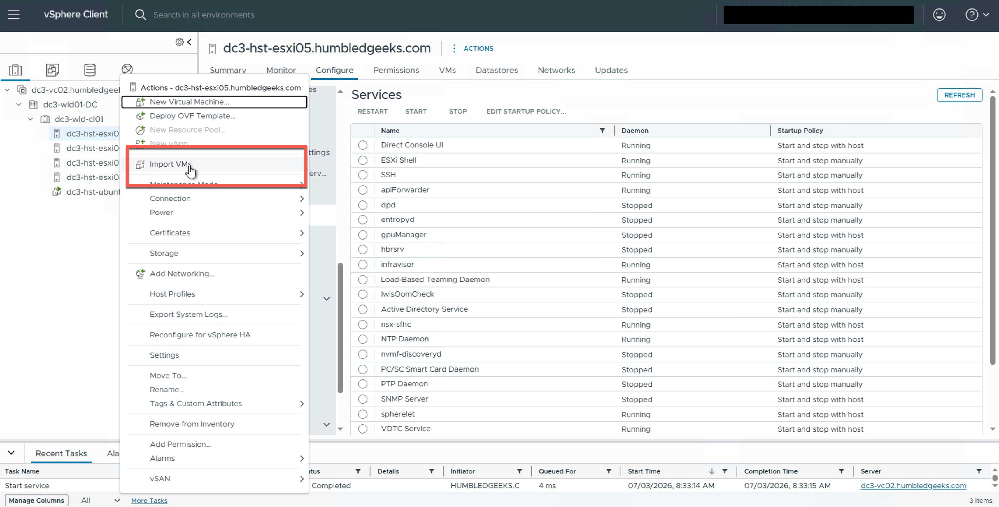

Step one is the source vCenter. New vCenter Server, `dc3-hst-mgmt1.humbledgeeks.com`, credentials, and because there is no shared trust, a certificate Security Alert I had to accept after eyeballing the SHA-256 fingerprint.

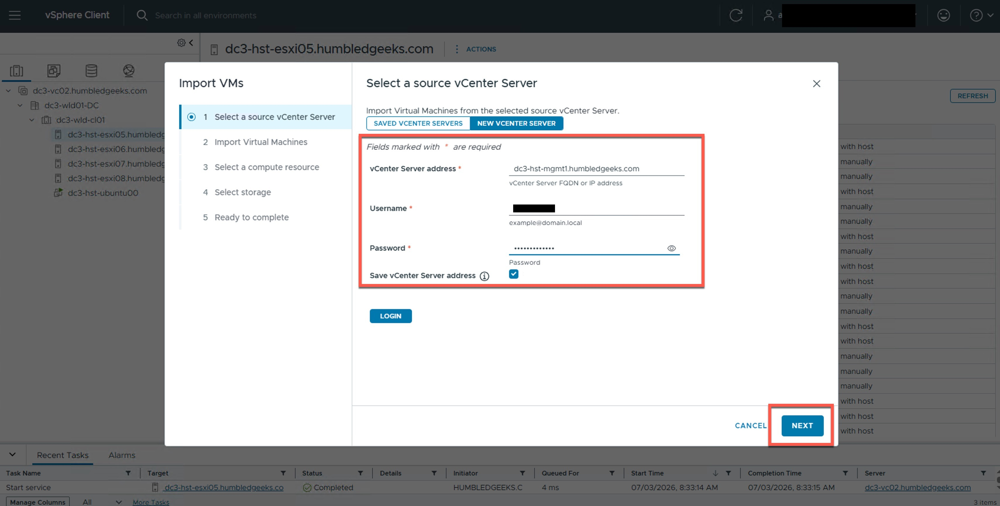

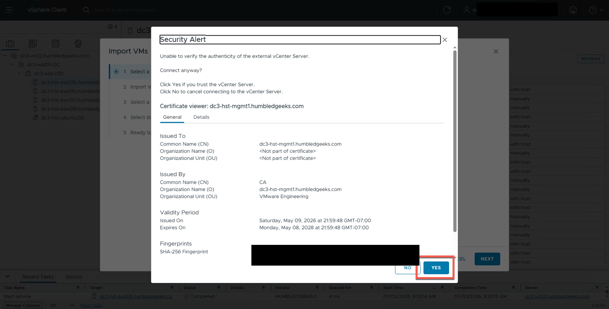

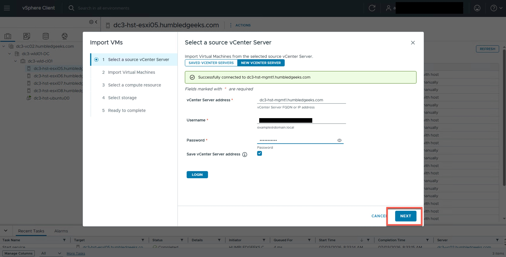

Then I picked the VM: `dc3-hst-rhel9`, from the legacy inventory.

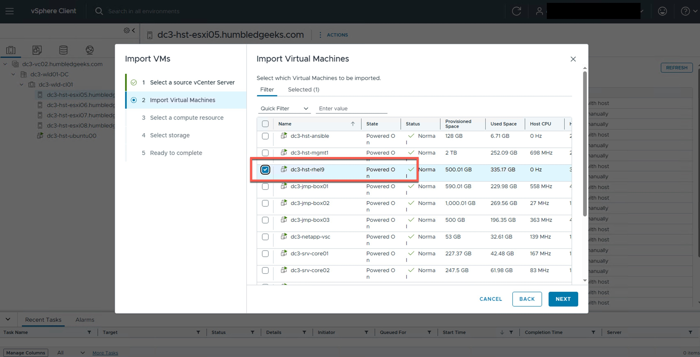

Here is where the migration-prep theory got tested for real. I ran it with the VM still powered on, and the compute-resource step stopped me: the target host does not support the VM's current hardware requirements, use EVC, see KB 1003212, and `MDS_NO is not supported`. That is the CPU-compatibility gate a live cross-vCenter vMotion enforces, and my legacy and WLD hosts are different CPU generations. Notice the wizard also grew a Select vMotion priority step, because a live move is a vMotion.

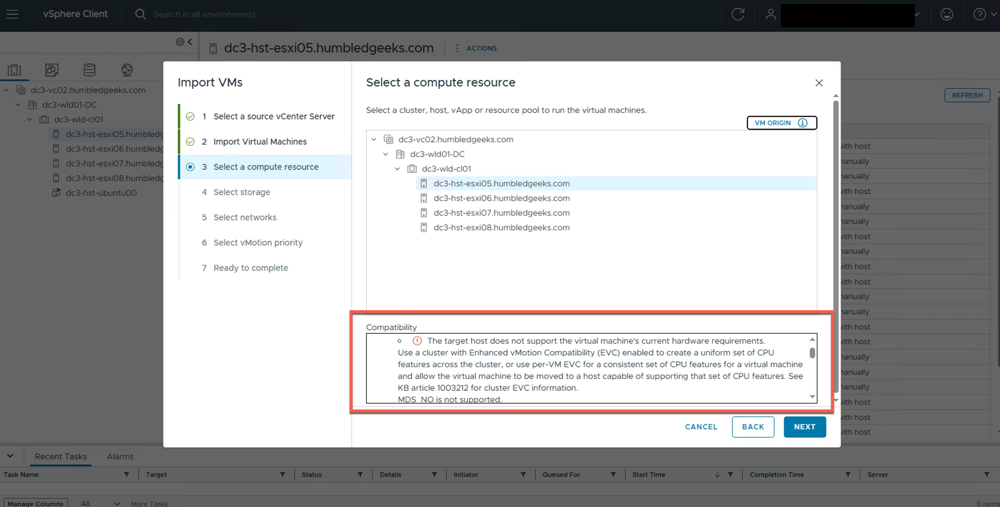

This is exactly the decision the prep section called out. EVC is not a wall I have to climb, it is a gate that only exists while the VM is powered on. So I shut the guest down cleanly, which turns the operation into a cold relocate with no CPU check.

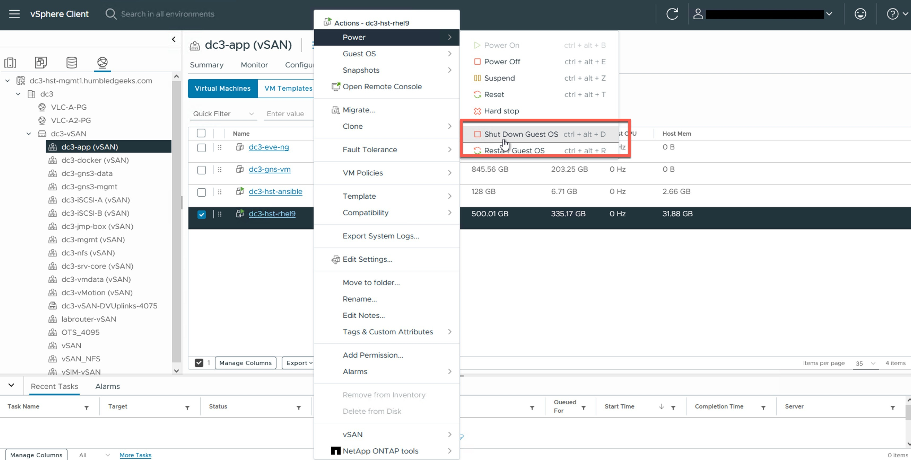

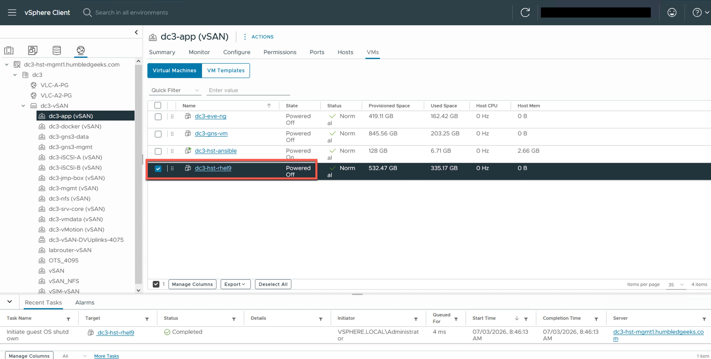

With the VM powered off I re-ran the wizard, selected `dc3-hst-rhel9` again, and this time the compute-resource step returned Compatibility checks succeeded. The Select vMotion priority step was gone, because a cold relocate is not a vMotion.

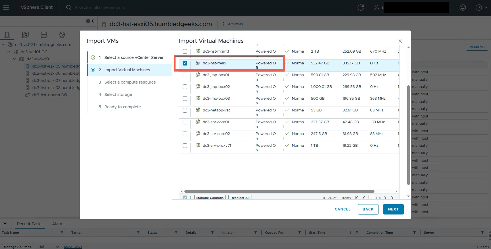

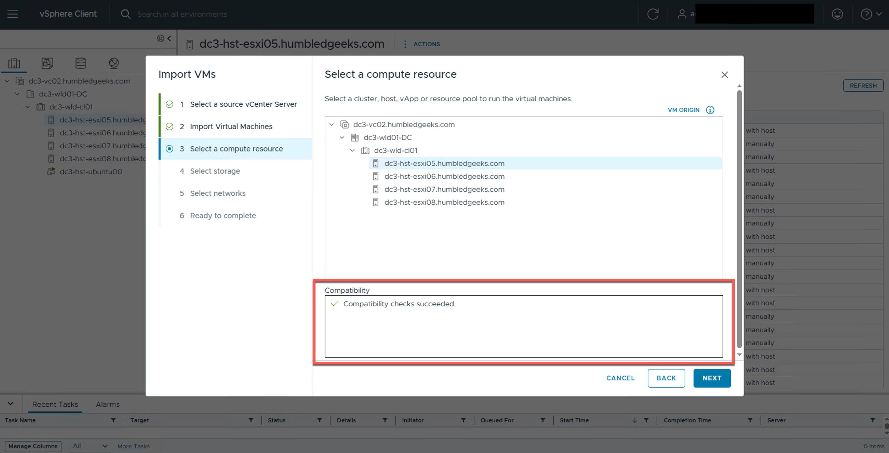

Storage was `VMFS01` on the A30. I left the disk format at Same format as source deliberately, rather than letting a thick default ride along.

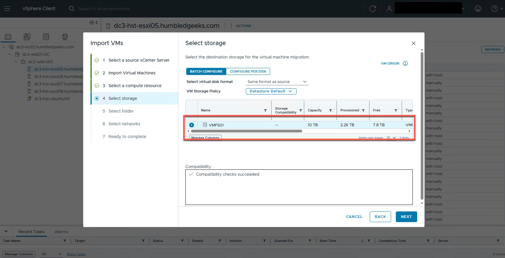

Folder was the default Discovered virtual machine, and the compatibility check passed there too.

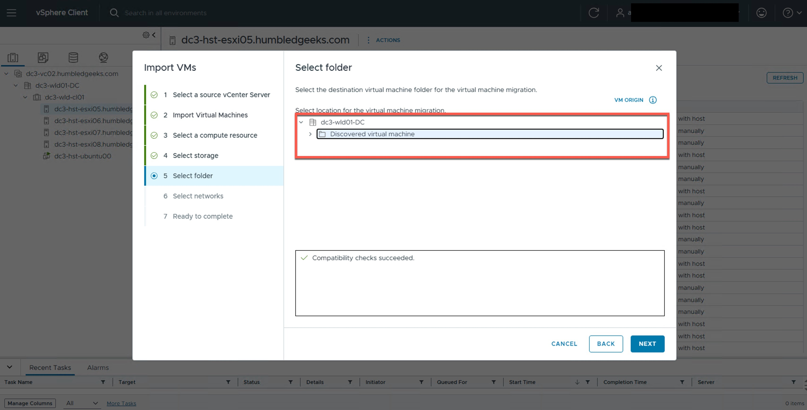

The network step is the one that preserves the IP. The picker has two tabs, VPC Subnets and Networks. The VLAN segment lives under Networks, where `seg-vlan18-apps` shows its NSX port group id `/infra/segments/seg-vlan18-apps` on `wld-cls-vds-02`. I mapped the source `dc3-app` network to it.

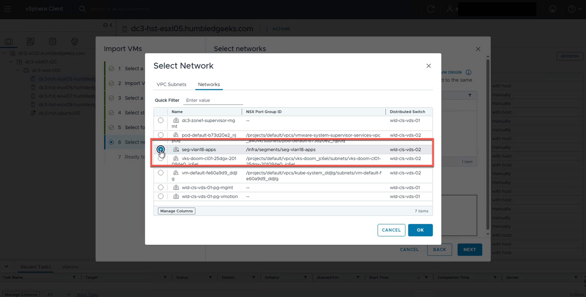

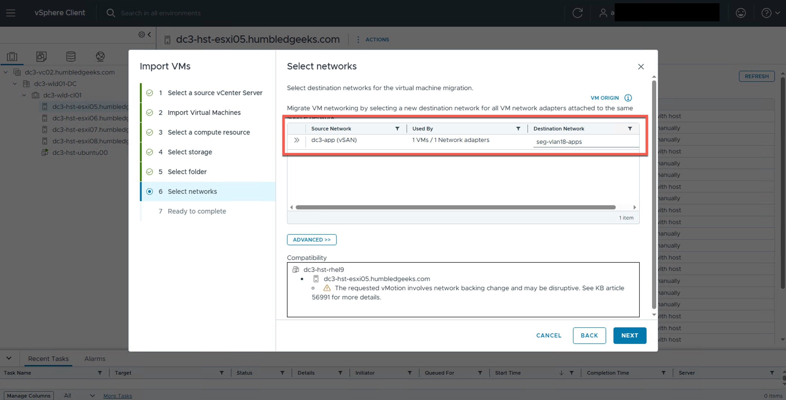

The wizard flags that changing the network backing may be disruptive and points at KB 56991. That is expected here: I am moving the vNIC from a VDS port group to an NSX VLAN segment, which is a backing change by definition. On a cold move there is nothing live to disrupt.

Ready to complete summarized it: migration type Change compute resource and storage, VM `dc3-hst-rhel9`, destination `dc3-vc02`, cluster `dc3-wld-cl01`, host `dc3-hst-esxi05`, network reassigned to `seg-vlan18-apps`, storage `VMFS01`, disk format Same format as source. Finish.

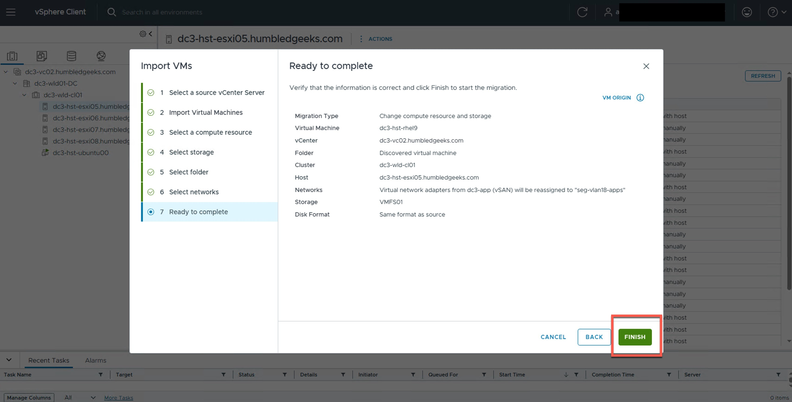

Clicking Finish kicks off the relocate. Because this is shared-nothing, the task is a real disk copy, and I watched it run in Recent Tasks against the source vCenter.

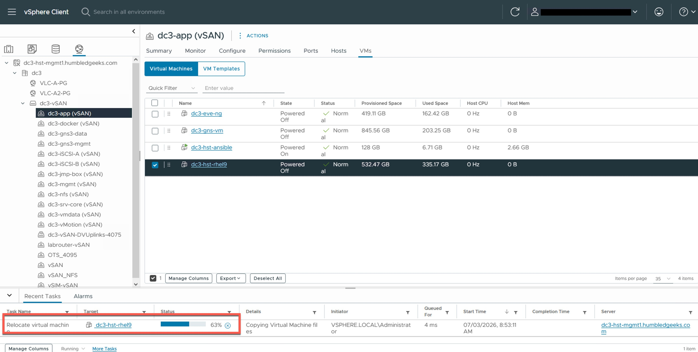

After the move, the same proof discipline applies. Success in a task pane is not proof the VM is healthy on the new domain. First, the VM landed on `dc3-wld-cl01` in `dc3-vc02`, powered off, its disk now Thin Provisioned on `VMFS01` and its adapter bound to `seg-vlan18-apps`. Powered off, the NIC shows disconnected, which is normal.

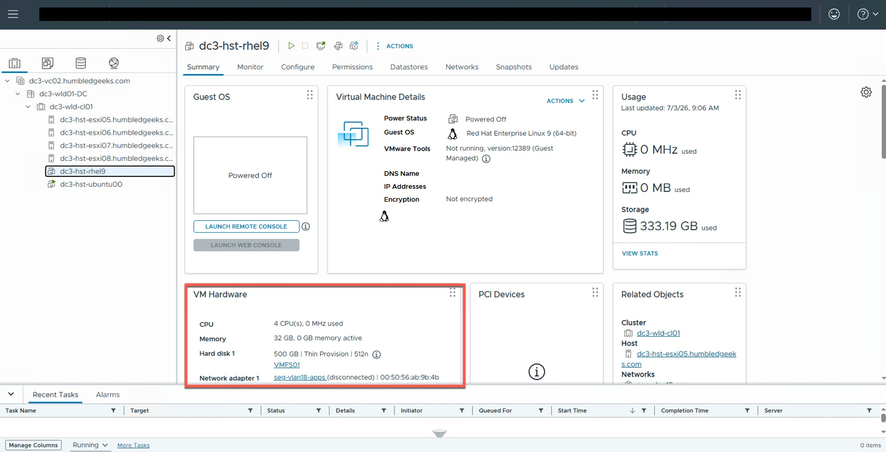

Then I powered it on. vCenter reported it running on host `dc3-hst-esxi08`, VMware Tools up, and the detail that matters: IP address `10.103.18.180`, the same VLAN 18 address it had on the legacy side, on `seg-vlan18-apps` and `VMFS01`.

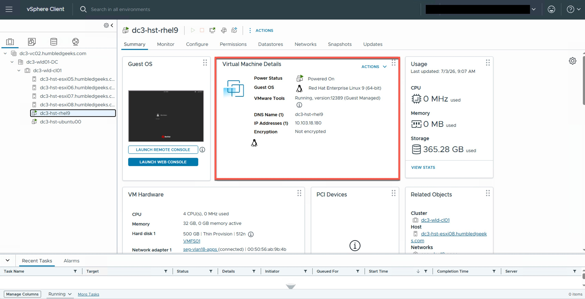

vCenter reporting an IP is still second-hand. The last proof is from inside the guest. On the RHEL 9 console, a ping to the VLAN 18 gateway `10.103.18.1` came back clean.

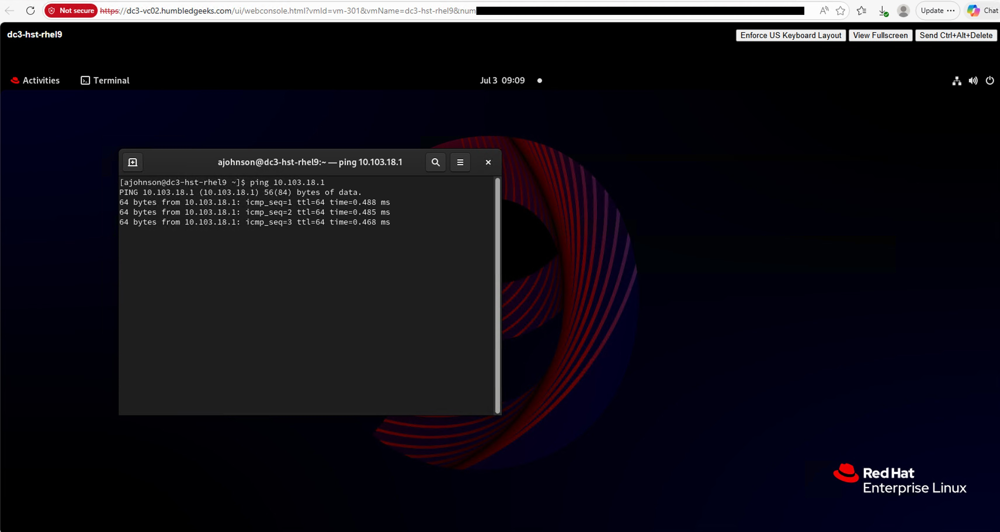

That closes goal two: an existing VLAN 18 VM now lives on the VCF 9.1 workload domain, running on the same VLAN, holding the same `10.103.18.180` address it always had, its disk relocated onto the A30 FC datastore `VMFS01` in the same operation. For the eventual Windows AD domain controller leg, I will also confirm the NIC is the same adapter with no hidden ghost, the static IP is intact, and AD services are healthy.

## Takeaways

A few things I am taking with me:

Green in NSX is object existence, not usability. The proof standard for a VLAN segment is a DVPG in vCenter, a selectable NIC, a real DHCP lease, and egress. Everything short of that is a status light.

When a button is greyed out, suspect your own uncommitted edit before you blame the platform. I lost time deciding VCF was locking me out when the truth was a row I never pressed ADD on.

A green VCF dashboard after an out-of-band NSX change means nothing complained, not that the change was inspected. VCF 9 drift detection does not look at NSX transport node profiles. The lifecycle operation is the real test, and I have not run it yet.

For a shared-nothing cross-vCenter vMotion there are two network paths, not one, and the disk path may not ride the stack you assume it does. Test both, both directions, jumbo where jumbo lives.

That is one road out of 8.0U3 walked end to end. The other road is where I am headed next: the in-place upgrade, taking the legacy environment up to 9.x as VVF (VMware vSphere Foundation) rather than folding it under VCF, and watching the bulk of the fleet ride an upgrade instead of a migration. That one is still being written, so check back on HumbledGeeks.com.
