<!-- ============================================================
GROUND-TRUTH NOTES (from the screenshots, read before editing):
- Environment in the captures is dc1-vcf-vc01.e360demo.com on ucs-nodeNN hosts.
  This is NOT the humbledgeeks.com / dc3 FlexPod used elsewhere in the series.
  DECIDE before publishing: keep, redact, or rebrand these names.
- This is NOT a 9.0 to 9.1 major upgrade. It is a 9.1 security PATCH:
  vCenter 9.1.0.0100 (build 25417926) to 9.1.0.0200 (build 25573614),
  released 07/08/2026, Type=PATCH, category=SECURITY, Critical=true.
- Driven entirely from vSphere Client > [vCenter] > Updates > vCenter Server >
  Upgrade > "Upgrade with online depot". NO VAMI:5480. The backup step is an
  in-workflow acknowledgment checkbox.
- Method = reduced-downtime "switchover": a NEW target appliance is deployed,
  configuration/data is migrated, then an automated switchover cuts over.
- SCOPE = vCenter only. The ESXi/vLCM cluster-image screenshots (Images tab,
  Check Compliance/Precheck/Stage/Remediate) and the VCF Installer binary-
  management shots are OUT of scope here; save them for a hosts post.
- IMAGE FILENAMES BELOW ARE MY BEST READ. Your upgrade_N files are NOT in
  chronological order (upgrade_4 is the END "Switchover Completed" screen).
  VERIFY every image path against the actual capture before publishing.
- REDACT: see DRAFT NOTES block at the bottom.
============================================================ -->

I just finished standing up **[VMware vSphere Foundation (VVF)](https://techdocs.broadcom.com/us/en/vmware-cis/vsphere/vsphere/8-0/vcenter-and-host-management/license-management-host-management/what-is-vmware-vsphere-foundation-vvf-solution-licensing-host-management.html)
with vSAN** in my lab and migrating everything over to it, and honestly, I've been
having a blast with it. As part of this whole
[*Zero to VCAP*](https://humbledgeeks.com/zero-to-vcap-i-passed-the-broadcom-vcf-vcap-storage-exam/)
journey, I've been keeping an eye out for good, real-world things to show off in
both my **VVF** and the larger **VCF FlexPod** I've been documenting — the Cisco
UCS + NetApp ASA stack I
[stood up on Broadcom VCF](https://humbledgeeks.com/automating-a-cisco-ucs-flexpod-with-netapp-asa-a30-on-broadcom-vcf/)
and then [licensed for VCF 9.1](https://humbledgeeks.com/licensing-my-flexpod-cisco-ucs-netapp-broadcom-vcf-91-deployment/)
— the kind of everyday task you actually end up doing at 9pm on a Tuesday. And wouldn't you know it, something popped up on its own: a **critical
security patch** landed for my freshly deployed vCenter. Perfect. There's a fix
sitting on a clock, so how much of my evening is it really going to cost me? That's
exactly what this post is about.

If you've run vSphere for any length of time, you know keeping updates in check
used to be a bit of a challenge. The staging, the mounting, the migration
assistant, the white-knuckle window. It all added up. With the **new lifecycle
management in VVF 9.1**, a lot of that is just gone. On VVF 9.1, patching vCenter is
**[reduced-downtime](https://techdocs.broadcom.com/us/en/vmware-cis/vsphere/vsphere/9-0/vcenter-upgrade/reduced-downtime-upgrade.html)
by default**, driven entirely from the vSphere Client, and it barely interrupts
anything.

And the best part? This is the small version of the story. Once I've shown how
painless a single vCenter patch is here, I can't wait to turn around and show how
easy this same thing is going to be on my much larger **VCF 9.1** FlexPod
deployment, so let's start here and build up to that.

---

## First, let's be precise about what this is

I want to be straight about the scope, because "upgrade" gets used loosely and
that's exactly where people get burned.

This is **not** a 9.0-to-9.1 major upgrade. My vCenter was already on **9.1**
(9.1.0.0100). What landed was a **security patch** that moved it to
**9.1.0.0200**: same major/minor release, newer patch build, flagged *critical*.
It's the kind of update you actually have to move on, on a clock, because it's
closing a security hole rather than adding a feature.

It's also **vCenter only**. The ESXi hosts get their own treatment through
[vSphere Lifecycle Manager](https://techdocs.broadcom.com/us/en/vmware-cis/vsphere/vsphere/8-0/managing-host-and-cluster-lifecycle/about-vsphere-lifecycle-manager-new.html)
cluster images, and that's a separate post. Mixing the two into one story is how
you end up with a half-finished maintenance window and no clean rollback point.
Control plane first, cleanly.

And here's the part that matters most for the "is VVF easy to live with" question:
I did the entire thing **from the vSphere Client**. No VAMI on port 5480, no ISO
mount, no migration-assistant console. The backup, the pre-checks, the new
appliance, the cutover, all of it lives under one Updates tab now.

---

## How vCenter patching works in VVF 9.1 (the mental model)

Two ideas up front, because they explain every screen that follows.

**Lifecycle is in the vSphere Client, not the appliance.** In VVF there's no SDDC
Manager orchestrating a fleet. vCenter owns its own
[lifecycle](https://techdocs.broadcom.com/us/en/vmware-cis/vsphere/vsphere/9-0/vcenter-upgrade.html).
You drive it from **[vCenter] › Updates › vCenter Server › Upgrade**, pointed at
the **online depot**. The workflow finds the compatible patch, updates its own
vLCM plugin, runs readiness pre-checks, and only then lets you proceed.

**Reduced downtime means a new appliance and a switchover.** This is the piece
worth understanding. Rather than upgrading the running appliance in place, VVF
**deploys a brand-new target vCenter appliance** beside the live one, migrates the
configuration and data into it during a **Prepare** stage while the old one keeps
serving, then performs an automated **Switchover**, a short cutover to the new
appliance. Your real downtime is just that switchover window, not the whole job.

One consequence to file away: because a new appliance is built and the old one is
retired, the vCenter you end on is not the same VM object you started with. That's
why your rollback plan is a **backup**, taken and acknowledged inside the workflow,
not a snapshot of the outgoing VM.

---

## Pre-flight

The patch is easy. The pre-flight is where the thinking goes, and it's short.

**Confirm where you're starting.** vCenter › Summary › **vCenter Details** shows
the current Release / Version / Build. Mine read **9.1.0.0100, build 25417926**,
with the yellow **"Security update available… VIEW UPDATES"** banner across the
top, the platform telling me exactly why I was here.

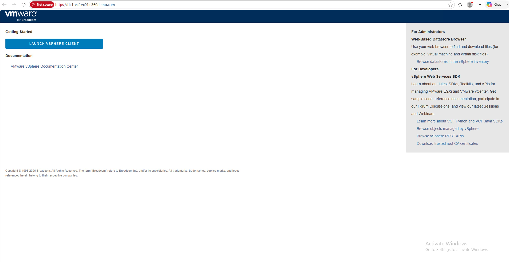

**Have healthy DNS and time.** Forward and reverse DNS for vCenter and the new
target appliance's temporary address, and NTP in sync. I verified the vCenter
records resolve before starting. This is behind a large share of "it failed at
the pre-check" tickets.

**Know your target.** Have a free IP on the vCenter management network ready for
the temporary appliance, and a maintenance window for the switchover. Even
reduced downtime is still downtime.

---

## Step 1: Open the upgrade workflow and pick the online depot

From the vCenter object, go to **Updates › vCenter Server › Upgrade**. The
workflow opens on **Target version**, where you choose your source: **Upgrade
with online depot** or **Upgrade with ISO file**. My vCenter has online depot
connectivity, so I took that path, no downloading and mounting anything.

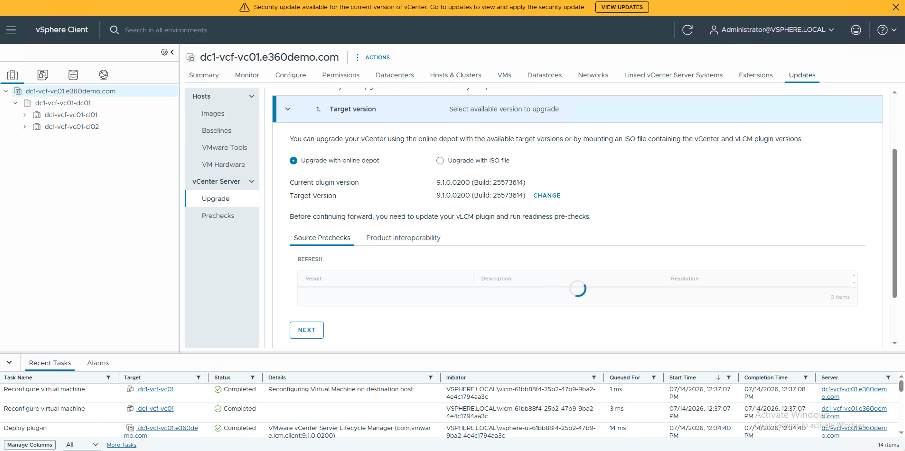

---

## Step 2: Select the available patch

Click through to see the compatible updates. The dialog listed exactly one:
release date **07/08/2026**, version **9.1.0.0200**, build **25573614**, Release
type **PATCH**, category **SECURITY**, Critical **true**. That "critical security"
label is the whole reason this isn't a someday task.

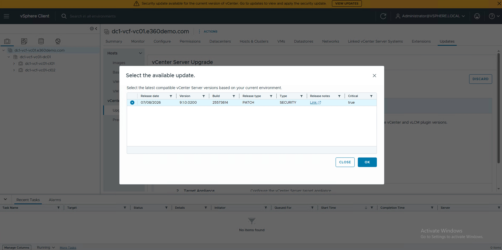

With the patch selected, the workflow shows the jump it's about to make: current
**9.1.0.0100 (build 25417926)** to target **9.1.0.0200 (build 25573614)**. Then it
tells you what it needs first, which is to **update the vLCM plugin and run
readiness pre-checks**.

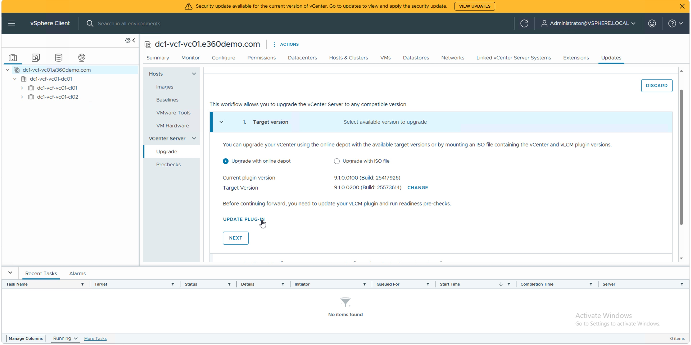

---

## Step 3: Update the vLCM plugin and run pre-checks

Let the workflow **update its vLCM plugin** and run the **readiness pre-checks**.
You'll watch it stop services briefly and churn through the checks. This is the
gate: green here earns you the right to proceed; a warning here is the upgrade
telling you what it's going to trip on, so read it.

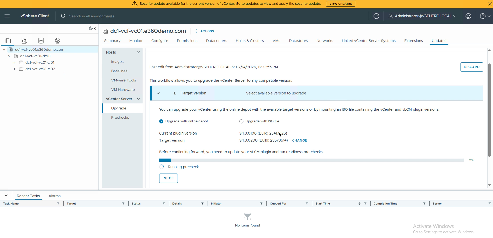

---

## Step 4: Acknowledge the backup (this is your rollback)

Before it will continue, the workflow throws up a **vCenter Backup** gate. In my
run it showed **"No backups available"** from a registered backup, with a checkbox
to attest: *"I have backed up the vCenter server and the required data using a
VMware product or a third-party utility."* You confirm, and only then does it move
on.

Don't rubber-stamp this. Because reduced downtime replaces the appliance, this
backup is your actual recovery path if the switchover goes wrong. Take a real
[file-based backup](https://techdocs.broadcom.com/us/en/vmware-cis/vsphere/vsphere/9-0/vcenter-installation-and-setup/file-based-backup-and-restore-of-a-vcenter-server-environment/schedule-a-file-based-backup.html)
first, then check the box honestly.

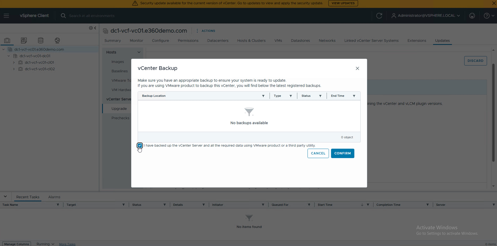

---

## Step 5: Configure the target appliance

This is the reduced-downtime part made visible. The workflow launches a
**Target VM deployment** wizard to build the *new* appliance that you'll switch
over to. It's the familiar deploy flow:

- **License Agreement** and **CEIP**
- **Target Location**, where the new appliance VM is placed
- **Deployment Type**, where I kept **Same Configuration** so the new appliance
  inherits the current one's settings
- **VM Appliance details**, the target VM name and a temporary **root password**
- **Network Settings**, the **temporary address** the new appliance uses during
  migration. I left **Network configuration** on **Automatic** and let it grab an
  address off the management network (the free IP from pre-flight)
- **Review**, then confirm and finish

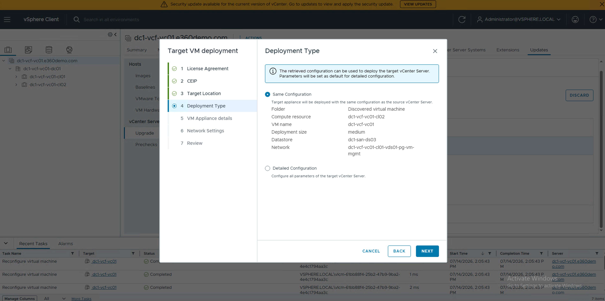

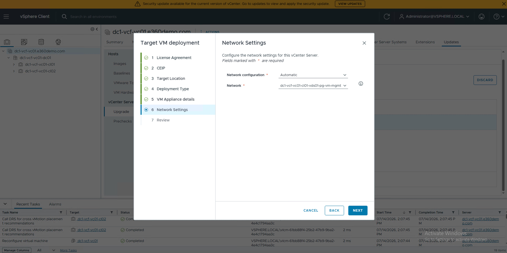

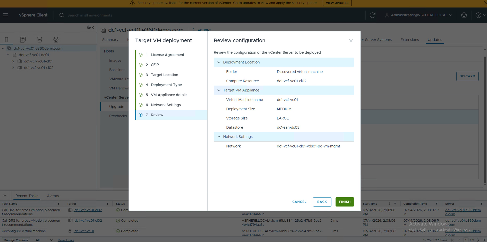

---

## Step 6: Choose the switchover, then start

Back in the upgrade workflow you set how the cutover is handled: **Prepare
Upgrade** (stage everything, switch over later) or let the **Switchover** run
**automatically after the prepare stage completes**. I let it run automated. The
**Configure Switchover** dialog confirms the timing, and **Start Upgrade** kicks
it off.

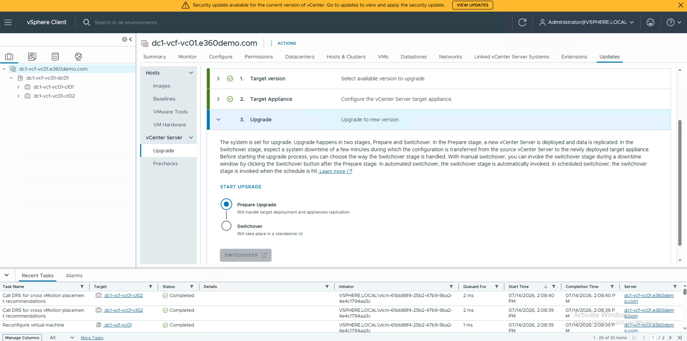

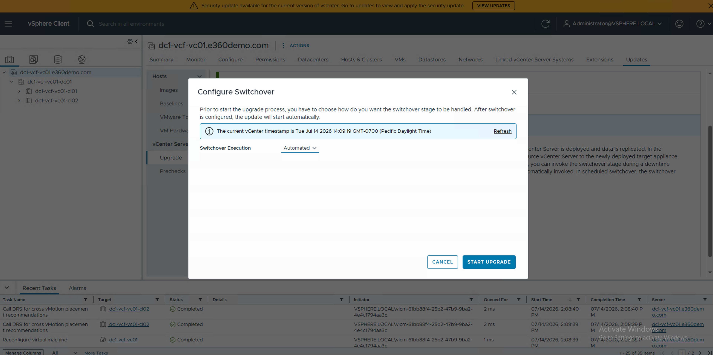

---

## Step 7: Watch it prepare and switch over

Now you mostly wait. The workflow deploys the target appliance, migrates the
data, and, because I chose automated, performs the **Switchover** on its own.
The screen is explicit that this is the one moment not to touch anything:

> *The vCenter Server is being upgraded. Please wait. Do not go back, refresh, or
> close this screen till the upgrade completes.*

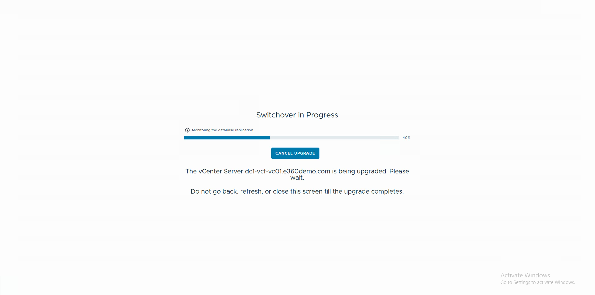

The vSphere Client drops briefly at cutover, which is expected, and comes back on
the new appliance.

---

## Step 8: Confirm you landed on 9.1.0.0200

When it finishes you get a clean **"Switchover Completed"** screen: *the vCenter
Server is upgraded*, with a button to open the vSphere Client on the new build.

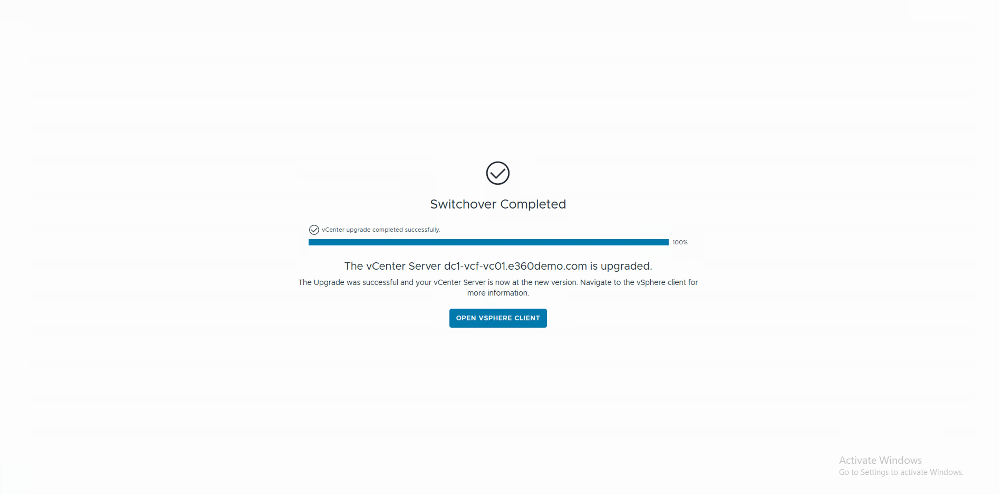

Verify it for real, don't trust the banner disappearing:

- **vCenter Details** now reads **9.1.0.0200, build 25573614**.
- **Services healthy** and **inventory intact**, with hosts, clusters, and plugins
  all present and talking.
- The **"security update available" banner is gone**.

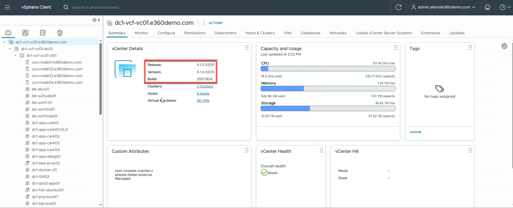

Then clean up: reclaim the temporary IP, and note the new build in your records.

---

## What actually mattered

Strip it down and the whole job was: confirm the current build, point the Updates
tab at the online depot, pick the critical patch, let it update its plugin and
pre-check, attest to a backup, deploy the target appliance, and let the automated
switchover do the cutover. One tab. One short interruption. No VAMI, no ISO, no
console babysitting.

That's the real answer to "is VVF easy to keep current." You give up the fleet
orchestration of full VCF, and in exchange the single-vCenter patch story is
low-drama enough that "there's a critical security patch" stops being a dreaded
maintenance window and becomes a coffee-length task. For a security fix on a
clock, that's exactly the property you want.

If patching a single vCenter is this painless, the obvious next question is what
happens when there's a whole fleet to move. So next up I'm taking on a much larger
**VCF upgrade** (**[link to your next topic]**) on the same FlexPod stack I've
already [wired into Active Directory](https://humbledgeeks.com/connecting-my-flexpod-vcf-91-deployment-to-active-directory-vcf-single-sign-on/)
and [run Kubernetes (and DOOM) on](https://humbledgeeks.com/running-doom-on-kubernetes-vsphere-kubernetes-service-vks-on-my-flexpod-vcf-91/),
to see whether the easy-button lifecycle story holds up once SDDC Manager is
orchestrating the entire stack.

If you're sitting on a VVF 9.1 vCenter with that yellow banner up top: it's a
smaller lift than you think. Open the Updates tab and see what it's offering you.

<!-- DRAFT NOTES, remove before publishing
DECIDE FIRST: these captures are the e360demo.com lab on ucs-nodeNN hosts, not the
humbledgeeks.com / dc3 FlexPod used elsewhere in the series. Keep, redact, or rebrand?

Redact before publishing (screenshots + any prose that leaks them):
- host/vCenter FQDNs: dc1-vcf-vc01.e360demo.com, ucs-node0N.e360demo.com, dc1-vcf-* names
- the e360demo.com domain throughout
- vCenter IP + the temporary target-appliance IP (Network Settings screen)
- online depot hostname/credentials (depot config screens)
- accounts: administrator@vsphere.local, admin.admin@e360demo.com / admin@local
- any build/instance identifiers you'd rather not publish
- DO NOT PUBLISH the VCF Installer "Review Passwords" screen; it exposes credentials
  (that shot is out of scope for this post anyway)
Leave visible: version strings (9.1.0.0000 / 9.1.0.0200), build numbers if you're OK
with them, the PATCH/SECURITY dialog, progress UI, healthy-service greens.

VERIFY IMAGE MAPPING, your upgrade_N files are NOT chronological. My best read:
  upgrade_1  = Summary/vCenter Details BEFORE (banner up)      [CONFIRM]
  upgrade_2  = Summary AFTER patch (banner cleared)            [CONFIRM]
  DNS.jpg    = DNS resolution check                            [CONFIRM]
  upgrade_23 = Target version, "online depot" full frame       [CONFIRM]
  upgrade_30 = "Select the available update" 9.1.0.0200 dialog [CONFIRM]
  upgrade_28 = Target version, current to target + UPDATE PLUGIN [CONFIRM]
  upgrade_25 = running readiness pre-checks                    [CONFIRM]
  upgrade_27 = vCenter Backup acknowledgment gate              [CONFIRM]
  upgrade_16 = Deployment Type = Same Configuration            [CONFIRM]
  upgrade_12 = Network Settings (temp IP)                      [CONFIRM]
  upgrade_11 = Target VM deployment Review                     [CONFIRM]
  upgrade_6  = Prepare Upgrade / Switchover options            [CONFIRM]
  upgrade_8  = Configure Switchover dialog                     [CONFIRM]
  upgrade_5  = Switchover in progress                          [CONFIRM]
  upgrade_4  = Switchover Completed (end screen)               [CONFIRM]
TODO before publish:
- Fill the [link to your next topic] placeholder once the VCF upgrade post exists.
- Confirm exact UI labels against your captures (menu path, button wording).
- No post ID yet, draft on disk only. Publish via the image-heavy pattern
  (build script, then publish.py --no-images, then postprocess_wp.py).
-->
